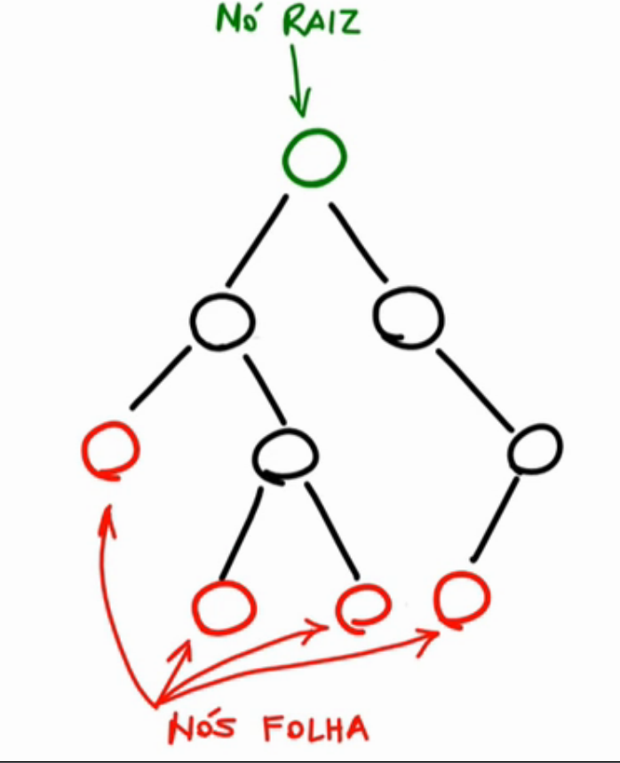
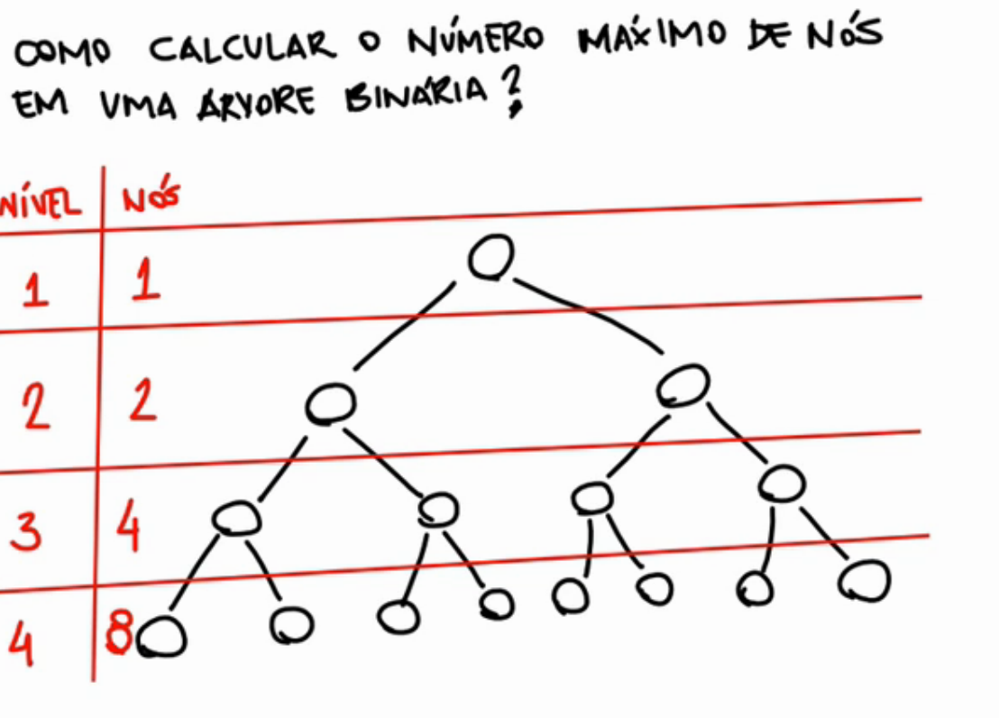

# Árvores binárias

Árvore binária é uma estrutura de dados que possui dois elementos, os nós e os arcos, onde
* Um nó pode ser ligado a no máximo dois outros nós;

Aqueles nós que não tem nenhum filho são chamados de nós folha.

## Definição recursiva

Árvore binária é definida de forma recursiva, assim na definição de uma árvore binária inclui a própria definição.

assim os filhos dos nós também serão pais e poderão ter no máximo dois filhos.

## Definindo tamanho da árvore binária

Para realizar a definição do tamanho que uma árvore binária tem, é necessário primeiro analisar a quantidade de níveis que a árvore tem. Isso porque a cada novo nível dobra a quantidade de nós do nível anterior.

Assim numa árvore com quantidade de nível k, teremos 2 ^ k - 1

O número máximo de nós na árvore é a soma do número máximo de nós em cada nível.

nivel-arvore.png

## Inserir, Busca e remoção de elementos em ávores binárias

### Inserir
Para realizar a busca em árvores binárias, é necessário que, na estrutura existente, não haja, elemento igual ao que será inserido

No momento de realizar a inserção, dois casos podem surgir:

* 1° - A árvore está vazia
    * Neste caso o primeiro elemento a ser inserido será considerado a raiz da árvore
* 2° - A árvore já possui elementos
    * Neste caso será necessário analisar a situação, para isso, utiliza-se as seguintes perguntas:
        * O elemento que será inserido é menor que a raiz, caso seja vá para a esqueda;
        * O elemento que será inserido é maior que a raiz, caso seja, vá para a direita.

### Busca

Para realizar uma busca na árvore binária, é necessário se fazer duas perguntas:
* O elemento que estou buscando é o elemento que está no nó atual ?
* O elemento é maior ou menor ao elemento do nó atual ?

Com essas perguntas será possível definir o caminho a ser seguido, e assim encontrar o elemento desejado dentro da árvore.

### Remoção
No momento da remoção, três casos podem surgir, e são eles:

#### Nenhum filho (Remoção de nó-folha)
Este é o caso mais simples, já que nenhuma tratativa de estrutura deverá ser feita. Para remover basta fazer com que a conexão do pai com o filho que será removido, passe a ser null

#### Possui um filho
No caso de haver um ou dois filhos (Tratado no próximo tópico) será necessário mudar a estrutura da árvore. Isso para que mesmo removendo o pai, os fihos não se percam. Para isso será necessário mover os ponteiros que estão apontado para o elemento que será removido (E que tem filho) para o filho dele.

#### Possui dois filhos
Neste caso existem formas diferentes de resolver o problema, irei tratar de apenas uma delas

Então supondo que quero remover um elemento que possui dois filhos, o que irei fazer é, buscar na sub-árvore esquerda o maior elemento presenta lá, e este irá substituir a raiz, e então ela poderá ser removida sem grandes problemas.

Resumidamente será necessário percorrer a sub-arvore esqueda, entrar na sub-árvore direta, e percorrer até chegar na folha, o que consequentemente trará o maior elemento da sub-árvore esquerda.

OBS: Caso queira implementar utilizando o lado mais a direita, basta que, dentro desta sub-árvore, seja percorrido o lado esquerdo, ou seja, busque o menor elemento.

## Percorrer árvore binária

Percorrer árvores binárias são importantes para que seus elementos sejam visualizados e recuperados.

Em todos os casos que serão vistos, as mesmas operações serão utilizadas, a diferença é a ordem com que as operações são feitas. As operações realizadas são:

* Visitar a raiz (Nó raiz);
* Percorrer a sub-árvore esquerda;
* Percorrer a sub-árvore direita.

### Pré-ordem (RED)
Neste caso as operações serão realizadas na seguinte ordem:
* Raiz;
* Sub-árvore esquerda;
* Sub-árvore direita.

Dicas para o entendimento:
* Sempre que chegar em uma raiz, imprima;
* Depois o primeiro caminho é pela esquerda.

### In-Ordem (ERD)
A ordem das operações é:
* Sub-árvore esquerda;
* Raiz;
* Direita.

Dicas para entendimento:
* Percorrer todos da esquerda sem imprimir;
* Imprime a raiz;
* Vai para a direita.

### Pós-Ordem (EDR)
As operações no pós-ordem serão feitas da seguinte forma:
* Sub-árvore esquerda;
* Sub-árvore direita;
* Raiz.

Dicas para entendimento:
Percorre todos da direita, depois todos da esquerda e por fim, utilize a raiz.

## Referências 

* https://www.youtube.com/watch?v=PgZflufXGUU
* https://www.youtube.com/watch?v=XZ0MEDhb4oE
* https://www.youtube.com/watch?v=FzPceEhQCSQ
* https://www.youtube.com/watch?v=L5AU1DmwUIM