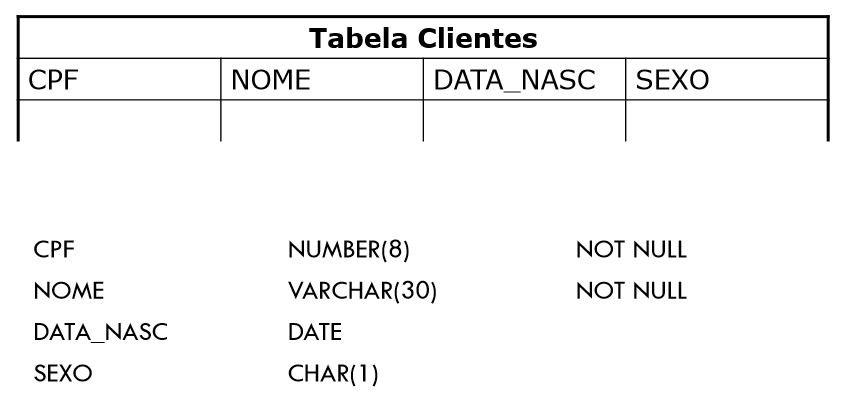
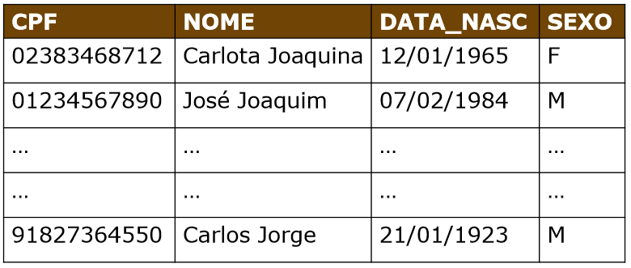
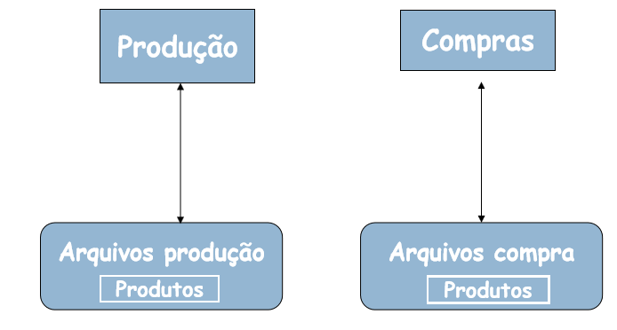
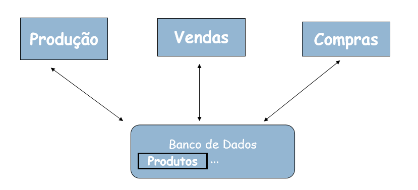
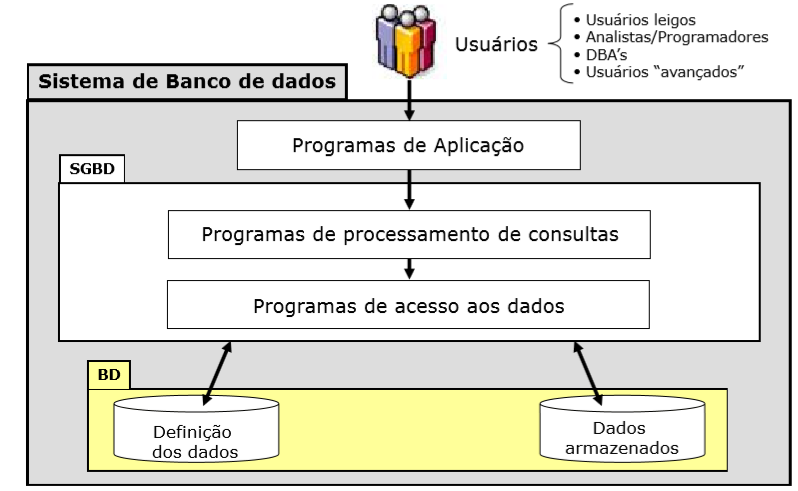
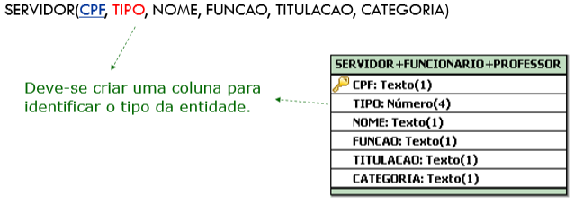
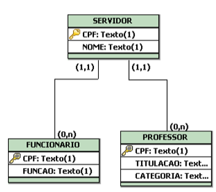
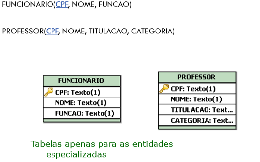
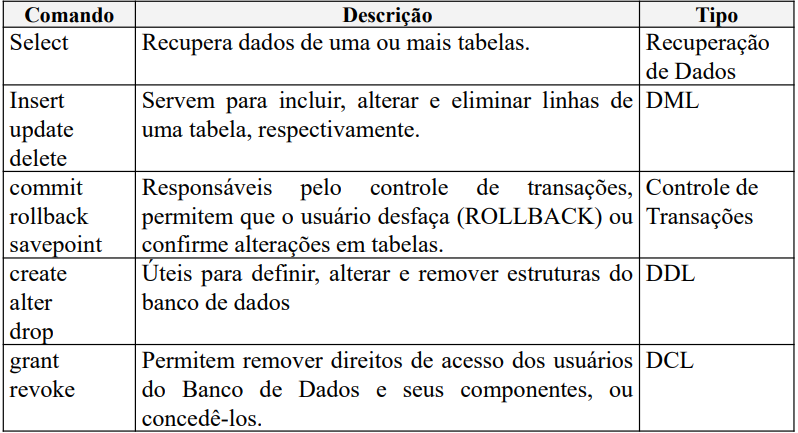
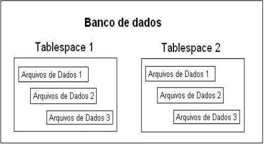

# Banco de dados

Matéria de projetos e modelagens de banco de dados

## Visão geral

De acordo com Heuser, `bancos de dados são um conjunto de dados integrados, que tem por objetivo atender a uma comunidade de usuários`. E neste contexto, os dados são fatos do mundo real que precisam ser armazenados.

Veja que, definir um banco de dados, é criar as estruturas para armazenamento dos dados e especificar as restrições que devem ser impostas aos dados.

Ao falarmos sobre os bancos de dados, é importante ter alguns conceitos bem definidos, são esses:

* Dado -> É a representação da informação
    * Fato do mundo real que está registrado e possui um significado no contexto de um domínio de aplicação;
* Informação -> Significado do dado
    * Fato útil que pode ser extraído a partir dos dados.
* Ex: Dado a data de aniversário de uma pessoa(Dado), descobrir a idade dela(informação).


E lembre-se: `Armazenando informação perdemos a informação !`. Nunca armazene informações e sim dados, isso porque você estará perdendo as informações armazenadas com o tempo, um exemplo simples, o armazenamento da idade de uma pessoa deve ser feito utilizando a data de seu nascimento, e não quantos anos tem direto, pois os anos passam e esta pessoa muda de idade, mas não a data que nasceu.

Há outros conceitos que também tem grande importância na área de banco de dados:
* Esquemas (Estrutura)
    * Definição dos tipos de dados que estão armazenados ou estarão armazenados no banco de dados;
    * É difícil apresentar mudanças.
Exemplo de esquema.


Veja que a tabela clientes representa a estrutura e os tipos de dados que serão armazenados.

* Instâncias (Estado)
    * São os dados e informações de um banco de dados;
    * Conjunto de informações de um banco de dados em um dado momento;
    * Sempre sofre alterações.

Exemplo de instância


Cada registro na tabela acima, representa uma instância de cliente.

* Instância X Esquema - (Exemplos)
    * Esquema: FUNCIONARIO(nome, salario)
    * Instância: Ana Maria, 2.500

### Abstração de dados

Para que seja possível utilizar um banco de dados, ou um SGBD, é importante que o modelo de dados seja conhecido, ou seja, que a estrutura a qual o dado será armazenado seja conhecida, isso é feito principalmente através de representações em modelos conceituais da estrutura e dos dados (Demonstrados nos próximos tópicos).

### Usuários de um banco de dados

É importante que se conheça os usuários que irão fazer a utilização, criação e manutenção do banco, de uma forma geral, os seguintes tipos de usuários fazem a utilização das bases de dados:

* Programadores:
    * Utilizam comandos DML nos programas de aplicação.
* Usuários simples:
    * Utilizam os programas de aplicação sem saber os detalhes de como os dados estão sendo armazenados.
* Analistas:
    * Fazem acesso ao banco de dados através da DML.
* Administrador de banco de dados:
    * Faz o controle total dos dados e dos programas que os acessam;
    * São esses os usuários que fazem a definição e controle da estrutura conceitual, de armazenamento dos dados, além de fazerem modificações e organizações no modelo físico (Estrutura) do banco de dados.

## Sistemas de arquivos

Esta foi uma das primeiras formas encontradas para realizar o armazenamento das informações, aqui os programas que fazem o armazenamento contém todas as funcionalidades de controle e manipulação dos dados.

Veja que este tipo de sistema criava sistemas isolados dentro de uma mesma empresa, ou seja, havia sistemas de áreas relacionadas que trabalhavam de forma separada, sem nenhuma ligação, veja a representação abaixo.

.

Perceba que as áreas fazem a manipulação do mesmo dado (Produto), porém sem haver comunicação entre elas, com este tipo de sistema gera-se redundância de dados.

Veja que, redundância ocorre quando o dado está representado no sistema várias vezes, como exemplo há o Produto, que está em dois lugares diferentes, mesmo se tratando do mesmo produto.

* Desvantagens do sistema de arquivos
    * Inconsistência e redundância dos dados
        * Duplicação de informação;
        * Maior custo de armazenamento;
        * Inconsistência dos dados (Por conta da redundância pode gerar incosistência).
    * Dificuldade de acesso aos dados
        * Não permite acesso/manipulação eficiente dos dados;
        * Acesso não previsto
            * Este é um grande problema presente nos sistemas de arquivos, a lógica dos dados era feita pensando no programa, e não na melhor forma de manipulação, assim quando um novo programa precisava utilizar os dados já existentes surgiam muitos problemas, já que a estrutura do program teria de ser alterada para começar a acessar os dados antigos.
        * Por exemplo: Listar o nome de um cliente X que gasta mais de 2.500 reais, era praticamente impossível, já que mesmo estando armazenado havia problemas para a manipulação.
    * Isolamento dos dados
        * As formas de restringir acesso aos dados eram limitadas.
    * Problemas de integridade
        * Há uma grande dificuldade em realizar as restrições de integridade, os programas que fazem o uso dos dados devem garantir a integridade, e isto é um grande problema, uma vez que, nem sempre essa garantia será seguida.
    * Problemas de atomicidade
        * Operações atômicas, ou ocorrem por inteiro ou não ocorrem.
        * Exemplo: Uma transferência bancária, há apenas duas possíbilidades sucesso ou falha, assim a operação ou ocorre por inteiro, com sucesso, ou não há transferência.
    * Problemas de acesso concorrente
        * Não há controle do acesso concorrente, caso multiplos usuários acessem os dados simultâneamente, a integridade dos dados poderá ser comprometida.

### Tipos de redundância

Acima foi citado que os sistemas de arquivos geram redundância, porém nem sempre a redundância é algo ruim, há sistemas que criam redundância para aumentar a confiabilidade e disponibilidade dos dados, abaixo são listados dois tipos de redundância.

* Redundância controlada de dados
    * Neste caso o *software* é desenvolvido para manter a sincronia entre os dados. Exemplo: Sistemas distribuidos (Aqui há várias instâncias do mesmo dado separadas em diferentes locais)

* Redundância não controlada de dados
    * A responsabilidade em manter a sincronia dos dados é do usuário e não do *software*. Exemplo: O sistema isolado demonstrado acima.
    * Problemas deste tipo de redundância:
        * Entrada repetida do mesmo dado;
        * Incosistência de dados.
    * Solução:
        * Para resolver este tipo de problema faz-se necessário o compartilhamento dos dados

Ao realizar o compartilhamento dos dados, o problema de redundância não controlada dos dados é resolvido, uma vez que os dados estarão centralizados e poderão ser utilizados por diversos sistemas, veja abaixo:



Veja que, todas as áreas que fazem o uso do Produto estarão acessando a mesma informação, assim quando uma área modificar estes dados, as demais saberão e poderão tomar decisão mais acertivas.

## Sistema gerenciador de banco de dados (SGBD)

Este é um sistema de incorpora as funções de definição, recuperação e alteração de dados em um banco de dados. Pode ser definido também como: `Sistema constituído por um conjunto de dados associados a um conjunto de programas para acesso a esses dados.`. Koth & Silberschatz.

Os SGBDs trazem independência entre os dados e os programas que farão a leitura desses. Isso porque todo o controle e formas de armazenamento passarão a ser controlados pelo SGBD, isso evita problemas citados no tópico de sistemas de arquivos onde os programas e dados eram fortemente acoplado, isso porque todos os dados eram estruturados seguindo a lógica definida pelo programa, com isso, quando outro programa fosse fazer as leituras, era necessário a adequação da lógica de leitura e aquisição para a estrutura dos dados.

### Objetivos do SGBD

O SGDB tem por objetivo, isolar os usuários dos detalhes mais internos do banco de dados (Abstração dos dados), além de prover independência entre os dados e as aplicações.

### Vantagens

As características citadas acima sobre o SGBD, trazem várias vantagens para que faz sua utilização, veja as principais:

* Controle de redundância: O SGBD evita que multiplas instâncias do mesmo dado sejam salvos no banco (Lembre-se de que, o ato de salvar várias instânicias do mesmo dado podem trazer problemas de inconsistência nos dados);

* Controle de acesso: O SGBD oferece formas de autorização e segurança que previne acessos indevidos aos dados;

* Persistência para programas e estruturas de dados: Códigos e estruturas de dados são armazenados e gerenciados pelos SGBDs, como objetos (Eles são nomeados, e podem ser invocados, alterados, e excluídos)

* Eficiência no processamento de consultar: A recuperação de informações é realizada de forma bastante rápida, isso por conta de otimizações nos sistemas e ainda, gerênciamento de indíces e de memória;

* Oferecimento de sistemas de *backups* e recuperação: Os SGBDs oferecem formas de *backup* o que torna os dados integros, além de aumentar a dispinibilidade e segurança dos dados;

* Gerantia das restrições de integridade: Os dados armazenados em um banco de dados, são associados a algumas restrições. Essas são sempre verificadas e garantidas.

* Garante padrões;

* Flexibilidade e disponibilidade dos dados.

## Sistemas de banco de dados

De acordo com Date `O sistema de banco de dados é basicamente um sistema de manutenção de registros por computadores, ou seja, um sistema cujo objetivo global é manter as informações e torná-las disponíveis quando solicitado`.

### Ambiente de um sistema de banco de dados

Um sistema de banco de dados é composto por:
* 1° - Usuários que fazem a utilização dos programas de aplicação;
* 2° - Programas de aplicação (Que fazem acesso aos dados);
* SGBD
    * 3° - Programas de processamento de consulas;
    * 4° - Programa de acesso aos dados;
* Banco de dados
    * Definição dos dados;
    * Dados armazenados

A estrutura descrita acima, pode ser visualizada na imagem abaixo:



## Modelos de dados

O modelo de dados (BD) é basicamente um conjunto de conceitos utilizados para descrever um banco de dados.

Pode ser definido também como, `Descrição formal da estrutura de um banco de dados`. (Heuser, 2004).

### Modelo entidade-relacionamento (Conceitual)

Modelo de dados abstratos, que descreve a estrutura de um banco de dados, e essa independe do sistema gerenciador de banco de dados (SGBD).


Dentro deste modelo há alguns conceitos que devem ficar bastante claros, para que haja facilidade no processo de modelagem dos dados.
* Entidade
    * Objeto da realidade modelada, sobre os quais deseja-se manter informações na base de dados.
    * Entidade forte:
        * São as entidades que conseguem existir no modelo de forma idependente.
    * Entidade fraca:
        * Essas são entidades que necessáriamente dependem de alguma outra entidade e/ou relação para existir.
    * Atributo:
        * É uma propriedade que descreve uma entidade.
* Atributos
    * Existem alguns tipos de atributos, são eles
        * Simples
        * Compostos
            * Atributos que são constituidos por outros atributos.
        * Univalorados
        * Multivalorados
            * Valores que podem assumir mais de um valor
        * Armazenados
        * Derivados
            * Valores que são resultantes de cálculos ou valores de outros atributos
    * Atributo chave
        * Valor único de identificação de uma instância, dentro de uma entidade.
        * No caso da entidade fraca, o atributo chave é nomeado `chave parcial`. Quando houver chave parcial, será necessário haver uma chave primária, de alguma entidade forte.
    * Restrição de unicidade
        * Proíbe que duas entidades, em um mesmo conjunto entidade, tenham o mesmo atributo chave (Este é um conceito aplicado com a utilização do `atributo chave`.

* Relacionamentos
    * Os relacionamentos representam as associações existentes entre as entidades.
    * Grau
        * O grau de um relacionamento é o número de tipos de entidade participantes do relacionamento, pondendo ser:
            * Binário (Grau dois);
            * Ternário (Grau três);
            * n-ário (Grau n).
    * Atributos
        * Os atributos nos relacionamentos são usados para descrever uma relação (Associação) entre as entidades envolvidas.   

* Auto-relacionamento:
	* Normalmente um relacionamento associa entidades diferentes. Porém há casos especiais em que o relacionamento entra na mesma entidade, nestas situações surge o conceito de *PAPEL* que identificará o relacionamento.

* Cardinalidade (Mínina, Máxima)
    * A cardinalidade indica a quantidade de instâncias de relacionamento nas quais uma instância de entidade pode participar.
    * Cardinalidade máxima: É o número máximo de ocorrências de entidade associadas à uma ocorrência da entidade em questão através de relacionamento.
    * Apenas duas cardinalidades máximas são de nosso interesse, as:
        * de valor 1;
        * de valor n.
    * Utilizada para classificar relacionamentos binários
        * Classificamos os relacionamentos binários em:
            * 1:1 (um para um);
            * 1:N (um para muitos);
            * M:N (muitos para muitos).    
	* Cardinalidade Mínima
		* Número mínimo de ocorrências de entidades que são associadas a uma determinada ocorrência de uma entidade através de um relacionamento.
		Consideram-se apenas duas cardinalidades:
            * Cardinalidade Mínima 1 = associação obrigatória;
            * Cardinalidade Mínima 0 = associação opcional.

#### Atributo chave

Durante os tópicos do modelo conceitual, foi citado o `atributo chave`, este é um conceito bastante importante. Veja que este atributo chave, pode ser representado de duas formas

* Chave primária
    * Esta é uma chave que deve ser única no banco de dados, ele é utilizado para fazer a identificação de uma única instância de dados;

* Chave estrangeira
    * Este é uma chave primária, porém em uma outra tabela, desta forma ela cria um relacionamento entre as entidades.

#### Modelo conceitual estendido

O modelo conceitual estendido representa um modelo mais acutado, capaz de expressar propriedades e restrições de dados com mais precisão.

Esta é uma forma que permite expressar estruturas de hierarquia e especialização.

* Especialização
    * Processo de definir um conjunto de subtipos (ou subclasses) de um tipo entidade (supertipo ou superclasse), a partir das características que distinguem subconjuntos de entidades individuais.

    * Algumas formas de restrição são aplicadas na especialização:
        * Restrição de disjunção (d): Haverá apenas um subtipo equivalente para o tipo entidade, isso no momento do relacionamento. Para que fique claro, lembre desta restrição como um `OU`, assim em uma relação de funcionários por exemplo, ele não poderá ser engenheiro e secretário, apenas um `OU` outro. Neste caso pode acontecer de, não haver atributos vinculados no subtipo, apenas alguma nova ligação (considerado comportamento);

* Generalização
    * Processo inverso da abstração, no qual as diferenças entre vários tipos entidades são suprimidas na criação de um supertipo.
    * Este é um tipo que pode ser vinculado a uma herança, onde há no supertipo, as características gerais, e nos subtipos há características próprias, que se juntam as características do supertipo.

* Agregação
    * É uma abstração que permite a construção de objetos a partir de seus componentes. Veja que aqui o processo feito é a junção de dois objetos já relacionados, e partindo desta junção um outro objeto é criado.

* Entidade associativa
    * Um relacionamento é uma associação entre tabelas
    * Na modelagem entidade-relacionamento não é permitido
        - Associar uma entidade com um relacionamento;
        - Associar dois relacionamentos entre si.

Para entender melhor a entidade associativa, veja a figura abaixo:


* Modelo com Aspecto Temporal
	* Um banco de dados é dito temporal quando é capaz de armazenar dados passados, presentes e futuros sobre os objetos de interesse para um negócio.

### Modelo lógico (Relacional)

Modelo de dados que representa a estrutura de dados de um banco de dados conforme vista pelo usuário do SGBD. Este é um modelo que depende do SGBD que está sendo utilizado


Um modelo lógico de um banco de dados relacional deve definir quais as tabelas que o banco de dados contém e, para cada tabela, quais os nomes das colunas.

Funcionário(id_funcionario, nome, cargo, id_empresa) `id_empresa referencia Empresa`

Empresa(id_empresa, nome)

### Modelo físico

Este é o modelo que representa análise e aplicação do modelo lógico.


### Transformação do Modelo entidade-relacionamento (Nivel Conceitual) para o Modelo Relacional (Modelo Lógico)

A transformação do modelo entidade-relacionamento para o modelo lógico, representa a transição entre passos de um projeto de banco de dados.

Assim, é importante garantir que as informações contidas no modelo entidade-relacionamento sejam representadas corretamente no modelo relacional (Lógico). Para que haja esta garantia, existem algumas diretrizes que devem ser seguidas.

Veja que, para um único modelo conceitual, existem `N` modelos relacionais, isso porque esta transformação depende da abstração do projeto e dos conceitos envolvidos. Muitas ferramentas já automatizam esta etapa, porém é importante saber como realizá-la, pois qualquer definição equivocada do modelo relacional, afeta a estrutura de todo o projeto.

#### Os sete passos

De acordo com Elmasri & Navathe, para realizar o mapeamento do modelo conceitual para o relacional, são necessários sete passos:

* 1° - Mapear conjuntos de entidades "Fortes";
    * Para cada conjuntos de entidade forte `E` no modelo conceitual, cria-se uma tabela `R` que inclui todos os atributos de `E`;
    * O atributo identificador de `E` passa a ser a chave primária de `R`;
    * Caso exista atributos compostos, inclua todos os atributos elementares que compõem o atributo composto.

* 2° - Mapear conjuntos de entidades "Fracas";
    * Para cada entidade fraca `F` no modelo conceitual que tenha como entidade proprietária (Forte) `E`:
        * Criar uma tabela `R` e incluir todos os atributos de `F`;
        * Incluir o atributo da chave primária da tabela proprietária `E`.
    * Lembre-se, a chave primária de `R` é a compinação da chave primária de `E` e da chave primária de `F`.

* 3° - Mapear conjuntos de relacionamento binário 1:1;
    * Identificar as tabelas das entidades participantes do relacionamento `R`;
    * Escolher uma das tabelas e incluir como chave entrangeira, a chave primária da outra tabela;
    * Incluir todos os atributos do `relacionamento` na relação escolhida para receber a chave.

* 4° - Mapear conjuntos de relacionamento binário 1:N;
    * Identificar a tabela `S` que representa a entidade do lado com cardinalidade n;
    * Incluir como chave estrangeira em `S` a chave primária da tabela que representa a entidade do lado com cardinalidade 1;
    * Incluir os atributos do relacionamento em `S`.

* 5° - Mapear conjuntos de relacionamentos binário M:N;
    * Para cada relacionamento `R` de M:N:
        * Criar uma nova tabela para representar `R`;
        * Incluir como chave estrangeira as chaves primárias das tabelas que participam em `R`. Estas chaves combinadas formarão a chave primária da nova tabela (`R`);
        * Incluir também eventuais atributos de `R` (Atributos do relacionamento que liga as entidades);

* 6° - Mapear conjuntos de relacionamentos N > 2 (Não binários);
    * Para cada relacionamento `R` (n > 2):
        * Criar uma nova tabela `S` para representar `R`;
        * Incluir como chaves estrangeiras as chaves primárias das tabelas que representam as entidades participantes;
        * Incluir eventuais atributos de `R`;
        * A chave primária de `S` é normalmente a combinação das chaves estrangeiras.

* 7° - Mapear atributos multivalorados.
    * Para cada atributo multivalorado `A`, criar uma nova tabela `R`, incluindo um atributo correspondendo a `A` mais a chave primária `K` da tabela que tem `A` como atributo;
    * A chave primária de `R` é a combinação de `A` e `K`.

Porém além dos casos descritos acima, o modelo pode conter generalizações e especializações, assim, faz-se necessário a utilização de um passo a mais

Para casos em que há generalização/especialização, há três alternativas para o mapeamento:

* 1° - Tabela única para entidade genérica e suas especializações;
    * Neste caso cria-se uma coluna para identificar o tipo da entidade, e todos os atributos de cada tipo ficarão na mesma tabela

Exemplo:


* 2° - Tabela para a entidade genérica e as entidades especializadas;
    * Nesta alternativa cria-se tabelas para cada uma das especializações, e essas são ligadas com a tabela especializada/generalizada utilizando a chave primária da mesma;

Exemplo:


* 3° - Tabelas apenas para as entidades especializadas.
    * Por fim, nesta alternativa, cria-se tabelas apenas para as especializações

Exemplo


OBS: Esta alternativa não se aplica para especializações parciais

Para lembrar:
* Generalização/Especialização total: Toda instância da super-classe precisa estar associada a uma instância correspondente de alguma sub-classe;
* Generalização/Especialização parcial: Pode haver instância da super-clase sem uma instância correspondente em nenhuma sub-classe

#### Regras de integridade/restrições do modelo relacional

* Integridade de identidade (ou entidade)
    * A chave primária não pode conter um valor nulo (*null*) e identifica exclusivamente cada linha de dados em uma tabela.

* Integridade referencial
    * Se uma determinada tabela `A` possui uma chave estrangeira, a qual é chave primária em outra tabela `B`, então ela deve ser:
        * Igul a um valor de chave primária existente em `B`; ou
        * ser nula (*null*)

    * Isso ocorre porque não pode existir na chave estrangeira, um valor que não exista na tabela na qual ela é chave primária.

* Integridade de domínio
    * O valor de um campo deve obedecer a uma definição de valores admitidos para coluna, como tamanho em caracteres, tipo de valores (Número, data, varchar, etc)

As regras citadas acima são regras que representam a garantia de que as tabelas guardam informações compatíveis. Por isso são de extrema importância para a confiabilidade das informações contidas no banco de dados.

OBS: Lembre-se *null* não é o valor zero e também não é um caracter de espaço, ou em branco, é simplesmente a não-existência de conteúdo neste campo.

## Formas normais

`A qualidade de um projeto de banco de dados pode ser medida a partir da verificação da forma normal que ele alcança`. Marques Peres, Sarajane.

`Normalização é um processo a partir do qual se aplicam regras a todas as tabelas do banco de dados com o objetivo de evitar falhas no projeto, como redundância de dados e mistura de diferentes assuntos numa mesma tabela`. Vanessa, Izabela.

A normalização é um conceito que se baseia em formas normais. Porém, o que são formas normais ?

    Uma forma normal é uma regra que deve ser obedecida por uma tabela.

Com a utilização da normalização é possível eliminar:
* Redundância;
* Atributo multivalorado;
* Grupo repetitivo;
    - Conjunto de atributos de uma entidade que ocorre várias vezes para cada ocorrência da Entidade.
* Dependência funcional parcial;
    - Ocorre quando um atributo depende apenas de parte de uma chave primária composta;
* Dependencia funcional transitiva.
    - Ocorre quando um atributo além de depender da chave primária da tabela, depende de outra coluna ou conjunto de colunas da tabela.

A forma normal atribuida a algum projeto de banco de dados, está ligado a relação que tenha a menor forma normal.

`Ao projetar um banco de dados, se temos um modelo de entidades e relacionamentos e a partir dele construirmos o modelo relacional seguindo as regras de transformação corretamente, o modelo relacional resultante estará, provavelmente, normalizado. Mas, nem sempre os modelos que nos deparamos são implementados dessa forma e, quando isso acontece, o suporte ao banco de dados é dificultado.`. Vanessa, Izabela.

Para qualquer um dos casos citados pela Izabela, sendo o primeiro, o modelo relacional resultante de um mapeamento utilizando os sete passos, ou por conta de um modelo que não foi construido seguindo os padrões até aqui demonstrados faz-se necessário o uso da normalização, seja para confirmar a consistência do banco de dados (Quando há o primeiro caso), ou quando é necessário normalizar o modelo (Quando há o segundo caso).

Sendo assim será demonstrado as regras que devem ser aplicadas para que se tenha, bancos de dados mais íntegros, sem redundâncias e inconsistências.

### Primeira forma normal (1FN) - Eliminar grupos repetitivos/não conter tabelas aninhadas

`Todos os atributos de uma tabela devem ser atômicos, ou seja, a tabela não deve conter grupos e nem atributos com mais de um valor. Para deixar nesta forma normal, é preciso identificar a chave primária da tabela, identificar a(s) coluna(s) que tem(êm) dado repetido e, por fim, criar uma relação entre a tabela principal e a tabela secundária`. Vanessa, Izabela.

Perceba que, em resumo o que foi dito pela Vanessa nada mais é que, a primeira forma normal exige que os atributos sejam atômicos.

Veja um exemplo de normalização para 1FN.

A tabela abaixo não está na forma 1FN

    DEPTO(numero, nome, gident, localizacoes)

Perceba que o localizacoes é um atributo multivalorado, e a primeira forma normal requer atributos atômicos, para resolver o problema, será realizado a decomposição (Assim como citado anteriormente).

    DEPTO(numero, nome, gident)
    DEPTO_LOCS(numero_depto, localizacao)

Outro exemplo:

    FUNC_PROJ(Ident, fnome, pnumero, horas)

Neste caso o pnumero e horas são atributos aninhados, o que também não é permitido da 1FN, para resolver isso a entidade será decomposta

    FUNC_PROJ1(Ident, fnome)
    FUNC_PROJ2(Ident, pnumero, horas)

Pronto, entidade novas criadas para resolver o problema. O ponto interessante é que, cada uma das entidades ficaram com suas devidas características, isso porque antes o funcionário carregava consigo características de seu relacionamento com o projeto, o que não ocorre mais, já que há uma tabela apenas para descrever este relacionamento.

### Segunda forma normal (2FN) - Eliminar dependência parcial

Para estar na segunda forma normal, é necessário antes estar na primeira forma normal.

`Todos os atributos não chaves da tabela devem depender unicamente da chave primária (não podendo depender apenas de parte dela). Para deixar na segunda forma normal, é preciso identificar as colunas que não são dependentes da chave primária da tabela e, em seguida, remover essa coluna da tabela principal e criar uma nova tabela com esses dados`. adaptado de: Vanessa, Izabela. 2011.

Por exemplo:

    ALUNOS_CURSOS(id_aluno, id_curso, nota, descricao_curso)

Nesta tabela, o atributo `descricao_curso`, depende apenas do `id_curso`, sendo assim será criado uma tabela para armazenar essas informações.

    ALUNOS_CURSOS(id_aluno, id_curso, nota)
    CURSOS(id_curso, descricao_curso)


### Terceira forma normal - Ideal em projetos de banco de dados. (3NF) - Eliminar dependência funcional transitiva

Para que o modelo esteja nesta forma normal, é necessário que os atributos não sejam dependentes que chaves que não a primária. Para resolver este problema, é preciso identificar as colunas que são dependentes das outras colunas não chave e extraí-las para outra tabela. Veja um exemplo

    FUNCIONARIOS(id, nome, id_cargo, descricao_cargo)


Veja que, o atributo `descricao_cargo` depende exclusivamente de `id_cargo`, que é um atributo não chave, e assim será necessário criar uma nova tabela com esses atributos.

    FUNCIONARIOS(id, nome, id_cargo)
    CARGOS(id_cargo, descricao)

## Structured Query Language (SQL)

O Structured Query Language (SQL) é a linguagem padrão para os bancos de dados relacionais, neste tópico, alguns aspectos desta serão tratados.

## Tipos de comandos SQL

Os comandos em SQL podem ser divididos em categorias, sendo algumas delas (Tratadas durante as aulas):
- Data Definition Language (DDL)
    - Esta é a linguagem SQL que será utilizada para realizar a criação e definição das estruturas que serão utilizadas para o armazenamento dos dados.

- Data Manipulation Language  (DML)
    - Esta é a linguagem SQL que será utilizada para fazer a manipulação dos dados que estão armazenados.
    
- Data Query Language (DQL)
    - Utilizada para realizar a recuperação dos dados que estão armazenados.

- Data Control Language (DCL)
    - Esta é utilizada para realizar o controle de acesso aos dados

A tabela abaixo faz o descritivo destas categorias e de algumas outras:



Com estes conceitos básicos definidos, é possível começar a realizar a seleção por dados dentro de um SGBD, os próximos tópicos irão abordar tanto a criação de tabelas, sua manipulação e recuperaão de dados.


## Definição de dados (DDL) 
Esta é a linguagem SQL que será utilizada para realizar a criação e definição das estruturas que serão utilizadas para o armazenamento dos dados. Dentro desse bloco encotramos os seguinte comandos:

1. CREATE
2. ALTER
3. DROP

### Create
Comando responsável por criar a estruturar de uma tabela dentro do SGBD.
A sintaxe baśica dele consiste no seguinte comando.

* Sintaxa do CREATE
``` sql
CREATE TABLE nome_schema.nome_table (
    coluna_1 tipo_dado colum_constraint,
    coluna_2 tipo_dado colum_constraint,
    ...
    table_constraint
);
```

Nesta sintaxe: 

1. Especificar o nome da tabela e esquema(schema) no qual a nova tabela será criada
2. Lista de todas as colunas da tabela com seu [tipo de dados](https://www.oracletutorial.com/oracle-basics/oracle-data-types/) e uma restrição de coluna como: NOT NULL, primary key, check
3. Restrições da tabela como chave estrangeira(foreign key), primary key, etc.


* Example CREATE
```js
CREATE TABLE bd_faculdade.alunos (
ra_aluno NUMBER primary key,
nome_aluno VARCHAR not null,
cpf_aluno VARCHAR(13) not null,
cod_curso number(4) not null, 
CONSTRAINT fk_cod_curso FOREIGN KEY(cod_curso)
REFERENCES curso(cod_curso)
)
```

OBS: Neste exemplo de comando criamos a restrição de `primary key` a nível de coluna, contudo é possível criá-lo através de nível de tabela como no comando abaixo:

```js
CREATE TABLE bd_faculdade.alunos (
ra_aluno number(4),
nome_aluno varchar(100) not null,
cpf_aluno VARCHAR(13),
cod_curso number(4) not null,
CONSTRAINT uk_cpf UNIQUE(CPF), # Constraint Unique CPF
CONSTRAINT pk_aluno PRIMARY KEY(ra_aluno), # Constraint PK 
CONSTRAINT fk_cod_curso FOREIGN KEY(cod_curso) #Constraint FK
REFERENCES curso(cod_curso)
)
```

### Alter
Comando responsável por alterar a estruturar de tabelas já criadas. Com ele é possível: Aumentar tamanho da coluna, acrescentar nova coluna, adicionar novo constraint.

* Sintaxe básica do Alter Table

```sql
ALTER TABLE NOME_DA_TABELA
    [ADD definição de coluna,]
    [MODIFY definição de coluna,]
    [DROP COLUMN nome,]
    [RENAME COLUMN antigo TO novo,]
    [ADD CONSTRAINT definição de constraint,]
    [MODIFY CONSTRAINT definição de constraint,]
    [DROP CONSTRAINT nome,]
    [RENAME CONSTRAINT antigo TO novo,]
    [ENABLE | DISABLE constraint,]
    [RENAME TO novo_nome];
```

Segue abaixo uma lista de exemplos de uso do comando alter table:

#### Adicionando Colunas 

Sintaxe:

```sql
ALTER TABLE NOME_DA_TABELA 
ADD (definição de coluna)
```

Exemplo: 

```sql
ALTER TABLE PEDIDO ADD valor_total number(8,2)
ALTER TABLE PEDIDO ADD ped_data DATE
```

PS: Observe que ao realizar tal comando o seguinte acontece:

1. A coluna torna-se a última coluna da tabela
2. Se já existirem registros na tabela, então a coluna será NULA para todos os registros.

#### Modificando colunas

Sintaxe: 

``` sql 
ALTER TABLE NOME_DA_TABELA 
MODIFY [Definição de coluna]
```

Exemplo: 

```sql 

ALTER TABLE PEDIDO MODIFY PED_COD number(8)

```

PS: Observe que ao realizar tal comando a seguinte regra existes:

**Apenas é possível para tipos equivalentes**

* Exemplo:
* number(4) -> number(8)
* varchar(4) -> varchar(8)


**Demais modificações só são permitidas se a coluna não tiver dado inserido**

#### Excluindo Colunas
Sintaxe: 

``` sql
ALTER TABLE NOME_DA_TABELA 
DROP COLUMN NOME_COLUNA
```

Exemplo :

```sql 
ALTER TABLE PEDIDO DROP COLUMN PED_DATA
```

**NOTE QUE: Não são permitidas exclusões de colunas com alguma constraint associada! É preciso excluir a restrição antes.**


#### Renomeando colunas

Sintaxe: 
```sql
ALTER TABLE NOME_DA_TABELA
RENAME COLUMN NOME_ANTIGO TO NOME_NOVO
```

Exemplo: 

```sql
ALTER TABLE PEDIDO
RENAME COLUMN PED_DATA TO PED_DATA_CADASTRO
```

#### Incluindo constraints

Sintaxe : 

```sql
#Primary key
ALTER TABLE NOME_DA_TABELA
ADD CONSTRAINT NOME_RESTRICAO PRIMARY(COLUNA_PG)
#Foreign key
ALTER TABLE NOME_DA_TABELA
ADD CONSTRAINT NOME_RESTRICAO FOREIIGN KEY(COLUNA_PG) REFERENCES TABELA_REFERIDA (COLUNA_PK)
#Unique
ALTER TABLE NOME_DA_TABELA
ADD CONSTRAINT NOME_RESTRICAO UNIQUE(COLUNA_UK)
```

Exemplo: 
```sql
#Primary key
ALTER TABLE PEDIDO 
ADD CONSTRAINT PK_PEDIDO PRIMARY KEY(PEDIDO)
#Foreign key
ALTER TABLE PEDIDO
ADD CONSTRAINT FK_CLI_COD FOREIGN KEY(CLI_COD)
REFERENCES CLIENTE(CLI_COD)
#Unique
ALTER TABLE CLIENTE
ADD CONSTRAINT UK_CLI_CPF UNIQUE(CLI_CPF)
```

#### Excluindo Constraints

Sintaxe: 

```sql
ALTER TABLE NOME_DA_TABELA
DROP CONSTRAINT NOME_RESTRICAO [CASCADE]
```
* Comando válido para qualquer restrição
* A Cláusula CASCADE elemina as constraints dependentes.

Exemplo: 
```sql
ALTER TABLE CLIENTE
DROP CONSTRAINT UK_CLI_CPF CASCADE
```

#### Modificando constraints 

Sintaxe: 

```sql
ALTER TABLE NOME_DA_TABELA
RENAME CONSTRAINT NOME_ANTIGO to NOME_NOVO
```

Exemplo:

```sql
ALTER TABLE PROJETO RENAME CONSTRAINT
PK_PROJETO_COD_PROJETO TO PK_PROJETO
```

#### Ativando/Desativando Constraint

Sintaxe: 
```sql
ALTER TABLE NOME_DA_TABELA [ENABLE | DISABLE]
CONSTRAINT NOME_CONSTRAINT [CASCADE]
```

* Enable: Habilita constraint
* Disable: Desabilita constraint
* Cascade: aplica a mesma regra para constraints dependentes

```sql
ALTER TABLE CLIENTE
DISABLE CONSTRAINT PK_CLI_COD CASCADE
```
#### Renomeando table

Sintaxe :

```sql
ALTER TABLE NOME_DA_TABELA
RENAME TO NOME_NOVO
```
Exemplo:

```sql
ALTER TABLE CLIENTE
RENAME TO CLI
```
### Drop

Comando responsável por apagar toda a estrutura de uma tabela

Sintaxe: 

```sql
DROP TABLE NOME_DA_TABELA [CASCADE]
```

Exemplo:

```sql

DROP TABLE CLI
```

### View

View é uma tabela virtual baseada no conjunto de resultados de uma consulta SQL.

Mostra sempre resultados de dados atualizados, pois o motor do banco de dados recria os dados toda vez que um usuário consulta a visão.
 
 * Uso do View:
 Evita que usuários não autorizados tenham acesso a todos os dados de uma tabela
 Os dados não estão fisicamente armazenados
 Evita redundâncias
 
 
* Sintaxe do VIEW
```sql
CREATE (OR REPLACE, FORCE, NOFORCE) VIEW (NOME) AS 
    SELECT 
        (COLUNAS) (APELIDO)
    FROM 
        (TABELA)
    WHERE (CONDIÇÕES);
```

## Manipulação de dados(DML) :warning:

Este tópico ainda está em construção. Caso queira, você pode ajudar a escrever ele. :bowtie:

## Consulta de dados(DQL)

Estas são as formas utilizadas para realizar a consulta dos dados que estão armazenados na base dados. Neste tópico será feito o uso de diversos comandos para a manipulação dos dados

### Selects

Esta é a forma de recuperar os dados **'base'**, e será utilizada por todos as demais formas que aqui serão apresentadas. O conceito do `select` é bastante simples, recuperar os dados, através de específicações de **projeção**, **seleção** e **junção**.

Tem-se que:

- Projeção: Lista coluna de uma tabela;
- Seleção: Escolhe as linhas de uma tabela;
- Junção: Faz a junção de duas tabelas.

Para realizar a utilização deste em um SGBD é bastante simples, a sintaxe é apresentada abaixo:

```sql
SELECT * {coluna / expressão [apelido], ...}
FROM tabela;
```

Para que se tenha um exeplo real, levaremos em consideração a seguinte tabela:


| Nome  | Cargo          | Salario |
|-------|----------------|---------|
| João  | Programador    | 2500    |
| Maria | Desenvolvedora | 3200    |


Caso queira-se recuperar todas as informações presentes nesta tabela, o `select` deverá ser utilizado, veja:

```sql
SELECT 
    *
FROM
    tabela;
```


Veja que este não é um processo muito complicado de ser realizado.

Perceba que, no `select` é possível fazer a utilização de operadores ariméticos. [+ - * /]. Para exemplificar seu uso, será feito a seleção dos dados, com um aumento de 100 reais no salário de cada linha da tabela.


```sql
SELECT
    Nome,
    Salario + 100
FROM
    tabela;
```


Porém apenas esta seleção básica pode não resolver o problema. Para isso é possível ainda com o `select` filtrar e classificar os dados, com a simples utilização de um novo comando junto ao `select`, o `where`

Seu funcionamento não é muito complicado, assim será feito um exemplo prático com o mesmo, neste irei filtrar os funcionários pelo salário, buscando apenas aqueles que ganham acima de R$ 3000.

```sql
SELECT
    Nome,
    Salario
FROM
    tabela
WHERE
    Salario > 3000;
```


No exemplo acima o comparador binário `>` foi utilizado, mas é possível utilizar também:

- `=` (Igual);

- `>` (Maior que);

- `>=` (Maior igual);

- `<` (Menor que);

- `<=` (Menor igual);

- `<>` (Menor maior que)

O `where`, pode também ser utilizado para realizar a junção de tabelas, mas neste processo é importante que se tenha atenção, pois discuidos no momento da junção utilizando o `where`, pode gerar os chamados produtos cartesianos, veja abaixo um exemplo que causa problemas e em seguida, um exemplo com a forma correta de se realizar junções com o `where`.

`Exemplo ERRADO!`

```sql
SELECT
    *
FROM
    tabelaA,
    tabelaB
```


Neste caso no momento da junção será realizado a multiplicação de todos os elementos da `tabelaA` com a `tabelaB`, gerando assim um produto cartesiano.

`Exemplo CORRETO!`

```sql
SELECT 
    *
FROM
    tabelaA,
    tabelaB
WHERE
    tabelaA.id = tabelaB.id;
```


Veja que isto ocorre pois os produtos cartesianos aparecem quando a condição de junção (where) é inválida ou simplesmente não é específicada.

### Junções

Além da junção de produto cartesiano demonstrado anteriormente, existem alguns tipos que são interessantes de serem compreendidos.

#### Junção interna (Inner Join)

As junções internas, ou **inner joins** são caracterizadas por uma seleção que retorna apenas os dados que atendem a verificação de ligação nas duas tabelas que estão sendo 'juntadas'.

Esta é a principal caracaterística deste tipo de junção.

Para implementar junções deste tipo é possível utilizar o próprio comando `INNER JOIN`, veja um exemplo, onde será feito a união da tabelaA e da tabelaB.

```sql
SELECT
    a.nome,
    b.nome
FROM
    tabelaA a
INNER JOIN
    tabelaB b
ON
    a.id = b.id;
```

Veja que, a característica descrita anteriormente é válida, assim, somente as linhas que tiverem alguma ligação serão exibidas na nova tabela que está sendo gerada.

#### Junção externa (Outer Join)

Diferente das junções internas, as externas não exigem que haja uma ligação entre os elementos que estão sendo 'juntados'. Porém a permanência dos itens na tabela virtual que está sendo criada depende do lado que foi admitido que os elementos não tenham correspondência.

##### Left Outer Join

Neste caso a primeira tabela especificada no momento do `select` terá todos os seus elementos persistidos, mesmo aqueles que não tem qualquer ligação com os elementos da segunda tabela especificada, gerando assim um resultado, com todos os elementos da tabela A (Primeira a ser declarada), mais os elementos da tabela B (Segunda a ser declarada) que tem alguma correspondência em A.

##### Right Outer Join

Esta é a operação inversa da citada anteriormente, aqui a tabela levada em consideração é a segunda a ser declarada no `select`, desta forma, na tabela gerada como resultado, todos os elementos de B (Segunda tabela a ser declarada) serão mantidos mesmo que não tenham correspondência com A, e também os elementos de A, estes que são somente aqueles que tem alguma ligação com B.

##### Full Outer Join

No caso deste junção, todos os elementos de todas as tabelas serão mantidos, tendo ligação ou não, e aqui, os elementos que não tem ligação entre as tabelas que estão sendo 'juntadas', recebem campos com valores null, nos locais onde haveria uma chave de ligação, por exemplo.

#### Junção idêntica (Equi Join)

Esta é uma junção que é feita utilizando o operador de igualdade (`=`), assim, toda e qualquer junção que é relacionada com o operador de igualdade pode ser considerada uma junção `Equi Join`. Neste as tabelas tem algum tipo de ligação, equivalência.

#### Junção não-identica (Non Equi Join)

Ao contrário das `Equi Joins`, as `Non Equi Joins` utilizam como operador para fazer as junções, qualquer operador que não o de igualdade, sendo assim:

- `>` (Maior que);

- `>=` (Maior igual);

- `<` (Menor que);

- `<=` (Menor igual);

- `<>` (Menor maior que)

Neste tipo de junção, as tabelas não tem uma equivalência direta, e sim, valores que diferem e podem ser comparados, sendo maior, menor, etc.

#### Natural Joins

O Natural join é uma forma facilitada de se escrever `INNER JOIN`, neste não é preciso especificar os atributos que serão utilizados no momento da junção, porém, neste espera-se que, os nomes dos atributos que deverão ser utilizados na comparação sejam idênticos.

Veja o exemplo abaixo:

```sql
-- Código com INNER JOIN
SELECT
    a.nome
FROM
    tabelaA a
INNER JOIN
    tabelaB b
ON
    a.id = b.id;
```

```sql
-- Código com Natural Join
SELECT
    a.nome
FROM
    tabelaA a NATURAL JOIN tabelaB b;
```

Veja que os códigos são equivalentes, porém, a escrita tornou-se mais simples.

OBS: Caso quira-se juntar tabelas com `Natural Join` e não haja campos de atributos relevantes iguais, não ocorrerá erros, e sim um resultado com diversos valores duplicados. (Isto no caso do Oracle, que tentará fazer uma junção mesmo não tendo atributos de mesmo nome).

#### Self-Joins

Os `Self joins` são usados para realizar o relacionamento de uma tabela com ela mesma, logicamente, com o atributo comparador diferente. Este é um tipo de junção muito útil quando há na tabela um auto-relacionamento.

Para que se entenda, veja a tabela abaixo:

| ID | Nome        | Cargo          | Salario | CHEFE |
|----|-------------|----------------|---------|-------|
| 1  | Bob esponja | Gerente        | 50.00   | NULL  |
| 2  | Aninha      | Desenvolvedora | 150.00  | 1     |
| 3  | Pedrinho    | Desenvolvedor  | 150.00  | 1     |

Nela há um auto-relacionamento, onde a tabela faz referência a ela mesma, isto no campo `CHEFE`.

Caso seja necessário saber o cargo do chefe dos funcionários, um `Self Join` é uma boa solução, veja:

```sql
SELECT
    f1.nome,
    f1.cargo
FROM
    funcionario f1
INNER JOIN
    funcionario f2
ON
    f1.id = f2.chefe;
```

Perceba que é uma junção com a própria tabela, porém em um campo diferente.

### Operadores de conjunto

Estes são operadores que permite ao desenvolvedor aplicar junções parecidas com as dos conjuntos, visto em matemática. Neste usa-se dois tabelas, para gerar uma terceira.

Há algumas regras na aplicação destes operadores, mas aqui irei citar apenas alguns:

- As colunas a serem juntadas devem ter as mesmas dimensões;
- As colunas devem possuir os mesmos tipos de dados;
- Os nomes representados no resultado, serão os da primeira coluna especificada.

As regras citadas acima são as mais relevantes para a aplicação prática dos operadores. Lembre-se, aqui a junção é feita com base nas colunas originais, logo a junção é dita `Vertical`, ou seja, uma junção de linhas.

Com as definições feitas, veja quais são estes operadores:

#### UNION (União)

Este é um operador que permite a reunião de dois conjuntos (Desde que estes sigam as regras citadas acima).

Seu uso é exemplificado abaixo:

```sql
SELECT
    nome
FROM
    tabelaA
UNION
SELECT
    nome
FROM
    tabelaB;
```

O resultado de um `UNION` é um conjunto, ou seja, sem elementos repetidos, mas caso queira-se a exibição de elementos duplicados, pode-se utilizar o `UNION ALL`, que funciona da mesma forma, porém exibe todos os elementos.

O `UNION ALL` pode ser mais rápido, pois ele não realiza um **sort** para a remoção das duplicatas.

#### Intersect (Intersecção)

O operador intersect, cria um conjunto com os elementos que fazem a intersecção nos dois conjuntos selecionados, veja:

```sql
SELECT
    idade
FROM
    tabelaA
INTERSECT
SELECT
    idade
FROM
    tabelaB;
```

Ele fará o retorno somente dos elementos que fazem intersecção.

#### MINUS (Diferença)

Por fim, o minus é um operador que faz o retorno apenas da diferença entre os conjuntos.

```sql
SELECT
    idade
FROM
    tabelaA
MINUS
SELECT
    idade
FROM
    tabelaB;
```

### Funções de grupo

As funções de grupo atuam sobre um grupo de linhas, trazendo diversos tipos de resultados. As principais funções de grupo são:

- AVG: Retorna a média dos valores presente no grupo de linhas especificados;
- COUNT: Conta os elementos no conjunto especificado;
- MIN: Retorna o valor mínimo presente no conjunto;
- MAX: Retorna o valor máximo presente no conjunto.

Junto a estes, é necessário realizar a utilização do `GROUP BY`, esta que é uma cláusula que permite que o resultado das funções de grupo sejam feitos levando em consideração algum grupo de colunas especificados.

### Subconsulta

Como é sabido, cada consulta retorna uma nova tabela, as subconsultas trabalham sobre este conceito, nelas, valores e resultados de junções, ou aplicação de função de grupo, podem sem comparados com outros resultados de outras consultas.

Para que se fique claro, veja o exemplo abaixo, da aplicação de uma subconsulta:

```sql
SELECT
    a.nome
FROM
    tabelaA a,
    (SELECT * FROM tabelaB) b
WHERE
    a.nome = b.nome
```

Perceba que, dentro de uma consulta há outra, este conceito permite que diversas formas de consultar os dados sejam feitas.

## Trigger

Trigger basicamente é um gatilho, que é ativo quando uma determinada ação ocorre dentro do banco de dados. Esta ação pode ser definida no momento da criação da trigger.

O uso da trigger é muito importante e facilita diversas atividades, desde a geração de histórico até mesmo a auditoria, com elas é possível fazer coisas como:

- Validação de Dados;
- Verificação de integridade dos dados;
- Arquivamento de registros excluidos.

`Sintaxe das triggers`

```sql
CREATE (OR REPLACE) TRIGGER NOME_DO_TRIGGER
    -- Acima você pode definir se deseja criar ou substituir um trigger existente
(BEFORE OU AFTER)
-- Acima você pode definir se deseja que o comando seja executado antes ou depois de executada determinada ação
INSERT OR DELETE OR UPDATE 
-- Acima você define que ação deve ser executada para que seja disparado o trigger
    ON TABEL_NOME 
    -- ACIMA VOCÊ DEFINE EM QUAL TABELA SERÁ EXECUTADO DETERMINADO TRIGGER
    FOR EACH ROW 
    -- ACIMA VOCÊ DEFINE QUE O CÓDIGO CONTIDO SERÁ EXECUTADO PARA CADA LINHA
    WHEN
        -- ACIMA VOCÊ DEFINE A CONDIÇÃO EX: WHEN(ALUNO_IDADE > 19)
    DECLARE
        -- AQUI VOCÊ DECLARA VARIÁVEIS PARA UTILIZAR NO TRIGGER EX: DECLARE IDADE NUMBER;
    BEGIN
        -- AQUI É O CORPO DO TRIGGER, ONDE É INSERIDO OS COMANDOS PL/SQL
    END;
```

Por exemplo: Você está criando um banco de dados para uma escola, após criar a tabela "PROFESSORES" você quer que sempre que seja inserido um novo "PROFESSOR" nesta tabela, a mensagem "Professor inserido com sucesso" seja exibida.

```sql
CREATE OR REPLACE TRIGGER PROF_MSG
BEFORE INSERT
    ON PROFESSORES
        FOR EACH ROW 
        BEGIN
            DBMS_OUTPUT.PUT_LINE('Professor inserido com sucesso');
        END;
```

## Sobre o SGBD utilizado

Conforme já explicado no documento, os *softwares* utilizados para a gerência dos bancos de dados são os SGBDs, isso é feito por conta de inumeras vantagens. Durante as aulas de banco de dados, o SGBD padrão utilizado foi o Oracle 11G Express. Aqui será feito uma pequena descrição de sua forma de armazenamento.

"O Oracle aloca espaço físico para os `bancos de dados`, utilizando definições hierarquicas". Pasquini, Juliana.

Abaixo há a explicação dos níveis hierarquicos citados pela professora durante as aulas.

- Bancos de dados: Uma coleção lógica de dados compartilhados armazenados em `tablespaces`;
    - Tablespace: Repositório lógico para dados físicamente agrupados;
        - Arquivos de dados: Arquivo de dados físico pertencendo a uma única `tablespace`.

A estrutura descrita pode ser visualizada na figura abaixo: 




## Referências bibliográficas

Pet news. (2018). Normalização de Bancos de Dados Relacionais. [online] Available at: http://www.dsc.ufcg.edu.br/~pet/jornal/maio2011/materias/recapitulando.html [Acessado em 14 Abril de 2018]
