# Banco de dados

Matéria de projetos e modelagens de banco de dados

## Visão geral

De acordo com Heuser, `bancos de dados são um conjunto de dados integrados, que tem por objetivo atender a uma comunidade de usuários`. E neste contexto, os dados são fatos do mundo real que precisam ser armazenados.

Veja que, definir um banco de dados, é criar as estruturas para armazenamento dos dados e especificar as restrições que devem ser impostas aos dados.

Ao falarmos sobre os bancos de dados, é importante ter alguns conceitos bem definidos, são esses:

* Dado -> É a representação da informação
    * Fato do mundo real que está registrado e possui um significado no contexto de um domínio de aplicação;
* Informação -> Significado do dado
    * Fato útil que pode ser extraído a partir dos dados.

E lembre-se: `Armazenando informação perdemos a informação !`. Nunca armazene informações e sim dados, isso porque você estará perdendo as informações armazenadas com o tempo, um exemplo simples, o armazenamento da idade de uma pessoa deve ser feito utilizando a data de seu nascimento, e não quantos anos tem direto, pois os anos passam e esta pessoa muda de idade, mas não a data que nasceu.

Há outros conceitos que também tem grande importância na área de banco de dados:
* Esquemas (Estrutura)
    * Definição dos tipos de dados que estão armazenados ou estarão armazenados no banco de dados;
    * É difícil apresentar mudanças.
Exemplo de esquema.
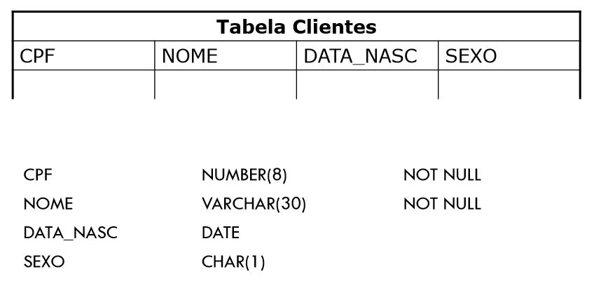

Veja que a tabela clientes representa a estrutura e os tipos de dados que serão armazenados.

* Instâncias (Estado)
    * São os dados e informações de um banco de dados;
    * Conjunto de informações de um banco de dados em um dado momento;
    * Sempre sofre alterações.

Exemplo de instância
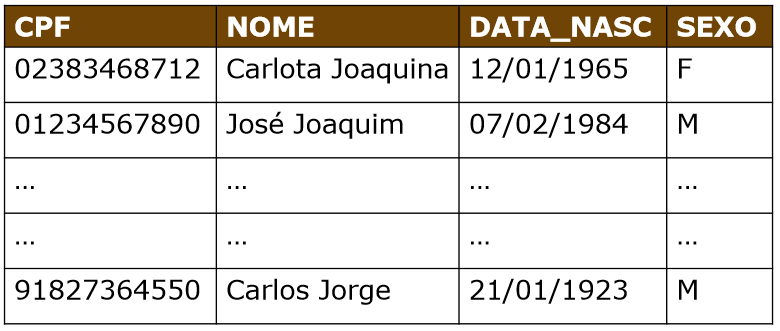

Cada registro na tabela acima, representa uma instância de cliente.

* Instância X Esquema - (Exemplos)
    * Esquema: FUNCIONARIO(nome, salario)
    * Instância: Ana Maria, 2.500 

### Abstração de dados

Para que seja possível utilizar um banco de dados, ou um SGBD, é importante que o modelo de dados seja conhecido, ou seja, que a estrutura a qual o dado será armazenado seja conhecida, isso é feito principalmente através de representações em modelos conceituais da estrutura e dos dados (Demonstrados nos próximos tópicos).

### Usuários de um banco de dados

É importante que se conheça os usuários que irão fazer a utilização, criação e manutenção do banco, de uma forma geral, os seguintes tipos de usuários fazem a utilização das bases de dados:

* Programadores:
    * Utilizam comandos DML nos programas de aplicação.
* Usuários simples:
    * Utilizam os programas de aplicação sem saber os detalhes de como os dados estão sendo armazenados.
* Analistas:
    * Fazem acesso ao banco de dados através da DML.
* Administrador de banco de dados:
    * Faz o controle total dos dados e dos programas que os acessam;
    * São esses os usuários que fazem a definição e controle da estrutura conceitual, de armazenamento dos dados, além de fazerem modificações e organizações no modelo físico (Estrutura) do banco de dados. 

## Sistemas de arquivos

Esta foi uma das primeiras formas encontradas para realizar o armazenamento das informações, aqui os programas que fazem o armazenamento contém todas as funcionalidades de controle e manipulação dos dados.

Veja que este tipo de sistema criava sistemas isolados dentro de uma mesma empresa, ou seja, havia sistemas de áreas relacionadas que trabalhavam de forma separada, sem nenhuma ligação, veja a representação abaixo.

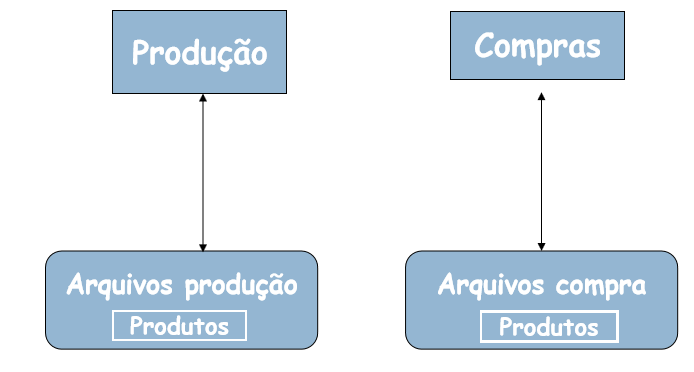.

Perceba que as áreas fazem a manipulação do mesmo dado (Produto), porém sem haver comunicação entre elas, com este tipo de sistema gera-se redundância de dados. 

Veja que, redundância ocorre quando o dado está representado no sistema várias vezes, como exemplo há o Produto, que está em dois lugares diferentes, mesmo se tratando do mesmo produto.

* Desvantagens do sistema de arquivos
    * Inconsistência e redundância dos dados
        * Duplicação de informação;
        * Maior custo de armazenamento;
        * Inconsistência dos dados (Por conta da redundância pode gerar incosistência).
    * Dificuldade de acesso aos dados
        * Não permite acesso/manipulação eficiente dos dados;
        * Acesso não previsto
            * Este é um grande problema presente nos sistemas de arquivos, a lógica dos dados era feita pensando no programa, e não na melhor forma de manipulação, assim quando um novo programa precisava utilizar os dados já existentes surgiam muitos problemas, já que a estrutura do program teria de ser alterada para começar a acessar os dados antigos.
        * Por exemplo: Listar o nome de um cliente X que gasta mais de 2.500 reais, era praticamente impossível, já que mesmo estando armazenado havia problemas para a manipulação.
    * Isolamento dos dados
        * As formas de restringir acesso aos dados eram limitadas.
    * Problemas de integridade
        * Há uma grande dificuldade em realizar as restrições de integridade, os programas que fazem o uso dos dados devem garantir a integridade, e isto é um grande problema, uma vez que, nem sempre essa garantia será seguida.
    * Problemas de atomicidade
        * Operações atômicas, ou ocorrem por inteiro ou não ocorrem.
        * Exemplo: Uma transferência bancária, há apenas duas possíbilidades sucesso ou falha, assim a operação ou ocorre por inteiro, com sucesso, ou não há transferência.
    * Problemas de acesso concorrente
        * Não há controle do acesso concorrente, caso multiplos usuários acessem os dados simultâneamente, a integridade dos dados poderá ser comprometida.

### Tipos de redundância

Acima foi citado que os sistemas de arquivos geram redundância, porém nem sempre a redundância é algo ruim, há sistemas que criam redundância para aumentar a confiabilidade e disponibilidade dos dados, abaixo são listados dois tipos de redundância.

* Redundância controlada de dados
    * Neste caso o *software* é desenvolvido para manter a sincronia entre os dados. Exemplo: Sistemas distribuidos (Aqui há várias instâncias do mesmo dado separadas em diferentes locais)

* Redundância não controlada de dados
    * A responsabilidade em manter a sincronia dos dados é do usuário e não do *software*. Exemplo: O sistema isolado demonstrado acima.
    * Problemas deste tipo de redundância:
        * Entrada repetida do mesmo dado;
        * Incosistência de dados.
    * Solução:
        * Para resolver este tipo de problema faz-se necessário o compartilhamento dos dados

Ao realizar o compartilhamento dos dados, o problema de redundância não controlada dos dados é resolvido, uma vez que os dados estarão centralizados e poderão ser utilizados por diversos sistemas, veja abaixo:

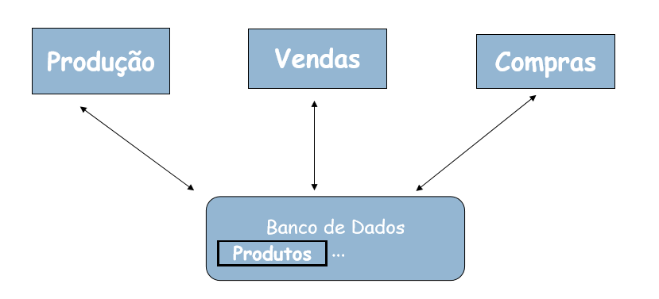

Veja que, todas as áreas que fazem o uso do Produto estarão acessando a mesma informação, assim quando uma área modificar estes dados, as demais saberão e poderão tomar decisão mais acertivas.

## Sistema gerenciador de banco de dados (SGBD)

Este é um sistema de incorpora as funções de definição, recuperação e alteração de dados em um banco de dados. Pode ser definido também como: `Sistema constituído por um conjunto de dados associados a um conjunto de programas para acesso a esses dados.`. Koth & Silberschatz.

Os SGBDs trazem independência entre os dados e os programas que farão a leitura desses. Isso porque todo o controle e formas de armazenamento passarão a ser controlados pelo SGBD, isso evita problemas citados no tópico de sistemas de arquivos onde os programas e dados eram fortemente acoplado, isso porque todos os dados eram estruturados seguindo a lógica definida pelo programa, com isso, quando outro programa fosse fazer as leituras, era necessário a adequação da lógica de leitura e aquisição para a estrutura dos dados.

### Objetivos do SGBD

O SGDB tem por objetivo, isolar os usuários dos detalhes mais internos do banco de dados (Abstração dos dados), além de prover independência entre os dados e as aplicações.

### Vantagens

As características citadas acima sobre o SGBD, trazem várias vantagens para que faz sua utilização, veja as principais:

* Controle de redundância: O SGBD evita que multiplas instâncias do mesmo dado sejam salvos no banco (Lembre-se de que, o ato de salvar várias instânicias do mesmo dado podem trazer problemas de inconsistência nos dados);

* Controle de acesso: O SGBD oferece formas de autorização e segurança que previne acessos indevidos aos dados;

* Persistência para programas e estruturas de dados: Códigos e estruturas de dados são armazenados e gerenciados pelos SGBDs, como objetos (Eles são nomeados, e podem ser invocados, alterados, e excluídos)

* Eficiência no processamento de consultar: A recuperação de informações é realizada de forma bastante rápida, isso por conta de otimizações nos sistemas e ainda, gerênciamento de indíces e de memória;

* Oferecimento de sistemas de *backups* e recuperação: Os SGBDs oferecem formas de *backup* o que torna os dados integros, além de aumentar a dispinibilidade e segurança dos dados;

* Gerantia das restrições de integridade: Os dados armazenados em um banco de dados, são associados a algumas restrições. Essas são sempre verificadas e garantidas.

* Garante padrões;

* Flexibilidade e disponibilidade dos dados.

## Sistemas de banco de dados

De acordo com Date `O sistema de banco de dados é basicamente um sistema de manutenção de registros por computadores, ou seja, um sistema cujo objetivo global é manter as informações e torná-las disponíveis quando solicitado`.

### Ambiente de um sistema de banco de dados

Um sistema de banco de dados é composto por:
* 1° - Usuários que fazem a utilização dos programas de aplicação;
* 2° - Programas de aplicação (Que fazem acesso aos dados);
* SGBD 
    * 3° - Programas de processamento de consulas;
    * 4° - Programa de acesso aos dados;
* Banco de dados
    * Definição dos dados;
    * Dados armazenados

A estrutura descrita acima, pode ser visualizada na imagem abaixo:

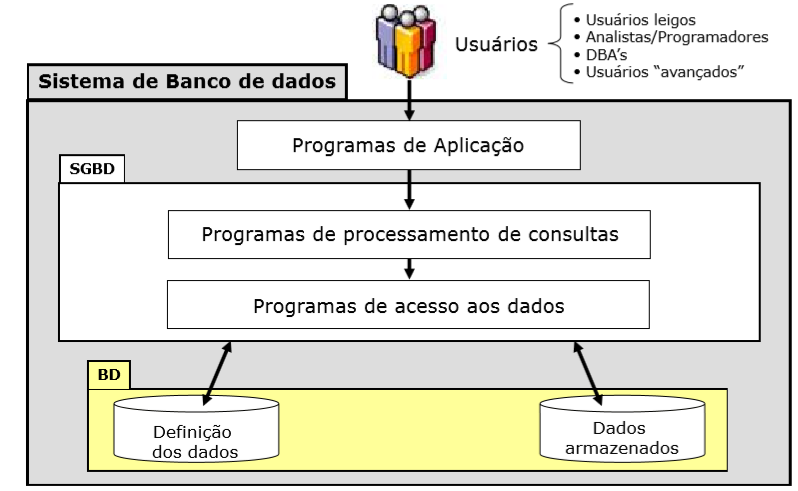

## Modelos de dados

O modelo de dados (BD) é basicamente um conjunto de conceitos utilizados para descrever um banco de dados.

Pode ser definido também como, `Descrição formal da estrutura de um banco de dados`. (Heuser, 2004).

### Modelo entidade-relacionamento (Conceitual)

Modelo de dados abstratos, que descreve a estrutura de um banco de dados, e essa independe do sistema gerenciador de banco de dados (SGBD).

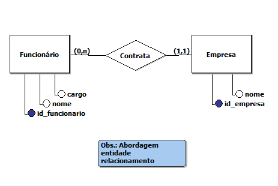

Dentro deste modelo há alguns conceitos que devem ficar bastante claros, para que haja facilidade no processo de modelagem dos dados.
* Entidade
    * Entidade forte:
        * São as entidades que conseguem existir no modelo de forma idependente.
    * Entidade fraca:
        * Essas são entidades que necessáriamente dependem de alguma outra entidade e/ou relação para existir.
    * Atributo:
        * É uma propriedade que descreve uma entidade.
* Atributos
    * Existem alguns tipos de atributos, são eles
        * Simples
        * Compostos
            * Atributos que são constituidos por outros atributos.
        * Univalorados
        * Multivalorados
            * Valores que podem assumir mais de um valor
        * Armazenados
        * Derivados
            * Valores que são resultantes de cálculos ou valores de outros atributos
    * Atributo chave
        * Valor único de identificação de uma instância, dentro de uma entidade.
        * No caso da entidade fraca, o atributo chave é nomeado `chave parcial`. Quando houver chave parcial, será necessário haver uma chave primária, de alguma entidade forte.
    * Restrição de unicidade
        * Proíbe que duas entidades, em um mesmo conjunto entidade, tenham o mesmo atributo chave (Este é um conceito aplicado com a utilização do `atributo chave`.

* Relacionamentos
    * Os relacionamentos representam as associações existentes entre as entidades.
    * Grau
        * O grau de um relacionamento é o número de tipos de entidade participantes do relacionamento, pondendo ser:
            * Binário (Grau dois);
            * Ternário (Grau três);
            * n-ário (Grau n).
    * Atributos
        * Os atributos nos relacionamentos são usados para descrever uma relação (Associação) entre as entidades envolvidas.   

* Auto-relacionamento:
	* Normalmente um relacionamento associa entidades diferentes. Porém há casos especiais em que o relacionamento entra na mesma entidade, nestas situações surge o conceito de PAPEL que identificará o relacionamento.

* Cardinalidade (Mínina, Máxima)
    * A cardinalidade indica a quantidade de instâncias de relacionamento nas quais uma instância de entidade pode participar.
    * Cardinalidade máxima: É o número máximo de ocorrências de entidade associadas à uma ocorrência da entidade em questão através de relacionamento.
    * Apenas duas cardinalidades máximas são de nosso interesse, as:
        * de valor 1; 
        * de valor n.
    * Utilizada para classificar relacionamentos binários
        * Classificamos os relacionamentos binários em:
            * 1:1 (um para um);
            * 1:N (um para muitos);
            * M:N (muitos para muitos).    
	* Cardinalidade Mínima
		* Número mínimo de ocorrências de entidades que são associadas a uma determinada ocorrência de uma entidade através de um relacionamento.
		Consideram-se apenas duas cardinalidades:
            * Cardinalidade Mínima 1 = associação obrigatória;
            * Cardinalidade Mínima 0 = associação opcional.

#### Atributo chave

Durante os tópicos do modelo conceitual, foi citado o `atributo chave`, este é um conceito bastante importante. Veja que este atributo chave, pode ser representado de duas formas

* Chave primária
    * Esta é uma chave que deve ser única no banco de dados, ele é utilizado para fazer a identificação de uma única instância de dados;

* Chave estrangeira
    * Este é uma chave primária, porém em uma outra tabela, desta forma ela cria um relacionamento entre as entidades.

#### Modelo conceitual estendido

O modelo conceitual estendido representa um modelo mais acutado, capaz de expressar propriedades e restrições de dados com mais precisão.

Esta é uma forma que permite expressar estruturas de hierarquia e especialização.

* Especialização
    * Processo de definir um conjunto de subtipos (ou subclasses) de um tipo entidade (supertipo ou superclasse), a partir das características que distinguem subconjuntos de entidades individuais.

    * Algumas formas de restrição são aplicadas na especialização:
        * Restrição de disjunção (d): Haverá apenas um subtipo equivalente para o tipo entidade, isso no momento do relacionamento. Para que fique claro, lembre desta restrição como um `OU`, assim em uma relação de funcionários por exemplo, ele não poderá ser engenheiro e secretário, apenas um `OU` outro. Neste caso pode acontecer de, não haver atributos vinculados no subtipo, apenas alguma nova ligação (considerado comportamento);

* Generalização
    * Processo inverso da abstração, no qual as diferenças entre vários tipos entidades são suprimidas na criação de um supertipo.
    * Este é um tipo que pode ser vinculado a uma herança, onde há no supertipo, as características gerais, e nos subtipos há características próprias, que se juntam as características do supertipo.

* Agregação
    * É uma abstração que permite a construção de objetos a partir de seus componentes. Veja que aqui o processo feito é a junção de dois objetos já relacionados, e partindo desta junção um outro objeto é criado.

* Entidade associativa
    * Um relacionamento é uma associação entre tabelas
    * Na modelagem entidade-relacionamento não é permitido
        - Associar uma entidade com um relacionamento;
        - Associar dois relacionamentos entre si. 

Para entender melhor a entidade associativa, veja a figura abaixo:
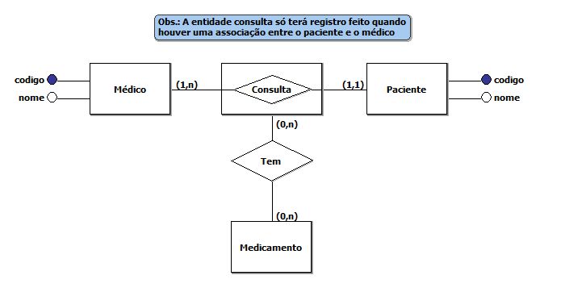

* Modelo com Aspecto Temporal
	* Um banco de dados é dito temporal quando é capaz de armazenar dados passados, presentes e futuros sobre os objetos de interesse para um negócio.

### Modelo lógico (Relacional)

Modelo de dados que representa a estrutura de dados de um banco de dados conforme vista pelo usuário do SGBD. Este é um modelo que depende do SGBD que está sendo utilizado

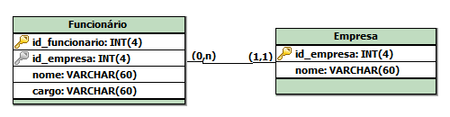

Um modelo lógico de um banco de dados relacional deve definir quais as tabelas que o banco de dados contém e, para cada tabela, quais os nomes das colunas. 

Funcionário(id_funcionario, nome, cargo, id_empresa) `id_empresa referencia Empresa`

Empresa(id_empresa, nome)

### Modelo físico

Este é o modelo que representa análise e aplicação do modelo lógico.

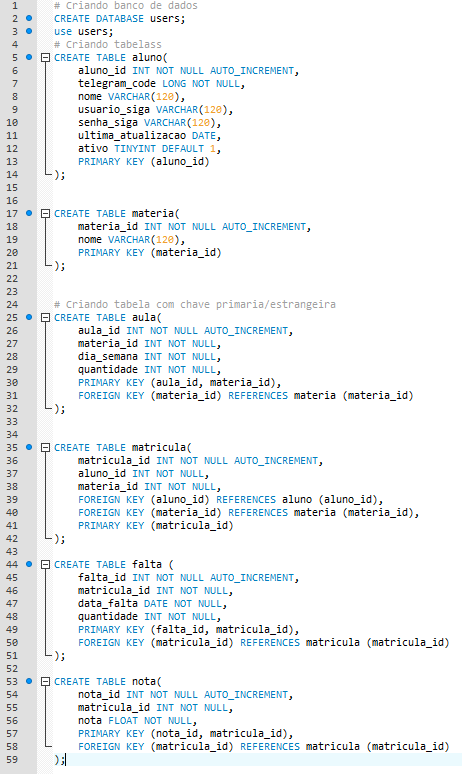

### Transformação do Modelo entidade-relacionamento (Nivel Conceitual) para o Modelo Relacional (Modelo Lógico)

A transformação do modelo entidade-relacionamento para o modelo lógico, representa a transição entre passos de um projeto de banco de dados.

Assim, é importante garantir que as informações contidas no modelo entidade-relacionamento sejam representadas corretamente no modelo relacional (Lógico). Para que haja esta garantia, existem algumas diretrizes que devem ser seguidas.

Veja que, para um único modelo conceitual, existem `N` modelos relacionais, isso porque esta transformação depende da abstração do projeto e dos conceitos envolvidos. Muitas ferramentas já automatizam esta etapa, porém é importante saber como realizá-la, pois qualquer definição equivocada do modelo relacional, afeta a estrutura de todo o projeto.

#### Os sete passos

De acordo com Elmasri & Navathe, para realizar o mapeamento do modelo conceitual para o relacional, são necessários sete passos:

* 1° - Mapear conjuntos de entidades "Fortes";
    * Para cada conjuntos de entidade forte `E` no modelo conceitual, cria-se uma tabela `R` que inclui todos os atributos de `E`;
    * O atributo identificador de `E` passa a ser a chave primária de `R`;
    * Caso exista atributos compostos, inclua todos os atributos elementares que compõem o atributo composto.

* 2° - Mapear conjuntos de entidades "Fracas";
    * Para cada entidade fraca `F` no modelo conceitual que tenha como entidade proprietária (Forte) `E`:
        * Criar uma tabela `R` e incluir todos os atributos de `F`;
        * Incluir o atributo da chave primária da tabela proprietária `E`.
    * Lembre-se, a chave primária de `R` é a compinação da chave primária de `E` e da chave primária de `F`.

* 3° - Mapear conjuntos de relacionamento binário 1:1;
    * Identificar as tabelas das entidades participantes do relacionamento `R`;
    * Escolher uma das tabelas e incluir como chave entrangeira, a chave primária da outra tabela;
    * Incluir todos os atributos do `relacionamento` na relação escolhida para receber a chave.

* 4° - Mapear conjuntos de relacionamento binário 1:N;
    * Identificar a tabela `S` que representa a entidade do lado com cardinalidade n;
    * Incluir como chave estrangeira em `S` a chave primária da tabela que representa a entidade do lado com cardinalidade 1;
    * Incluir os atributos do relacionamento em `S`.

* 5° - Mapear conjuntos de relacionamentos binário M:N;
    * Para cada relacionamento `R` de M:N:
        * Criar uma nova tabela para representar `R`;
        * Incluir como chave estrangeira as chaves primárias das tabelas que participam em `R`. Estas chaves combinadas formarão a chave primária da nova tabela (`R`);
        * Incluir também eventuais atributos de `R` (Atributos do relacionamento que liga as entidades);

* 6° - Mapear conjuntos de relacionamentos N > 2 (Não binários);
    * Para cada relacionamento `R` (n > 2):
        * Criar uma nova tabela `S` para representar `R`;
        * Incluir como chaves estrangeiras as chaves primárias das tabelas que representam as entidades participantes;
        * Incluir eventuais atributos de `R`;
        * A chave primária de `S` é normalmente a combinação das chaves estrangeiras.

* 7° - Mapear atributos multivalorados.
    * Para cada atributo multivalorado `A`, criar uma nova tabela `R`, incluindo um atributo correspondendo a `A` mais a chave primária `K` da tabela que tem `A` como atributo;
    * A chave primária de `R` é a combinação de `A` e `K`.

Porém além dos casos descritos acima, o modelo pode conter generalizações e especializações, assim, faz-se necessário a utilização de um passo a mais

Para casos em que há generalização/especialização, há três alternativas para o mapeamento:

* 1° - Tabela única para entidade genérica e suas especializações;
    * Neste caso cria-se uma coluna para identificar o tipo da entidade, e todos os atributos de cada tipo ficarão na mesma tabela

Exemplo:
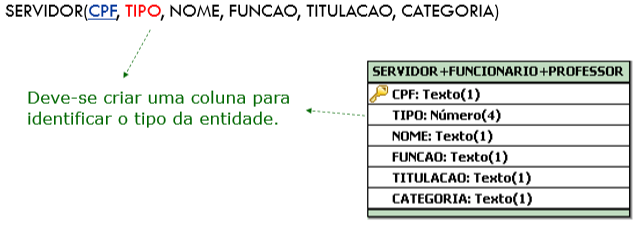

* 2° - Tabela para a entidade genérica e as entidades especializadas;
    * Nesta alternativa cria-se tabelas para cada uma das especializações, e essas são ligadas com a tabela especializada/generalizada utilizando a chave primária da mesma;

Exemplo:
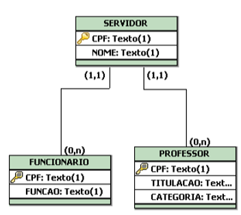

* 3° - Tabelas apenas para as entidades especializadas.
    * Por fim, nesta alternativa, cria-se tabelas apenas para as especializações

Exemplo
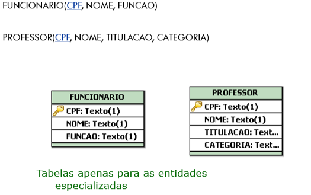

OBS: Esta alternativa não se aplica para especializações parciais

Para lembrar:
* Generalização/Especialização total: Toda instância da super-classe precisa estar associada a uma instância correspondente de alguma sub-classe;
* Generalização/Especialização parcial: Pode haver instância da super-clase sem uma instância correspondente em nenhuma sub-classe

#### Regras de integridade/restrições do modelo relacional

* Integridade de identidade (ou entidade)
    * A chave primária não pode conter um valor nulo (*null*) e identifica exclusivamente cada linha de dados em uma tabela.
 
* Integridade referencial
    * Se uma determinada tabela `A` possui uma chave estrangeira, a qual é chave primária em outra tabela `B`, então ela deve ser:
        * Igul a um valor de chave primária existente em `B`; ou
        * ser nula (*null*)
    
    * Isso ocorre porque não pode existir na chave estrangeira, um valor que não exista na tabela na qual ela é chave primária.

* Integridade de domínio
    * O valor de um campo deve obedecer a uma definição de valores admitidos para coluna, como tamanho em caracteres, tipo de valores (Número, data, varchar, etc)

As regras citadas acima são regras que representam a garantia de que as tabelas guardam informações compatíveis. Por isso são de extrema importância para a confiabilidade das informações contidas no banco de dados.

OBS: Lembre-se *null* não é o valor zero e também não é um caracter de espaço, ou em branco, é simplesmente a não-existência de conteúdo neste campo.

## Formas normais

`A qualidade de um projeto de banco de dados pode ser medida a partir da verificação da forma normal que ele alcança`. Marques Peres, Sarajane.

`Normalização é um processo a partir do qual se aplicam regras a todas as tabelas do banco de dados com o objetivo de evitar falhas no projeto, como redundância de dados e mistura de diferentes assuntos numa mesma tabela`. Vanessa, Izabela.

A normalização é um conceito que se baseia em formas normais. Porém, o que são formas normais ?

    Uma forma normal é uma regra que deve ser obedecida por uma tabela.

Com a utilização da normalização é possível eliminar:
* Redundância;
* Atributo multivalorado;
* Grupo repetitivo;
    - Conjunto de atributos de uma entidade que ocorre várias vezes para cada ocorrência da Entidade.
* Dependência funcional parcial;
    - Ocorre quando um atributo depende apenas de parte de uma chave primária composta;
* Dependencia funcional transitiva.
    - Ocorre quando um atributo além de depender da chave primária da tabela, depende de outra coluna ou conjunto de colunas da tabela.

A forma normal atribuida a algum projeto de banco de dados, está ligado a relação que tenha a menor forma normal.

`Ao projetar um banco de dados, se temos um modelo de entidades e relacionamentos e a partir dele construirmos o modelo relacional seguindo as regras de transformação corretamente, o modelo relacional resultante estará, provavelmente, normalizado. Mas, nem sempre os modelos que nos deparamos são implementados dessa forma e, quando isso acontece, o suporte ao banco de dados é dificultado.`. Vanessa, Izabela.

Para qualquer um dos casos citados pela Izabela, sendo o primeiro, o modelo relacional resultante de um mapeamento utilizando os sete passos, ou por conta de um modelo que não foi construido seguindo os padrões até aqui demonstrados faz-se necessário o uso da normalização, seja para confirmar a consistência do banco de dados (Quando há o primeiro caso), ou quando é necessário normalizar o modelo (Quando há o segundo caso).

Sendo assim será demonstrado as regras que devem ser aplicadas para que se tenha, bancos de dados mais íntegros, sem redundâncias e inconsistências.

### Primeira forma normal (1FN) - Eliminar grupos repetitivos/não conter tabelas aninhadas

`Todos os atributos de uma tabela devem ser atômicos, ou seja, a tabela não deve conter grupos e nem atributos com mais de um valor. Para deixar nesta forma normal, é preciso identificar a chave primária da tabela, identificar a(s) coluna(s) que tem(êm) dado repetido e, por fim, criar uma relação entre a tabela principal e a tabela secundária`. Vanessa, Izabela.

Perceba que, em resumo o que foi dito pela Vanessa nada mais é que, a primeira forma normal exige que os atributos sejam atômicos.

Veja um exemplo de normalização para 1FN.

A tabela abaixo não está na forma 1FN

    DEPTO(numero, nome, gident, localizacoes)

Perceba que o localizacoes é um atributo multivalorado, e a primeira forma normal requer atributos atômicos, para resolver o problema, será realizado a decomposição (Assim como citado anteriormente).

    DEPTO(numero, nome, gident)
    DEPTO_LOCS(numero_depto, localizacao)

Outro exemplo:

    FUNC_PROJ(Ident, fnome, pnumero, horas)

Neste caso o pnumero e horas são atributos aninhados, o que também não é permitido da 1FN, para resolver isso a entidade será decomposta

    FUNC_PROJ1(Ident, fnome)
    FUNC_PROJ2(Ident, pnumero, horas)

Pronto, entidade novas criadas para resolver o problema. O ponto interessante é que, cada uma das entidades ficaram com suas devidas características, isso porque antes o funcionário carregava consigo características de seu relacionamento com o projeto, o que não ocorre mais, já que há uma tabela apenas para descrever este relacionamento. 

### Segunda forma normal (2FN) - Eliminar dependência parcial

Para estar na segunda forma normal, é necessário antes estar na primeira forma normal. 

`Todos os atributos não chaves da tabela devem depender unicamente da chave primária (não podendo depender apenas de parte dela). Para deixar na segunda forma normal, é preciso identificar as colunas que não são dependentes da chave primária da tabela e, em seguida, remover essa coluna da tabela principal e criar uma nova tabela com esses dados`. adaptado de: Vanessa, Izabela. 2011.

Por exemplo:

    ALUNOS_CURSOS(id_aluno, id_curso, nota, descricao_curso)

Nesta tabela, o atributo `descricao_curso`, depende apenas do `id_curso`, sendo assim será criado uma tabela para armazenar essas informações.

    ALUNOS_CURSOS(id_aluno, id_curso, nota)
    CURSOS(id_curso, descricao_curso)

### Terceira forma normal - Ideal em projetos de banco de dados. (3NF) - Eliminar dependência funcional transitiva

Para que o modelo esteja nesta forma normal, é necessário que os atributos não sejam dependentes que chaves que não a primária. Para resolver este problema, é preciso identificar as colunas que são dependentes das outras colunas não chave e extraí-las para outra tabela. Veja um exemplo

    FUNCIONARIOS(id, nome, id_cargo, descricao_cargo)

Veja que, o atributo `descricao_cargo` depende exclusivamente de `id_cargo`, que é um atributo não chave, e assim será necessário criar uma nova tabela com esses atributos.

    FUNCIONARIOS(id, nome, id_cargo)
    CARGOS(id_cargo, descricao)

## DDL e DML

## SQL - Structured Query Language

<!-- Será adicionado depois -->

## Dúvidas

- (?) Nas normalizações, os atributos multivalorados sempre serão removidos (Transformados em tabela) ?
    - Não se pode ter atributos multivalorados no modelo relacional.

- (?) Relacionamento recursivo é o mesmo que auto-relacionamento ?

- (?) Chave estrangeira é a mesma coisa que chave parcial ?

- (?) O que são atributos aninhados ?

- (?) Caso haja não haja chave primária composto, a forma normal pode partir da 1FN para a 3FN ?

## Referências bibliográficas

Pet news. (2018). Normalização de Bancos de Dados Relacionais. [online] Available at: http://www.dsc.ufcg.edu.br/~pet/jornal/maio2011/materias/recapitulando.html [Acessado em 14 Abril de 2018].
