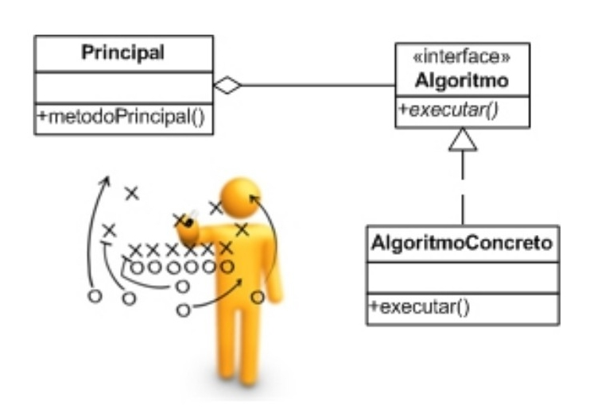

# Padrões de projeto ou Design Patterns

Um `padrão` descreve um conjunto composto por um contexto, um problema e uma solução, isto é, um padrão descreve uma solução para um problema em um contexto. Contudo, um padrão descreve uma solução que ja tenha sido utilizada com sucesso em mais de um contexto.Portanto, um padrão descreve soluções consolidadas.

### Composição
Apesar de não estar entre os quatro elementos principais de uma linguagem orientada a objetos, a composição é um conceito que vem implícito quando se fala em objetos. a composição combinada com o uso de abstrações pode ser eficaz na solução de diferentes
problemas.

## Strategy

 O `Strategy` é um padrão que deve ser utilizado quando uma classe possuir diversos diversos algoritmos que possam ser utilizados de forma intercambiável. A Solução proposta consiste em delegar a execução do algoritmo para uma instância que compõe a classe principal. Isto é, o algortimo de execução é composto (implementado) na classe principal em tempo de execução.

 A figura abaixo demonstra um Diagrama de classes genérico do padrão `Strategy` :

### Pontos positivos
* O algortimo pode ser alterado sem a modificação da classe, logo é fácil adicionar novas implementações
* Lógica condicional na classe princial é reduzida.
* A implementação pode ser trocada em tempo de execução, com isso o comportamento da classe pode ser trocado dinamicamente.

### Pontos negativos
* Aumento de complexidade na criação do objeto, pois a instância da dependência precisa ser criada e configurada e caso o atributo seja nulo haverá comportamento inesperado.
* Aumento do número de classes: há uma para cada algoritmo, criando uma maior dificuldade em seu gerenciamento.

## Bridge

O padrão `Bridge` cria uma ponte entre duas hierarquias ligadas por um relação de composição permitindo que ambas variem de forma independente. Nesse caso, a ponte é caracterizada pela relação de composição entre classes.
Um cenário em que esse tipo de solução é comum é quando temos uma hierarquia de abstrações e outra com implementações, permitindo que cada uma possa variar independentemente.

A figura abaixo mostra um Diagrama de classes genérico do padrão `Bridge`:

### Pontos positivos
* Torna independente os fatores que podem variar
* As classes que foram separadas (Componentes) podem ser reutilizadas em outros contextos
* Desacoplamento de responsabilidades, permitindo mais facilmente o reuso

### Pontos negativos
* Aumento do número de classes: há uma para cada componente, criando uma maior dificuldade em seu gerenciamento.

## Referências

GUERRA, Eduardo. Design Patterns com Java: Projeto orientado a objetos guiado por padrões. Editora Casa do Código,
2014.