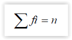
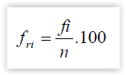
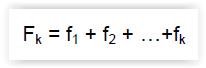
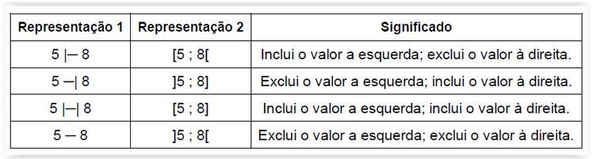
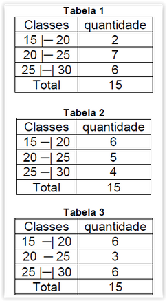
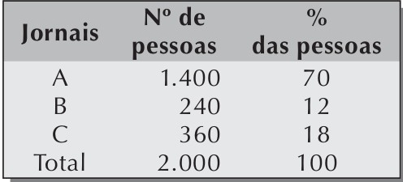

Revisões da matéria de estatística aplicada.

## Visão geral

Estatística é a `ciência que usa números para descrever dados`. Nos estudos estatísticos chama-se de `dados estatísticos os dados numéricos que nos permitem descrever e avaliar fatos para realizar previsões, estimativas e tomadas de decisões`.

Outra definição é que estatística é o `conjunto de técnicas que permite, de forma sistemática, coletar, organizar, descrever, analisar e interpretar dados oriunos de estudos ou experimentoss`.

Este dados estatísticos podem ser representados por [Tabelas](#tabelas) ou [Gráficos](#Gráficos).

## Conceitos 

### Populacao

Conjunto de todos os elementos de um fenômeno que possuem uma característica em comum, ou seja, todos os indivíduos ou objetos que fazem parte do estudo. Geralmente é representada pela letra `N`.

### Amostra

É um subconjunto da população que deve ser representativa de moda que ela expresse todas as características da população. Geralmente a amostra é representada pela letra `n`

### Análise estatística

Uma análise estatística distinguem-se duas etapas:

#### Etapa 1: Estatística Descritiva

Procura-se descrever, resumir e agrupar dados, afim qde que se possam tirar conclusões a respeita das características de interesse.

Algumas técnincas descritivas são: gráficos, tabelas, médias, variâncias, etc.

#### Etapa 2: Estatística Indutiva
Após conhecidas certas propriedades, imaginam-se proposições que exprimam conclusões para toda a população.

## Regras de arrendondamento

### Caso 1

O algarismo a ser conservado for seguido de algarismo inferior a 5, permanece o algarismo a ser conservado e retiram-se os posteriores.

Ex: 2,333333 arredondado a primeira decimal torna-se 2,3

### Caso 2

Quando o algarismo a ser conservado for seguido de algarismo superior a 5, ou igual a 5 seguido de no mínimo um algarismo diferente de zero, soma-se uma unidade ao algarismo a ser conservado e retiram-se os posteriores

Ex: 2,6666 arredondado a primeira decimal torna-se 2,7;
Ex: 5,850 arredondado a primeira decimal torna-se 4,9;

### Caso 3

O algarismo a ser conservado a ser conservado for ímpar, seguido de 5 e posteriormente de zeros, soma-se uma unidade ao algarismo conservado e retira-se os posteriores

Ex: 5,5550 arredondado a primeira decima torna-se 4,6;

###  Caso 4

O algarismo a ser conservado for par, seguido de 5 e posteriormente de zeros, permanece o algarismo a ser conservado e retira-se os posteriores

Ex: 5,850 arredondado a primeira decimal torna-se 5,8

## Estatística Descritiva

### ROL

Chama-se ROL a sequência de dados brutos ordenada de forma crescente.

#### Exemplo de construção de um ROL

Suponhamos uma pesquisa em que 10 casais foram entrevistados com relação ao número de filhos que possuíam. Os resultados obtidos, na ordem das entrevistas (dados brutos) foram:

`2, 1, 1, 3, 0, 1, 0, 0, 0, 2.`

Para estes dados, podemos construir o ROL: 

`0, 0, 0, 0, 1, 1, 1, 2, 2, 3.`

*Note que o ROL possui a mesma quantidade de dados inicialmente coletados. Ou seja, em nosso exemplo anterior, obteve-se 10 valores. Logo, o ROL deve possuir 10 valores também.*

### Frequências

#### Frequências Simples ou absoluta (fi)

É o número de vezes que determinado valor é observado. É válido observar que a soma de todas as frequências simples ou absoluta resultado no tamanho total da amostra `(n)`:

#### Frequência relativa (fri)

São os valores das razões (quociente) entre as frequências simples e a frequencia total multiplicada por 100 para que os dados sejam apresentados em porcentagem.

#### Frequência Acumulada Simples (Fi)

Consiste na somatória das frequências absolutas anteriores.

#### Frequência Acumuada Relativa (Fri)
 
Consiste na frequência acumulada da class dividida pela frequência total da distribuição, multiplicando-se por 100 para obtermos porcentagem. 

### Classes ou intervalos de classes

Quando temos dados brutos devemos agrupá-los, para a construção de uma tabela conhecida em intervalos que também são conhecidos por classes.

Os tipos de classes ou intervalos estão exemplificados na tabela a seguir:

#### Exemplo

Considerando o ROL:

16,18,20,20,20,20,20,22,23,23,25,25,26,26,29,30

Agora alguns formas de realizar agrupamentos nesse ROL de acordo com a representação utilizada:

#### Limite inferior (LI)

Menor elemento do conjunto estudado.

Considerando a primeira classes da tabela 1 do exemplo anterior o limite inferior(LI) é 15, na segunda classe é 20 e na terceira classe é 25

#### Limite superior (LS)

Maior elemento do conjunto estudado.

Considerando a primeira classes da tabela 1 do exemplo anterior o limite superior(LS) é 20, na segunda classe é 25 e na terceira classe é 3
0m
#### Amplitude de classe

Corresponde da diferença entre o limite superior e limite inferior da classe.

Considerando a tabela 1 do exemplo anterior. Na primeira classe o limite inferior é 15 e o limite superior é 20.

Isto é,

> h = LS - LI

Logo,

> h = 20 - 15 
> h = 5

## Gráficos Estatísticos e tabelas

### Tabelas

As tabelas dispõem os `dados estatísticos` de modo comparativo. Seu ponto forte é mostrar uma grande quantidade de 	informação em pouco espaço.

Por exemplo:

Para determinar preferência pelos jornais A, B ou C, foram entrevistadas 2.000 pessoas. A pesquisa revelou
o seguinte:

Logo, com base nesta pesquisa, os jornais B e C podem concluir que seus produtos devem sofrer algum tipo de modificação para ganhar o público-leitor.

### Gráficos

<!-- Adicionar depois -->

## Medidas de tendência central ou Medidas de posição

Os valores de `medida de tendência central` consiste em encontrar um número representante do grupo, um valor "médio" característica daquele conjunto de dados. Geralmente, esse valor se localiza em torno do meio ou centro de uma distribuição.

As três medidas de tendência central mais conhecidas são: média aritmética, moda e mediana.

### Média aritmética(Ma)
A `média aritmética` é o quociente entre a soma de n valores e o número n de valores desse conjunto. 

Por exemplo:

Maísa teve as seguintes notas nas provas de Matemática: 6,5; 7,0; 9,5; 4,0 e 8,0.
O calculo da média de suas notas é representado por:

> Ma = 6,5 + 7,0 + 9,5 + 4,0 + 8,0 / 5 

> Ma = 7,0

### Moda (Mo)

A `moda` de um conjunto de n número é o valor que ocorre com maior frequência, isto é, o valor mais comum.

Exemplo:
Na sequência numérica 2,2,3,7,9,9,9,10,11,12,18 a moda é 9, pois é o número que aparece com maior frequência;

> Mo = 9

Há casos em que pode haver mais de uma moda, como por exemplo na sequencia: 5, 7, 7, 7, 8, 9, 9, 10, 10, 10 há duas modas: 7 e 10. Portanto MO = 7 e 10. 

Em outros casos pode não existe moda.

### Mediana(Md)

A `Mediana` de um conjunto de n valores é o valor que ocupa a posição central, *quando esses dados são colocadas em ordem* crescente ou descrescente.

Nos dados: 

> 126,198,164, 460 e 188

temos cinco elementos que, colocamos em ordem crescente, irão fornecer-nos a mediana: 

> 126, 164, 188, 198, 460. 

Como a mediana é o termo central da sequência número, temos:

> Md = 188

No caso do número de elementos ser par, a mediana será a média aritmética entre os dois termos centrais:

Exemplo:

> 68,72,78,84,87,91

A media será a média entre 78,84. Portante temos: 

> Md = 78 + 84 / 2

> Md = 162 / 2 

> Md = 81

## Classificação (Agrupamento)

### Range(Variação) - h

> h = maiorValor - menorValor 

isto é, a diferença entre o maior e o menor valor do conjunto estudado.

### Numero de classes - k

> k = sqrt(n), onde n é o numero de elementos do conjunto estudado.

### Tamanho de cada classe

> t = h/k

## Referências

* [1] Bosquilha, A; Corrêa, M.L.P; Viveiro, T.C.N.G. Minimanual compacto de matemática : teoria e prática : ensino médio: 2. ed. rev.São Paulo: Editora Rideel, 2003
* [2] ESTATÍSTICA. Disponível em: [<http://professorguru.com.br/estatistica/index.html>](http://professorguru.com.br/estatistica/index.html). Acesso: 2 semestre de 2019	
* [3] Associação Brasileira de Normas Técnicas. Regras de arredondamente na numeração decimal. Rio de Janeiro: 2014

