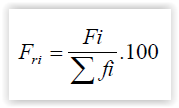
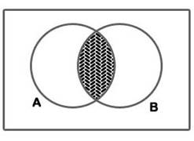

## Visão geral

Estatística é a `ciência que descreve dados`. Nos estudos estatísticos chama-se de `dados estatísticos os dados numéricos que nos permitem descrever e avaliar fatos para realizar previsões, estimativas e tomadas de decisões`.

Outra definição aplicável neste contexto é `conjunto de técnicas que permite, de forma sistemática, coletar, organizar, descrever, analisar e interpretar dados oriundos de estudos ou experimentos`.

Este dados estatísticos podem ser representados por [Tabelas](#tabelas) ou [Gráficos](#Gráficos).

Para você que está fazendo esta matéria agora, existe um conjunto de funções e classes (R e Python) que podem te ajudar a resolver os exercícios da aula. O pacote está disponível [aqui](https://github.com/M3nin0/nancian).

## Conceitos 

Este capítulo apresenta conceitos gerais utilizados na matéria de estatística básica.

### População

Conjunto de todos os elementos de um fenômeno que possui uma característica em comum, ou seja, todos os indivíduos ou objetos que fazem parte de um estudo. Geralmente é representada pela letra `N`.

### Amostra

É um subconjunto representativa da população, permitindo que todas as características da população sejam descritas e entendidas.

### Dados estatísticos

O entendimento de todos os demais conceitos apresentados neste documento baseia-se na utilização de dados estatísticos, assim sendo, vamos para algumas definições de dados estatísticos e suas classificações.

- Dados estatísticos: São os valores da variável obtidos nos elementos da população ou da amostra;
- Variável: É qualquer característica da população que pode ser classificada em variável qualitativa ou variável quantitativa;
    - Variável qualitativa: Quando a variável é um atributo (ou qualidade) do indivíduo pesquisado. Podem ser nominais ou ordinais
      - Nominais: Não possui ordem dentre as categorias (Exemplo: Sexo, religião);
      - Ordinais: Existe uma certa ordem (Exemplo: Escolaridade - 1° lugar, 2° lugar)
    - Variável quantitativa: Quando a variável é um número associado ao indivíduo pesquisado. Podem ser contínuas ou discretas
    - Discretas: Valores que assumem números inteiros e não tem uma alta variação;
    - Contínua: Valores racionais (Q), com alta variação.

### Análise estatística

A análise estatística apresenta duas etapas:

#### Etapa 1: Estatística Descritiva

Procura-se descrever, resumir e agrupar dados, afim de tirar conclusões sobre os dados.

Algumas técnicas descritivas são: gráficos, tabelas, médias, variâncias, etc.

#### Etapa 2: Estatística Indutiva

Após conhecidas certas propriedades, imaginam-se proposições que exprimam conclusões para toda a população.

## Estatística Descritiva

### ROL

Chama-se ROL a sequência de dados brutos ordenada de forma crescente ou decrescente.

#### Exemplo de construção de um ROL

Suponhamos uma pesquisa em que 10 casais foram entrevistados com relação ao número de filhos que possuíam. Os resultados obtidos, na ordem das entrevistas (dados brutos) foram:

`2, 1, 1, 3, 0, 1, 0, 0, 0, 2.`

Para estes dados, podemos construir o ROL: 

`0, 0, 0, 0, 1, 1, 1, 2, 2, 3.`

*Note que o ROL possui a mesma quantidade de dados inicialmente coletados, ou seja, em nosso exemplo anterior, obteve-se 10 valores, logo, o ROL deve também possuir 10 valores.*

### Frequências

As frequências apresentadas abaixo são utilizadas no processo de distribuição de frequências, onde tem-se como objetivo separar os dados em classes e intervalos que permitam uma forma mais simples e direta de extrair informações sobre seus comportamentos.

Vale lembrar que, as formas de aplicação da distribuição de frequência pode variar dependendo do tipo de dado (Contínuo ou discreto).

#### Frequências Simples ou absoluta (fi)

É o número de vezes que determinado valor é observado. A soma de todas as frequências simples devem resultar na quantidade de elementos `(n)` da amostra.

#### Frequência relativa (fri)

São os valores das razões (quociente) entre cada frequência simples e a quantidade de amostras `n`, sendo o resultado da operação multiplicado por 100.

#### Frequência Acumulada Simples (Fi)

Consiste na somatória das frequências simples

#### Frequência Acumulada Relativa (Fri)
 
Consiste na frequência acumulada da classe dividida pela frequência total da distribuição, isto multiplicado por 100.

### Classes ou intervalos de classes

Para facilitar toda a interpretação de dados brutos, estes podem ser agrupados em intervalos (Também chamados de classes), gerando assim uma tabela que melhor divide e apresenta tais dados.

Os tipos de classes ou intervalos estão exemplificados na tabela a seguir:

#### Exemplo

Considerando o ROL:

16,18,20,20,20,20,20,22,23,23,25,25,26,26,29,30

Agora alguns formas de realizar agrupamentos nesse ROL de acordo com a representação utilizada:

#### Limite inferior (LI)

Menor elemento do conjunto estudado.

Considerando a primeira classes da tabela 1 do exemplo anterior o limite inferior (LI) é 15, na segunda classe é 20 e na terceira classe é 25

#### Limite superior (LS)

Maior elemento do conjunto estudado.

Considerando a primeira classes da tabela 1 do exemplo anterior o limite superior (LS) é 20, na segunda classe é 25 e na terceira classe é 30

#### Amplitude de classe

Corresponde a diferença entre o limite superior e limite inferior da classe.

Considerando a tabela 1 do exemplo anterior. Na primeira classe o limite inferior é 15 e o limite superior é 20.

Isto é

> AT = LS - LI

ou 

> AT = maior - menor

Logo,

> AT = 20 - 15 
> AT = 5

### Caracterização da distribuição de frequência

Em certos casos podem ser necessário determinar a quantidade de classes e o tamanho do intervalo de cada um dessas na tabela de distribuição, para isto, alguns passos podem ser aplicados.

Para definir a amplitude de cada uma das classes criadas durante a distribuição de frequência, os seguintes passos podem ser utilizados.

1. Determinam-se o maior [(limite superior)](#Limite-superior) e o menor número [(limite inferior)](#Limite-inferior) dos dados brutos, então, calcula-se a [amplitude total](#Amplitude-de-classe) do rol representada pela variável `AT`.

2. Determinar a amplitude de cada classe `h` 

Divide-se a [amplitude total do rol](#Amplitude-de-classe), variável `AT` pela quantidade de classes representada pela letra `k` 

* Para determinar a quantidade de classe, denominada por `k` utilizamos [Regra de Sturges](#Regra-de-Sturges) ou [Critério da Raiz Quadrada](#Criterio-da-raiz-quadrada)
  
* Após determinar a amplitudade de cada classe, denominada por `h`, utilizamos a seguinte fórmula:

#### Regra de Sturges

A regra de Sturges propõe a seguinte fórmula para calcular o número de classes.

.

Essa fórmula pode ser condensada na seguinte tabela.

#### Critério da raiz quadrada

O `número de classes`  ou quantidade de classes [k](#Variaveis-utiliazadas-nos-cálculos) é dado por: 

1. Determinam-se o número de observações que caem dentro de cada intervalo de classe, isto é, calculam-se as frequências de classe.

### Variáveis utilizadas nos cálculos

* `k` - denota o número de classe que pode ser definida pela [Regra de Sturges](#Regra-de-Sturges), [Critério da Raiz Quadrada](#Criterio-da-raiz-quadrada)
* `h` - Amplitude de cada classe 
* `At` - [Amplitude total do Rol](#Amplitude-de-classe)

#### Exemplo 

No exemplo teremos uma amostra de tamanho 200 em que observamos as idades das pessoas. A menor idade foi 10 anos e a maior, 70 anos.

#### Usando Sturges
Em nosso caso, n = 200. Logo:

> k = 1 + 3,3.log 200

> k = 1 + 3,3 . 2,3010

> k = 1 + 7,5933

> k = 8,5933  >>>  9

A amplitude de cada classe é:

.

Logo, as classes são:

.

#### Raiz quadrada

Em nosso exemplo: 

.

A amplitude de cada classe é: 

Vamos considerar h = 5. Logo, teremos:

## Gráficos Estatísticos e tabelas

### Tabelas

As tabelas dispõem os `dados estatísticos` de modo comparativo. Seu ponto forte é mostrar uma grande quantidade de 	informação em pouco espaço.

Por exemplo:

Para determinar preferência pelos jornais A, B ou C, foram entrevistadas 2.000 pessoas. A pesquisa revelou
o seguinte:

Logo, com base nesta pesquisa, os jornais B e C podem concluir que seus produtos devem sofrer algum tipo de modificação para ganhar o público-leitor.

### Gráficos

<!-- Adicionar depois -->

## Medidas de tendência central ou Medidas de posição

Os valores de `medida de tendência central` consiste em encontrar um número representante do grupo, um valor "médio" característica daquele conjunto de dados. Geralmente, esse valor se localiza em torno do meio ou centro de uma distribuição.

As três medidas de tendência central mais conhecidas são: média aritmética, moda e mediana.

### Média aritmética(Ma)
A `média aritmética` é o quociente entre a soma de n valores e o número n de valores desse conjunto. 

Por exemplo:

Maísa teve as seguintes notas nas provas de Matemática: 6,5; 7,0; 9,5; 4,0 e 8,0.
O calculo da média de suas notas é representado por:

> Ma = 6,5 + 7,0 + 9,5 + 4,0 + 8,0 / 5 

> Ma = 7,0

### Moda (Mo)

A `moda` de um conjunto de n número é o valor que ocorre com maior frequência, isto é, o valor mais comum.

Exemplo:
Na sequência numérica 2,2,3,7,9,9,9,10,11,12,18 a moda é 9, pois é o número que aparece com maior frequência;

> Mo = 9

Há casos em que pode haver mais de uma moda, como por exemplo na sequencia: 5, 7, 7, 7, 8, 9, 9, 10, 10, 10 há duas modas: 7 e 10. Portanto MO = 7 e 10. 

Em outros casos pode não existe moda.

### Mediana(Md)

A `Mediana` de um conjunto de n valores é o valor que ocupa a posição central, *quando esses dados são colocadas em ordem* crescente ou descrescente.

Nos dados: 

> 126,198,164, 460 e 188

temos cinco elementos que, colocamos em ordem crescente, irão fornecer-nos a mediana: 

> 126, 164, 188, 198, 460. 

Como a mediana é o termo central da sequência número, temos:

> Md = 188

No caso do número de elementos ser par, a mediana será a média aritmética entre os dois termos centrais:

Exemplo:

> 68,72,78,84,87,91

A media será a média entre 78,84. Portante temos: 

> Md = 78 + 84 / 2

> Md = 162 / 2 

> Md = 81

## Medidas de dispersão
As medidas de tendência central não são suficientes para caracterizar totalmente uma sequência numérica. Por exemplo, se observarmos as sequências:

> X: 10, 1, 18, 20, 35, 3, 7, 15, 11, 10.
> Y: 12, 13, 13, 14, 12, 14, 12, 14, 13, 13.
> Z: 13, 13, 13, 13, 13, 13, 13, 13, 13, 13. 

As três sequências possuem média 13. No entanto, são sequências completamente diferentes do ponto de vista da variabilidade de dados, pois a sequência Z não tem variabilidade da média, na sequência Y tem elementos levemente diferenciados da média e na sequencia X existem muitos elementos diferentes da média.

Para avaliar o grau de variabilidade em torno da média, usaremos as medidas de dispersão: [desvio médio](#Desvio-médio), [variância](#Variância) e [desvio padrão](#Desvio-Padrão).
### Conceito de Desvio

Na estatística o conceito de `desvio`  corresponde o conceito matemático de distância.

### Desvio médio
O `desvio médio` indica a dispersão dos dados em relação à média de uma sequência. Este medida pode ser avaliada através dos desvio de cada elemento da sequência em relação a média da sequência, isto é, a somatória das diferenças de cada elemento da média. O desvio médio é definido como uma média aritmética dos desvios de cada elemento da sequência. A sua fórmula é expressa por:

#### Exemplo

Considere as notas 2,8,5,6 obtidas por 4 alunos.  Determine o devio médio.

Inicialmente, calculamos a média:

Agora, calcularemos o desvio médio, lembrando que a [frequencia de absoluta](#Frequências-Simples-ou-absoluta) de cada elemento é 1, visto que cada elemento apareceu uma única vez.

### Variância

#### Variância populacional
A variância populacional é representada por (σ²) e sua fórmula é:

#### Variância amostral

A variância amostral é representada por (s²) e sua fórmula é: 

## Probabilidade

### Conceitos
 
#### Experimentos Aleatorios 

Fenômenos que, quando repetidos inúmeras vezes em processos semelhantes, possuem resultados imprevisíveis. Por exemplo, O lançamento de um dado e de uma moeda são considerados exemplos de experimentos aleatórios. No caso dos dados podemos ter seis resultados diferentes {1, 2, 3, 4, 5, 6} e no lançamento da moeda, dois {cara, coroa}. 
#### Espaço Amostral
São os resultados possíveis que podem ser produzidos de um determinado evento aleatório.

#### Eventos
Evento é qualquer subconjunto do espaço amostral e geralmente os eventos são representados por letras maiúsculas.

Por exemplo, temos que o número possível de elementos no lançamento de um dado é o seu espaço amostral, que geralmente é representado pela letra grega maiúscula ômega (  Ω ). Ou seja, neste caso temos: 

 Ω ={1, 2, 3, 4, 5, 6}. 

Podemos definir um evento A da seguinte maneira:

* A: sair um número par no lançamento de um dado.

Neste caso, A={2,4,6},

#### União de eventos

Sejam A e B dois eventos; então (A U B) corresponde a um evento que ocorrerá quando uma das três condições forem satisfeitas:

1. Ocorre A e não ocorre B
2. Não ocorre A e ocorre B
3. Ocorre A e ocorre B simultaneamente

*Figura: União de eventos*

#### Instersecçõa de eventos

Sejam A e B dois eventos; então A ∩ B será um evento que corresponde à ocorrência de A e B simultaneamente. 
*Podemos perceber que o conjunto A ∩ B é um subconjunto de A U B:*

*Figura: Intersecçao de dois eventos*

#### Eventos multuamente exclusivos 
Sejam os eventos A e B. Se A ∩ B = ∅ ou { },isto é, os eventos não ocorrem simultaneamente, os A e B são chamados mutuamente exclusivos. 

*Figura: eventos mutuamente exclusivos*

#### Complementar a um evento

Seja A um evento; então AC será também um evento que ocorrerá se, e somente se, A não ocorrer. As figuras abaixo ilustram a situação do complementar em relação a A:

### Probabilidade de um evento

Existem três tipos de probabilidades: 
* Probabilidade clássica
* Probabilidade empírica 
* Probabilidade subjetiva.

**A probabilidade de que o evento E ocorrerá é escrita como P(E) e lê-se “probabilidade de um evento E”.**

#### Probabilidade clássica ou teórica

É utilizada quando cada resultado de um espaço amostral é igualmente possível de ocorrer. 

Ela é calculada pela fórmula:

*Figura: Probabilidade clássica 1*

A probabilidade de um evento é sempre um valor entre 0 e 1, ou seja, entre 0% e 100%.

*Figura: Probabilidade clássica 2*

Quando a probabilidade de um evento for 0, isso significa que não há possibilidades desse evento ocorrer. Por isso, dizemos que é um **evento impossível**. Em contrapartida, se a probabilidade for igual a 1, isto é, a 100%, isso indica que com certeza ocorrerá tal evento. Por isso dizemos que é um **evento certo**.

#### Probabilidade empírica ou estatística

Quando um experimento (por exemplo, lançar um dado ou lançar uma moeda) é repetido muitas vezes, são formados padrões regulares que permitem encontrar a probabilidade empírica de que determinado evento ocorra.

É a probabilidade observada de um evento, de forma empírica, em experimentos aleatórios.

Por exemplo: ao lançarmos uma moeda 10 vezes, pode ser que ocorra obtermos 2 caras e 8 coroas. Porém, isso não significa que a probabilidade de ocorrer cara não seja 50%. Se repetirmos o experimento lançar uma moeda em torno de 10.000 vezes, é muito provável que o número de caras observadas seja um valor bastante próximo de 5.000. 

Esse fato é explicado pela Lei dos Grandes Números: conforme um experimento é repetido várias vezes, a probabilidade empírica de um evento se aproxima da sua probabilidade teórica (real).

*Figura: Probabilidade empírirca*

#### Probabilidade subjetiva

As probabilidades subjetivas resultam da intuição, de suposições fundamentadas e de estimativas.

Por exemplo: um médico “acredita” que a chance de um paciente que possui ferimentos oriundos de um acidente de trânsito sobreviver é 80%. Note que se o mesmo paciente fosse avaliado por outro medido, essa probabilidade poderia ser de, por exemplo, 90%.

#### Probabilidade do evento complementar 

Sendo A um evento e à o evento complementar e o fato de a soma das probabilidades de todos os eventos ser sempre igual a 1, temos:

*Figura: probabilidade de eventos complementares 1*

ou ainda,

*Figura: probabilidade de eventos complementares 2*

### Probabilidade da união de dois eventos

Sejam A e B dois eventos tais que A ∩ B != {}, isto é não são mutuamente exclusivos. Então, 

*Figura: probabilidade da união de dois eventos*

É muito comum acharmos que a probabilidade da união de dois eventos seja igual a soma das probabilidades de A e B, contudo isso só é válido para eventos mutuamente exclusivos. Portanto, Se A e B são dois eventos tais que A ∩ B = {},isto é, são mutuamente exclusivos, então

*Figura: probabilidade da união de dois eventos mutuamente exclusivos*

### Evento equiprovável

Quando a probabilidade de eventos de um espaço amostral for a mesma dizemos que o evento é `equiprovável`

### Evento não equiprovaveis
 
Quando a probabilidade de ocorrência de cada evento do espaço amostral não for a mesma, dizemso que o evento é `não equiprovável`

### Evento independente

Dois eventos são estatisticamente independentes se a ocorrência de um deles não afetar a ocorrência do outro.

Por exemplo: ao lançarmos uma moeda honesta e observarmos o resultado, podemos ter obtido uma cara. Se lançarmos novamente, a probabilidade de obtermos outra cara não será alterada em função do resultado obtido na(s) jogada(s) anterior(es), ou seja, a probabilidade continua sendo 50%.

Dessa maneira, se A e B são eventos independentes então

*Figura: Independencia de dois eventos*

Caso A e B não sejam independentes, dizemos que são eventos independentes.

### Árvore de probabilidade

Uma maneira de resolver alguns exercícios, sem a necessidade de se escrever todas as possibilidades do espaço amostral, é trabalhar com o que chamamos de árvore de possibilidades ou árvore de probabilidades. 

A árvore deve partir de um ponto e “passar”, até o final dela, por todas as possibilidades de resultados. Em seus galhos, anotamos as probabilidades de ocorrências. Ao final dela, multiplicamos os resultados de cada galho para sabermos a probabilidade de um evento em específico. 

Por exemplo, Lança-se uma moeda 3 vezes. Sejam os eventos:

* A: ocorrem pelo menos duas caras.
* B: ocorrem resultados iguais nos três lançamentos.

Agora, vamos marcar as probabilidades nos galhos. Neste caso, por se tratar de uma moeda honesta, a probabilidade de cara e de coroa são iguais a 0,5. 

Indicamos com as letras A e B os casos de interesse, de acordo com os eventos A e B definidos. Para obtermos as probabilidades de cada evento, basta somarmos os resultados indicados na árvore:

P(A) = 4 . 0,125 = 0,5 ou 50%  e
P(B) = 2 . 0,125 = 0,25 ou 25%

## Utilidades

Abaixo são listados tópicos que podem ajudar na realização do entendimento e realização de exercícios estatísticos.

### Regras de arrendondamento

#### Caso 1

Se algarismo a ser conservado for seguido de algarismo inferior a 5, permanece o algarismo a ser conservado e retiram-se os posteriores.

Ex: 2,333333 arredondado a primeira decimal torna-se 2,3

#### Caso 2

Quando o algarismo a ser conservado for seguido de algarismo superior a 5, ou igual a 5 seguido de no mínimo um algarismo diferente de zero, soma-se uma unidade ao algarismo a ser conservado e retiram-se os posteriores

Ex: 2,6666 arredondado a primeira decimal torna-se 2,7;
Ex: 5,850 arredondado a primeira decimal torna-se 4,9;

#### Caso 3

O algarismo a ser conservado a ser conservado for ímpar, seguido de 5 e posteriormente de zeros, soma-se uma unidade ao algarismo conservado e retira-se os posteriores

Ex: 5,5550 arredondado a primeira decima torna-se 4,6;

####  Caso 4

O algarismo a ser conservado for par, seguido de 5 e posteriormente de zeros, permanece o algarismo a ser conservado e retira-se os posteriores

Ex: 5,850 arredondado a primeira decimal torna-se 5,8

# Referências

* [1] Bosquilha, A; Corrêa, M.L.P; Viveiro, T.C.N.G. Minimanual compacto de matemática : teoria e prática : ensino médio: 2. ed. rev.São Paulo: Editora Rideel, 2003
* [2] ESTATÍSTICA. Disponível em: [<http://professorguru.com.br/estatistica/index.html>](http://professorguru.com.br/estatistica/index.html). Acesso: 2 semestre de 2019	
* [3] Associação Brasileira de Normas Técnicas. Regras de arredondamente na numeração decimal. Rio de Janeiro: 2014
