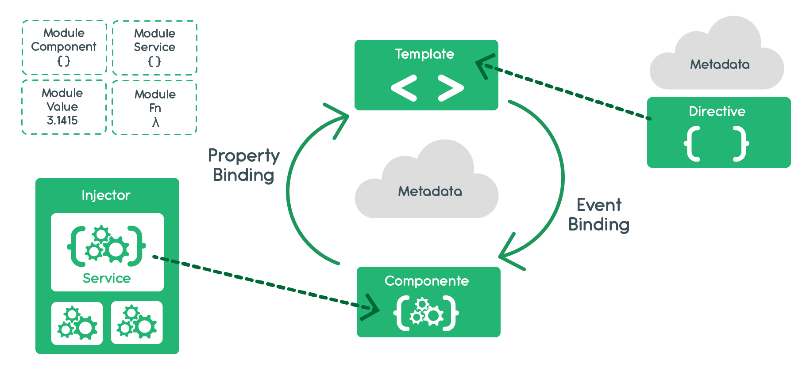

# Programação de scripts

Esta matéria estuda o desenvolvimento de paginas web com o uso de Scripts(JavaScript).

As páginas web são baseadas em três tecnologias

* HTML - Define estrutura
* CSS - Define estilo
* JavaScript - Define Comportamento

Além disso, a matéria engloba assuntos relacionados a Typescript e Angular, que serão abordados mais a frente.

## HTML (Hypertext Markup Language)

É a linguagem de *marcação* utilizada para definir a estrutura de uma página.
Para marcar um elemento na página utiliza-se a seguinte notação, chamada de tag ou nó: 

``` html
<tagname propriedade="valor"> conteudo da tag </tagname>
```

Por exemplo 

``` html 
<a href="https://www.g1.globo.com">Site da globo</a>
```

No exemplo a cima temos uma tag de link `<a>` para o site do globo. A propriedade `href` tem o valor `https://www.g1.globo.com`

De forma geral, a maioria das tags contém tag de fechamento, contudo há algumas tags que fogem a esta regra.

### Documento HTML

Um arquivo .html é chamado de documento html. Sua estrutura básica é:

```html
<!DOCTYPE html>
<html>
	<head>
	</head>
	<body>
	</body>
</html>

```

### Principais tags
* ``` <!DOCTYPE html> ``` - utilizada para o navegador entender a versão do HTML.
* ``` <html></html> ``` - Define um documento html.
* ``` <head></head> ``` - define uma informação de configuração sobre o documento (titulo, importações).
* ``` <title></title> ``` - Define o titulo do documento que ficará na aba do navegador.
* ``` <body></body> ``` - define o corpo da página.
* ``` <h1></h1> até <h6></h6 ``` - estas tag são utilizadas para cabeçalho da pagina. Esta tag possui variação de tamanho que vai de h1(maior) até h6(menor).
* ``` <div></div>```  - define uma seção no documento
* ``` <p></p>``` - Define um parágrafo de texto 
* ``` <a></a> ``` - Define um hyperlink
* ```  ``` - Define uma imagem
* ``` <meta>``` - Define informações meta
* ``` <ul></ul>``` - Define uma lista não ordenada
* ``` <ol></ol>``` - Define uma lista ordenada
* ``` <li> </li>``` - Define o elemento de uma lista
* ``` <br>``` - Define uma quebra de linha
* ``` <form></form> ``` - Define um formulário

---

## CSS (Cascading Style Sheets)
Utilizada para dar estilo as tags de marcação ([HTML](#HTML)). A utilização de estilos modificadas propriedades das tags como valor, posição, tamanho, etc. e assim conseguimos estilizar nossas páginas Web.

Há três formas de utilizar o css junto com o HTML.

* Inline
* Incorporado
* Importado

### CSS Inline

O CSS recebe a classificação de Inline quando está junto com uma tag HTML.

Por exemplo,

``` html 
<span style="color:red">Olá mundo</span>
```

### CSS Incorporado

O CSS recebe a classificação de Incorporada quando está em um arquivo HTML dentro da tag `<style></style>`

Por exemplo, 

```html 
<DOCTYPE html>
<html>
	<head>
		<style>
			span { 
				color: red;
			}
		</style>
	</head>
	<body>
		<span>Olá mundo</span>	
	</body>
</html>
```

### CSS Importado (Linkado ou externo)

O css recebe a classificação de importado quando é escrito em outro arquivo e importando, por meio da tag `<link>` no html.

Por exemplo

* arquivo style.css
``` css
span {
	color: red;
} 
```
* arquivo teste.html

``` html
<DOCTYPE html>
<html>
	<head>
		<link rel="stylesheet" type="text/css" href="style.css">
	</head>
	<body>
		<span>Olá mundo</span>	
	</body>
</html>
```
### Seletores CSS
Como dito anteriormente os CSS é responsável por aplicar estilo as marcações feitas com HTML e para determinar qual marcação deverá receber o estilo usamos os seletores, que através de uma regra vão selecionar qual marcação deve receber o estilo.
O CSS tem uma sintaxe propria para descrever estilo. 
``` css
seletor {
	propriedade: valor;
	propriedade: valor;
	propriedade: valor;
}
```
Sendo assim `seletor`  é uma regra para selecionar um ou vários elementos da página. Dentro das chaves é a declaração, então declaramos como queremos que aquele conjunto de propriedades vão receber o valor que determinarmos e ao final da linha exige-se um `;`(ponto e vírgula).
Por exemplo:

``` css
strong {
	color: red;
}
```

Neste exemplo selecionamos todas as tags `strong`, e dentro das chaves definimos que a propriedade `color`(cor) vai ter o valor `red`.

#### Seletores básicos

##### Seletor por tag
Este seletor escolhe todos os elementos que correspondem ao nome fornecido.

**Sintaxe:** `nome-da-tag`

**Exemplo:** input corresponderá a qualquer elemento input.
``` css
input{
	background-color: red;
}
```
##### Seletor por classe
Este seletor escolhe todos os elementos baseados no valor do seu atributo `classe`.

**Sintaxe:** `.nome-da-classe`

**Exemplo:** `index` corresponderá a qualquer elemento que tenha a classe `index`.
``` css
.index{
	background-color: red;
}
```
##### Seletor por ID
Este seletor escolhe o elemento baseados no valor do seu atributo `id`. Deve existir apenas um elemento com determinado ID no mesmo documento.

**Sintaxe:** `#nome-do-id`

**Exemplo:** `#toc` corresponderá ao elemento que tem o id `toc`.
``` css
#toc{
	background-color: red;
}
```
##### Seletor por atributo
Este seletor básico irá escolher os elementos baseados no valor de seus atributos, ou até mesmo pelo próprio atributo.

**Sintaxe:** `[atrib] [atrib=valor] [atrib*=valor]`

**Exemplo:** `td[colspan="2"]` corresponderá a todos elementos que tem o atributo  `colspan` igual a 2.
``` css
td[colspan="2"]{
	background-color: red;
}
```

#### Seletores Combinadores

##### Seletores de irmãos adjacentes(vizinhos)
O combinador `+` seleciona os elementos que seguem imediatamente o elemento especificado anteriormente.

**Sintaxe:** A + B

**Exemplo:** `ul + li` irá corresponder a qualquer elemento `<li>` que segue imediatamente após um elemento `<ul>`
``` css
ul + li {
	color: red;
	background-color: yellow
}
```
##### Seletores gerais de irmãos
O combinador `~` seleciona os elementos que seguem(não necessariamente imediatamente)o elemento especificado anteriormente, se ambos elementos compartilham o mesmo pai.

**Sintaxe:** A + B

**Exemplo:** `p ~ span` irá corresponder a qualquer elemento `<span>` que seguir um elemento `<p>` dentro de um mesmo pai.
``` css
p ~ span {
	color: red;
	background-color: yellow
}
```
##### Seletores de filhos
O combinador `>` seleciona os elementos são filhos diretos do elementos especificado anteriormente.

**Sintaxe:** A > B

**Exemplo:** `ul > li` irá corresponder a qualquer elemento `<li>` que estiver diretamente dentro de um elemento `<ul>`
``` css
ul > li {
	color: red;
	background-color: yellow
}
```
##### Seletores de descendentes
O combinador ` ` seleciona os elementos são filhos do elementos especificado anteriormente.(não é necessário que seja um filho direto).

**Sintaxe:** A B

**Exemplo:** `div span` irá corresponder a qualquer elemento `<span>` que estiver dentro de um elemento `<div>`
``` css
div span {
	color: red;
	background-color: yellow
}
```
##### Seletores multiplos
O combinador `,` seleciona os elementos listados. Este elementos não precisam ter relação de proximidade.

**Sintaxe:** A,B

**Exemplo:** `p, span` irá corresponder a qualquer elemento `<span>` e  qualquer elemento `<p>` dentro do documento.
``` css
p, span {
	color: red;
	background-color: yellow
}
```

##### Pseudo-classes

`Pseudo-classes` permitem selecionar elementos baseados em informações que não estão contidas na árvore de documentos como um estado ou que é particularmente complexa de extrair. Por exemplo, eles correspondem se um link foi visitado anteriormente ou não. Por exemplo, `:hover` pode ser usado para alterar a cor de um botão quando o usuário passar o cursor sobre ele.

**Sintaxe**
``` ccs 
seletor:pseudo-classe {
  propriedade: valor;
}
```

**Exemplo** 
``` css
div:hover {
  background-color: #F89B4D;
}
```
Neste exemplo a pseudo-classe `hover` identifica quando o mouse está em cima de um elemento `div` e quando este estado é verdadeiro este seletor muda a cor de fundo do elemento.

Outras pseudo-classes estão disponíveis 

##### Pseudo Elementos
`Pseudo-elementos` são asbtrações da árvore que representam entidades além do que o HTML faz. Por exemplo, o HTML não tem um elemento que descreva a primeira letra ou linha de um parágrafo, ou o marcador de uma lista. Os pseudo-elementos representam essas entidades e permitem que as regras CSS sejam associadas a elas. Desta forma, essas entidades podem ser denominadas independentemente.

**Sintaxe** 
``` css 
seletor::pseudo-elemento {
  propriedade: valor;
}
```

**Exemplo**
``` css
p::first-line {
  color: blue;
  text-transform: uppercase;
}
```
O seletor `first-line` selecionará a primeira linha de todo elemento `<p>` e modificará a cor e colocará em letra maiúscula.
h
Outros pseudo-elementos estão disponíveis na documentação 

## JavaScript
JavaScript é uma linguagem de programação orientada a objetos utilizada prncipalmente para definir o comportamento de páginas web. Ela é [client-side](https://www.gigasystems.com.br/artigo/60/client-side-e-server-side),podendo ser executada no lado do cliente(ou usuário) em seu navegador, e também [server-side](https://www.gigasystems.com.br/artigo/60/client-side-e-server-side), possibilitando a criação de [APIs RESTful](https://becode.com.br/o-que-e-api-rest-e-restful/) e, também, permite a criação de aplicativos nativos com a ajuda de alguns frameworks de desenvolvimento como o [REACT Native](https://www.devmedia.com.br/react-native/). 

O JavaScript pode ser aplicado em projetos com uma variedade de propósitos, dependendo de sua necessidade:

- O lado cliente do JavaScript fornece objetos para controlar um navegador web e seu [Document Object Model (DOM)](https://www.devmedia.com.br/trabalhando-com-dom-em-javascript/29039). Por exemplo, as extensões do lado do cliente permitem que uma aplicação coloque elementos em um formulário HTML e responda a eventos do usuário, como cliques do mouse, entrada de formulário e de navegação da página.

- O lado do servidor do JavaScript fornece objetos relevantes à execução do JavaScript em um servidor. Por exemplo, as extensões do lado do servidor permitem que uma aplicação comunique-se com um banco de dados, garantindo a continuidade de informações de uma chamada para a outra da aplicação, executar manipulações de arquivos em um servidor e até mesmo responder a requisições HTTP, devolvendo informações de acordo com o mapeamento acessado, em APIs RESTful.

### Exemplo de uso
Um exemplo simples da aplicação de javascript em uma página HTML pode ser representado abaixo, onde uma janela de alerta é exibida após o clique de um botão.

``` html
<!DOCTYPE html>
<html lang="pt-br">
  <head>
    <title>Olá Mundo</title>
    <meta charset="utf-8">
  </head>
  <body>
    <button onclick="alerta()">Clique em mim!</button>
    <script type="text/javascript">
      alerta() {
        alert('Olá Mundo!');
      }
    </script>
  </body>
</html>
```

No exemplo acima, ao clicar no botão exibido na tela, a mensagem "Olá Mundo!" é exibida em um alerta. O código a ser executado fica dentro da tag `<script></script>`, situado dentro da tag `<html></html>`. 

Caso fique dentro da tag `<head></head>`, o código será executado antes do conteúdo da página ser carregado, caso fique dentro do `<body></body>`, será carregado junto com o conteúdo, na rodem que aparece no código.

Além do uso exemplificado acima, um código javascript pode ser importado de um arquivo externo e utilizado da mesma forma: 

``` html
<!DOCTYPE html>
<html lang="pt-br">
  <head>
    <title>Olá Mundo</title>
    <meta charset="utf-8">
  </head>
  <body>
    <button onclick="alerta()">Clique em mim!</button>
    <script type="text/javascript" src="alo.js"></script>
  </body>
</html>
```

Arquivo "alo.js": 
``` javascript
alerta() {
    alert('Olá Mundo!');
}
```

### Variávies
Uma variável em JavaScript é dinamicamente tipada, isto é, uma variável pode conter qualquer conteúdo. Por exemplo:
``` js
let a = 3.1415 
typeof a // number
a = 'Olá mundo'
typeof a // string

```
### Tipos de dados

#### Number 
O tipo de dado `number` é usado para representar números, sejam eles inteiros ou números com ponto flutuante(reais).
Por exemplo.
``` js
let n = 123;
n = 12.345;
```

#### String
O tipo de dados `string` é usado para representar cadeias de caracteres. Eles podem ser construídas usando três tipos de aspas:

1. Aspas duplas: "Hello"
2. Aspas simples: 'Hello'
3. Crase: <code>&#96;Hello&#96;</code>

``` js
let str = "Hello";
let str2 = 'Mundo!';
let frase = `Ola  ${str2}`; // Ola Mundo
```
#### Boolean

O tipo boolean tem apenas dois valores: `true` e `false`.

Este tipo é comumente usado para armazenar valores de sim/não: `true` significa "sim, correto", e `false` significa "não, incorreto".

```js
let campoNomeCheck = true; // sim, o campo do nome é verificado
let campoIdadeCheck = false; // não, o campo idade não é verificado
```

#### O valor "null"

O valor especial `null` não pertence a nenhum dos tipos descritos acima.

```js
let idade = null;
```

Em JavaScript, `null` não é uma "referência a um objeto não-existente" ou um "ponteiro nulo" como em outras linguagens.

É apenas um valor especial que representa "nada", "vazio" ou "valor desconhecido".

#### O valor "undefined"

O valor especial `undefined` também se diferencia. Faz um tipo próprio, tal como `null`.

O significado de `undefined` é "o valor não é atribuído".

Se uma vaiável é declarada, mas não atribuida, então seu valor é `undefined`:

```js run
let x;

alert(x); // mostra "undefined"
```
#### Objeto 
Objetos são variaveis também. Mas objetos podem conter múltiplos valores.

Este código declara múltiplos valores (Fiat, Uno, branca) para a variável carro:

```js run
var carro = {tipo:"Fiat", modelo:"Uno", cor:"branca"};
```

Os valores são escritos com o par  `chave:valor`

> Objetos JavaScript são containers para valores nomeados denominados de propriedade.

Seguindo o exemplo anterior temos a seguinte tabela de propriedade

Propriedade | Valor da Propriedade
------------|----------------------
tipo | Fiat
modelo | Uno 
cor | branca


Para acessar o valor de uma propriedade usa-se a seguinte sintaxe:

>  Objeto. valor 

No exemplo anterior
``` js 
carro.cor //branca
```

###### Métodos em objetos JS
Objetos também podem conter métodos. Os métodos são armazenados nas propriedades como funções 

Exemplo: 

``` js 
var person = {
  firstName: "Joao",
  lastName : "Silva",
  id       : 5566,
  fullName : function() {
    return this.firstName + " " + this.lastName;
  }
};

person.fullName() // Joao Silva
```
Neste exemplo a palavra `this` em `this.firstName` referencia a propriedade `firstName` deste Objeto.

**Note que o padrão JSON(JavaScript Object Notation) é basicamente um objeto em JS.**

#####  Resumo

Existem 6 tipos básicos em JavaScript.

- `number` para números de qualquer tipo: inteiro ou ponto flutuante.
- `string` para cordas. Uma cadeia de caracteres pode ter um ou mais caracteres, não há nenhum tipo de caractere único separado.
- `boolean` para `true`/`false`.
- `null` para valores desconhecidos -- um tipo autônomo que tem um único valor `null`.
- `undefined` para valores não atribuídos -- um tipo autônomo que tem um único valor `undefined`.
- `object` para estruturas de dados mais complexas.

O operador `typeof` nos permite ver qual tipo é armazenado em uma variável.

- Duas formas: `typeof x` ou `typeof(x)`.
- Retorna uma string com o nome do tipo, como `"string"`.
- Para `null` retorna `"object"` -- isso é um erro na linguagem, não é realmente um objeto.


### Arrays

Arrays são usados para armazenar múltiplos valores em uma única variável.

Por exemplo:

``` js
var carros = ['Golfão', 'Polão','Golzeta rabaixada']
```
#### Criando um array

> var array_name  = [item1, item2, item3, ...]

Por exemplo:

``` js
var carros = ['Golfão', 'Polão','Golzeta rabaixada']
```
#### Acessando os elementos de um arrray

Voce pode acessar o elemento de um array se referindo ao seu indice.

Por exemplo, para pegar o primeiro elemento do array `carros`:

```js
carros[0]
```

**Note: O array começa com indice 0**

#### Alterando um elemento do array

Para mudar o elemento de um array basta usar a variável e o indice que se deseja mudar:

Por exemplo: 
``` js
	carros[0] = "Jettão"
```

#### Arrays são objetos 
Arrays são um tipo especial de objeto. A função `typeof` retorna `object` para um array. Contudo, é recomendado se referir a Javascript array como Array. A dirença entre `array`e `object` se dá pelo fato de que:

* Arrays usam **números** para acessar seus elementos. Por exempo: ``` carros[0] ```
* Objetos usam **nomes ou chaves** para acessar seus elementos. Por exemplo: ``` carro.nome ```

#### Métodos de um array

##### Array.toString()
Converte um array em uma string, com os elementos separados por vírgula.

``` js
var frutas = ["Banana", "Laranja", "Maça", "Manga"];
frutas.toString() // Banana, Laranja, Maça, Manga
``` 
##### Array.join()
Junta todos os elementos de um array. Funciona da maneira semalhante a função [toString()](#Array.toString()) com a diferença que você pode determinar o separador.

``` js
var frutas = ["Banana", "Laranja", "Maça", "Manga"];
frutas.join(" * ") // Banana * Laranja * Maça * Manga
``` 

##### Array.pop()
Remove o último item do array.
``` js
var frutas = ["Banana", "Laranja", "Maça", "Manga"];
frutas.pop() // ["Banana", "Laranja", "Maça"]
``` 

##### Array.push()
Adiciona um item no fim do array
``` js
var frutas = ["Banana", "Laranja", "Maça", "Manga"];
frutas.push("Abacate") //["Banana", "Laranja", "Maça", "Manga", "Abacate"];
```

#### Método de iteração em Arrays

##### Array.forEach()
O método forEach() chama uma função em cada elemento do array.

``` js
var txt = "";
var numeros = [45, 4, 9, 16, 25];
numeros.forEach(minhafuncao);

function minhafuncao(value, index, array) {
  txt = txt + value + "<br>";
}
console.log(txt) 
```

##### Array.Map()
O método map() cria um novo executando uma função em cada elemento do array. Este método não executa a função para um array com elementos sem valores. Além disso, o método não muda o array original.

Este exemplo multiplica cada posicao do array por 2:

``` js 
var numeros1 = [45, 4, 9, 16, 25];
var numeros2 = numeros1.map(minhaFuncao);

function minhaFuncao(value, index, array) {
  return value * 2;
}
```

##### Array.Filter()

O método filter() cria um novo array com todos os elementos que passaram no teste da função de callback.

No exemplo a seguir é criado um novo array com todos os elementos maiores do que 18.

``` js
var numeros = [45, 4, 9, 16, 25];
var maior18 = numeros.filter(minhaFuncao);

function minhaFuncao(value, index, array) {
  return value > 18;
} 
```

##### Array.Reduce()
O método reduce() executa uma função em cada elemento do para produzir (reduzí-lo) em um único valor.Este método funciona da esquerda para a direita, isto é, do início até o fim do array.

No exemplo abaixo teremos a soma de todos os elementos do array.
 
``` js
var numeros = [45, 4, 9, 16, 25];
var soma = numeros.reduce(minhaFuncao);

function minhaFuncao(total, value, index, array) {
  return total + value;
} 
```
Note que a função recebe 4 argumentos:
1. O total (O valor inicial)
2. O conteúdo da posição
3. O indice da posição
4. O array

Contudo, a função pode recebe apenas dois parâmetros (value, total):

``` js
var numeros = [45, 4, 9, 16, 25];
var soma = numeros.reduce(minhaFuncao);

function minhaFuncao(total, value) {
  return total + value;
} 
``` 


Note as função de iteração sobre um array, com exceção do reduce, recebem três argumentos:
1. O conteúdo do índice
2. O indice do array
3. O próprio array

Contudo, você pode usar somente o valor como parâmetro

``` js
var txt = "";
var numeros = [45, 4, 9, 16, 25];
numeros.forEach(minhaFuncao);

function minhaFuncao(value) {
  txt = txt + value + "<br>";
}

```
### Funções
Funções são um bloco de código designado para executar uma tarefa em particular e ela é executa quando é chamada. 
Por exemplo,
``` js
// Declaração
function produto(p1, p2) {
  return p1 * p2;   // Retorna o produto de dois números
}
// Chamada da função
produto(3,4) // 12
```
#### Sintaxe

Uma função é definida através da palavra reservada `function` seguindo de um nome para função e por último seus parâmetros `()`.
Os parâmetros são separados por vírgulas `function soma(n1,n2,n3)` e dentro da função os parâmetros se comportam como variáveis locais.
A função é executada até encontrar um `return` e então a execução para o ponto de onde foi chamada.
**Lembre-se para executar uma função necesita colocar `()` com seus argumentos, caso não haja os parenteses será mostrado a definição da função.**

``` js
function produto(p1, p2) {
  return p1 * p2;   // The function returns the product of p1 and p2
}
produto // produto() \n arguments: null \n caller: null \n length: 2 \n name:"produto" \n prototype: Object { … }
produto(4,3) // 12
​
<prototype>: function ()
```

**As variáveis de funções tem escopo local, logo podem ser usadas somente dentro da função**
#### Funções anônimas
Em JavaScript funções também são um tipo de data, logo é possível armazená-las em variáveis. O benefício deste recurso é você poder usar uma função como um objeto e passá-la como argumentos em outras funções.

``` js
var txt = "";
var numeros = [45, 4, 9, 16, 25];
var concatena = function (value) {
  txt = txt + value + "<br>";
}
numeros.forEach(concatena);

txt // "45<br>4<br>9<br>16<br>25<br>"

```
#### Arrow functions

As `arrows functions` é um sintaxe mais curta de escrever uma função em JavaScript.
Logo a função
``` js
ola = function() {
  return "Hello World!";
} 
```
Pode ser reescrita da seguinte forma
```js
ola = () => {
  return "Hello World!";
} 
```

Além disso, se a função tem apenas um comando você pode omitir as chaves `{}`.

``` js
ola = () => "Hello World!"; 
```

ou com parâmetros

``` js
ola = (val) => "Hello " + val; 
```

E se a funçaõ tiver apenas um parâmetro podemos omitir os parenteses `()`
```js
 ola = val => "Hello " + val; 
```

##### A palavra `this` em Arrow Functions
Em função normais a palavra `this` se refere ao escopo na qual ela foi definida, enquando na `arrow function` a palavra  `this` é herdado do contexto da execução.

Exemplo usando funcão normal
```js 
const car = {
  model: 'Fiesta',
  manufacturer: 'Ford',
  fullName: function() {
    return `${this.manufacturer} ${this.model}`
  }
}
car.fullName() // Ford Fiesta
```

Exemplo usando `arrow functions`

```js 
const car = {
  model: 'Fiesta',
  manufacturer: 'Ford',
  fullName: () => {
    return `${this.manufacturer} ${this.model}`
  }
}
car.fullName()// undefined undefined 
```
### Promises

A `Promises`("promessa") é um objeto usado para processamento assíncrono e representa valor que pode estar disponível agora,no futuro ou nunca. Nas promises utilizamos o `then` para quando ela tem sucesso e o `catch` para capturar qualquer erro que venha a ocorrer. 
Para criarmos uma Promise é muito simples, basta inicializar um new Promise que recebe uma função como parâmetro, esta função tem a assinatura `(resolve, reject) => {} `, então podemos realizar nossas tarefas assíncronas no corpo desta função, quando queremos retornar o resultado final fazemos `resolve(resultado)` e quando queremos retornar um erro fazemos `reject(erro)` .

#### Estados das promises

Uma promises pode estar em 4 estados:
1. `Pending`: O estado inicial da promise,  ela foi inicializada, mas ainda não foi realizada nem rejeitada.
2. `Fulfilled`:  A promises foi realizar com sucesso, isto é, ela realizou seu processamento com sucesso.
3. `Rejected`: A promises foi rejeitada, isto é, ela obteve algum erro durante sua execução.
4. `Settled`: O estado final da promise, neste estado ja sabemos se ela foi resolvida ou rejeitada.

## Bootstrap
### Bootstrap Grid System
O Grid system do Bootstrap nos permite divier a página em doze colunas. O grid system é responsivo e as colunas são reorganizadas dependendo do tamanho da tela.
#### Grid Classes
O grid system do bootstrap tem cinco classes
* `.col-` ( largura de tela menor do que 576px)
* `.col-sm` ( largura de tela maior ou igual do que 576px)
* `.col-md` ( largura de tela maior ou igual do que 768px)
* `.col-lg` ( largura de tela maior ou igual  do que 992x)
* `.col-xl` ( largura de tela maior ou igual do que 1200px)

As classes acima podem ser combinadas para criar layouts flexíveis e dinâmicos.

**Dica:** Cada classe aumenta de escala; portanto, se você deseja definir as mesmas larguras para `sm` e `md`, é necessário especificar apenas `sm`.

#### Regras do grid system
* Linhas(`rows`) devem estar localizadas dentro de uma classe `.container` (tamanho-fixo) ou `.container-fluid` (tamanho total da tela) para alinhamento(aling) e preenchimento(padding) adequados.
* As linhas(`rows`) devem ser usada para criar grupos horizontais de colunas
* O conteúdo deve ser colocado dentro das colunas(`col`) e apenas as colunas(`col`) podem ser filhos imediatos das linhas(`rows`)
* Classes predefinidas como `.row` e `.col-sm-4` estão disponíveis para criar layouts com grid system rapidamente
* As colunas do grid system são criadas especificando o número colunas que deseja-se usar. Por exemplo, três colunas iguais usariam três `.col-sm-4`
* As larguras das colunas são em porcentagem, portanto, elas são sempre fluidas e dimensionadas em relação ao elemento pai

#### Estrutura básica do grid system do bootstrap 4
``` html 
<div class="container">
	<!-- Controla a largura da coluna, e como ela aparece em diferentes dispositivos -->
	<div class="row">
		<div class="col-*-*"></div>
		<div class="col-*-*"></div>
		<div class="col-*-*"></div>
	</div>

	<!-- Deixando o bootstrap cuidar do tamanho -->
	<div class="row">
		<div class="col"></div>
		<div class="col"></div>
		<div class="col"></div>
		<div class="col"></div>
	</div> 
</div>

```
Primeiro exemplo: crie uma linha (<div class = "row">). Em seguida, adicione o número desejado de colunas (tags com as classes .col - * - * apropriadas). A primeira estrela (*) representa a responsividade: sm, md, lg ou xl, enquanto a segunda estrela representa um número, que sempre deve somar 12 para cada linha.

Segundo exemplo: em vez de adicionar um número a cada col, deixe a inicialização manipular o layout, para criar colunas de largura igual: dois elementos "col" = 50% de largura para cada col. três cols = 33,33% de largura para cada col. quatro colunas = 25% de largura, etc. Você também pode usar .col-sm | md | lg | xl para tornar as colunas responsivas.


## Typescript
Typescript é um **superset de javascript** criado pela microsoft que traz tipagem estática e elementos de orientação a objetos para uma melhor compreensão e organização do código. Esse superset disponibiliza melhor suporte aos recursos de POO, com base em seus quatro princípios fundamentais: encapsulamento, herança, abstração e polimorfismo.

A aplicação de POO em Javascript sempre foi um problema, pois sua tipagem de dados é dinâmica e uma classe criada em sua versão vanilla(versão pura e sem frameworks) não é clara o suficiente. O Typescript traz soluções para estes problemas em tempo de desenvolvimento, com tipagem estática, interfaces, classes, enums e toda uma checkagem de erros pelo [intelissense](https://docs.microsoft.com/pt-br/visualstudio/ide/using-intellisense?view=vs-2019) da IDE durante o desenvolvimento.

Por se tratar de um superset e não uma nova implementação, o Typescript permite a utilização de todos os recursos do **EC5+(ECMA Script 5 e superiores)**. Sintaxes que são apenas do superset são compiladas para a versão desejada do EC5+ através do comando `tsc nomedoarquivo.ts`.

### Instalação
Como pré-requisito é necessário possuir instalado o [node.js](https://www.opus-software.com.br/node-js/) e o gerenciador de pacotes do node, o [npm](https://www.hostinger.com.br/tutoriais/o-que-e-npm).

A instalação é realizada com o comando `npm install -g typescript`, onde o `-g` instala os recursos globalmente.

### Compilação 
O comando `tsc <nomeDoArquivo.ts>` é utilizado para compilar um código Typescript. Esse código compilado é transformado em javascript, que é executado diretamente no navegador.

### Exemplo de classe em Typescript

```ts
export class Pessoa {

  private nome: string;
  private idade: number;
  private parentesco: Array<Pessoa>;

  constructor(nome: String, idade: number, parentesco: Array<Pessoa>){
    this.nome = nome;
    this.idade = idade;
    this.parentesco = parentesco;
  }

  public getNome(): string {
    return this.nome;
  }

  public setNome(nome: string): void {
    this.nome = nome;
  }

  public getIdade(): number {
    return this.idade;
  }

  public setIdade(idade: number): void {
    this.idade = idade;
  }

  public getParentesco(): Array<Pessoa> {
    return this.parentesco;
  }

  public setParentesco(parentes: Array<Pessoa>): void {
    this.parentesco = parentes;
  }
}
```

---

## Angular
Angular é uma plataforma e framework criado por desenvolvedores da Google para contrução de interfaces de front-end utilizando HTML, CSS e Javascript em seu início (AngularJs), depois substituída por Typescript. Este framework diponibiliza facilidades no desenvolvimento de front-end como componentes, injeção de dependências, roteamento, módulos e ferramentas que automativam testes unitários.

O ambiente de desenvolvimento disponibilizado pelo Angular ajuda na criação de SPAs (Single Page Applications), que serão explicadas mais adiante.

### SPA (Single Page Application)
SPAs são aplicações que funcionam no navegador de internet e não recarregam durante o uso. São construídas com HTML, CSS e JavaScript e apresentam as informações aos usuários de uma forma simples, fluida e rápida.

### Arquitetura Angular
Aplicações Angular são divididas por componentes. Estes componentes possuem três tipos de arquivos: Template (HTML), Estilos (CSS), Componente (Typescript). 

A comunicação entre os elementos de uma aplicação Angular ocorre como na imagem abaixo:



#### Template
O template (HTML) se comunica com o componente (Typescript) através do event binding, onde eventos no navegador como cliques ou até mesmo contato do mouse com um elemento da página ativam métodos situados no componente e que podem afetar outros componentes da aplicação.

#### Componente
O componente (Typescript) se comunica com o Template através do property binding, onde variáveis contidas no componente são exibidas no HTML do template.

#### Diretivas
Diretivas são propriedades das tags HTML do Angular que alteram comportamento, visualização e estilo de onde são implementadas. Sua utilização é da mesma forma da aplicação de uma propiredade de TAG HTML: 
```html
<div diretiva>
  <!-- neste caso, a diretiva aplicada é uma diretiva customizada 
    e pode apresentar qualquer comportamento -->
</div>
```
Além das diretivas customizadas, [diretivas nativas](http://www.macoratti.net/18/06/ang_diret1.htm) como *ngIf, *ngFor e ngClass podem ser aplicadas em quaisquer tags do template.

#### Serviços
Serviços no Angular são arquivos que possuem uma função específica e podem ser utilizados em quaisquer componentes da aplicação. Geralmente se comunicam diretamente com o backend e retornam a informação ao componente desejado.

Sua utilização é providenciada através da injeção de dependências do Angular, que instancia o serviço desejado no componente quando necessário e permite um menor acoplamento entre componentes. o exemplo abaixo mostra a sintaxe de injeção de uma classe de serviços:

```ts
export class Pessoa {
  /*Códigos acima omitidos*/

  // Informando o serviço no contrutor, idica ao Angular que este serviço será necessário e pede para providenciar uma instância dele
  constructor(pessoaService: PessoaService) {}

  /*Códigos abaixo omitidos*/
}
```
#### Quick Reference Angular

##### Template Syntax

Template Syntax | Exemplo    | Descrição
----------------|------------|-------------------
Data Binding    | <p>{{ homeTitle }}</p> | Vincula o conteudo do atributo `homeTitle` ao conteúdo de texto da tag P
Property Binding | <input type="text" [value]="myString"/> | Atribui o conteúdo da variável `myString` como valor da propriedade `value` da tag `input`
Two way data binding | <input type="text" [(ngModel)]="myString"/> | Atribui o conteúdo da variável `myString` como valor da propriedade `value` da tag `input` além disso também permite a alteração de conteúdo da variável `myString` pelo usuário.
Event Binding | <button (click)="alertMe()">Click me</button> | Criar um `listener`(escutador) que aguarda o evento `click`, quando este evento ocorre chama o método `alertMe()`
Custom Property Biding | <p>{{ninja.nome}}</p> | Atribui como conteúdo de texto da tag p a propriedade `nome` do objeto `ninja`

##### Diretivas Angular

Diretivas Angular | Descrição 
------------------|----------------
<section *ngIf="showSection"> | Remove ou recria este elemento `section` em uma parte da página com base na expressão showSection.
<li *ngFor="let item of list"> | Transforma o elemento li e seu conteúdo em um modelo e usa isso para instanciar uma exibição para cada item da lista `list`.
<div [ngClass]="{'active': isActive, 'disabled': isDisabled}"> | Vincula a presença de classes CSS no elemento à veracidade dos valores de mapa associados. A expressão à direita deve retornar o mapa {class-name: true / false}.

#### Stackblitz
Stackblitz é uma plataforma de desenvolvimento online que providencia um ambiente completo para testes de códigos em Angular, React, Vue e outros frameworks. Com ela, o compartilhamento de pequenos códigos fica mais simples.

Um exemplo de uma aplicação Angular hospedada no Stackblitz foi criado [aqui](https://stackblitz.com/edit/cadastro-matriculas-firebase-orm). Nele foram aplicados conceitos de roteamento, lazy loading e comunicação com banco de dados externo utilizando Firebase.

# Referências
* [1] MDN Web Docs. "O que é JavaScript". Disponível em: [https://developer.mozilla.org/pt-BR/docs/Web/JavaScript/Guide/Introduction#O_que_é_JavaScript](https://developer.mozilla.org/pt-BR/docs/Web/JavaScript/Guide/Introduction#O_que_é_JavaScript). Acesso: meados do 2º semestre de 2019.
* [2] Davi Ferreira. "O que é JavaScript?". Disponível em: [https://tableless.github.io/iniciantes/manual/js/](https://tableless.github.io/iniciantes/manual/js/). Acesso: meados do 2º semestre de 2019.
* [3] RocketSeat. Curso de introdução ao Javascript. Disponível em: [https://rocketseat.com.br/starter/curso-gratuito-javascript](https://rocketseat.com.br/starter/curso-gratuito-javascript). Acesso: meados do 2º semestre de 2019.
* [4] GINAPE UFRJ. "Incluindo Javascript no Documento HTML". Disponível em: [http://www.nce.ufrj.br/ginape/js/conteudo/introducao/incluindo.htm](http://www.nce.ufrj.br/ginape/js/conteudo/introducao/incluindo.htm). Acesso: meados do 2º semestre de 2019.
* [5] DEVMEDIA. "Introdução ao TypeScript". Disponível em: [https://www.devmedia.com.br/introducao-ao-typescript/36729](https://www.devmedia.com.br/introducao-ao-typescript/36729). Acesso: meados do 2º semestre de 2019.
* [6] TypeScript Lang. "TypeScript in 5 minutes". Disponível em: [http://www.typescriptlang.org/](http://www.typescriptlang.org/). Acesso: meados do 2º semestre de 2019.
* [7] Eduardo Rabelo. "TypeScript: O guia definitivo". Disponível em: [https://medium.com/@oieduardorabelo/typescript-o-guia-definitivo-1a63b04259cc](https://medium.com/@oieduardorabelo/typescript-o-guia-definitivo-1a63b04259cc). Acesso: meados do 2º semestre de 2019.
* [8] Diego Fernandes. "TypeScript: Vantagens, mitos, dicas e conceitos fundamentais". Disponível em: [https://blog.rocketseat.com.br/typescript-vantagens-mitos-conceitos/](https://blog.rocketseat.com.br/typescript-vantagens-mitos-conceitos/). Acesso: meados do 2º semestre de 2019.
* [9] Alexandre Afonso. "O que é Angular?". Disponível em: [https://blog.algaworks.com/o-que-e-angular/](https://blog.algaworks.com/o-que-e-angular/). Acesso: meados do 2º semestre de 2019.
* [10] Neoteric. "Single-page application vs. multiple-page application". Disponível em: [https://medium.com/@NeotericEU/single-page-application-vs-multiple-page-application-2591588efe58](https://medium.com/@NeotericEU/single-page-application-vs-multiple-page-application-2591588efe58). Acesso: meados do 2º semestre de 2019.
* [11] GARY SIMON. "Angular 4 Event Binding". Disponível em: [https://coursetro.com/posts/code/59/Angular-4-Event-Binding](https://coursetro.com/posts/code/59/Angular-4-Event-Binding). Acesso: meados do 2º semestre de 2019.
* [12] José Carlos Macoratti. "Angular 5 -  Principais diretivas - I". Disponível em: [http://www.macoratti.net/18/06/ang_diret1.htm](http://www.macoratti.net/18/06/ang_diret1.htm). Acesso: meados do 2º semestre de 2019.
* [13] JavaScript. Disponível em: [https://www.w3schools.com/js/](https://www.w3schools.com/js/). Acesso: 2 semestre de 2019
* [14] HTML. Disponível em: [https://www.w3schools.com/html/](https://www.w3schools.com/html/). Acesso: 2 semestre de 2019
* [15] CSS. Disponível em: [https://www.w3schools.com/css/](https://www.w3schools.com/css/). Acesso: 2 semestre de 2019
* [16] Seletores CSS. Disponível em: [https://developer.mozilla.org/pt-BR/docs/Web/CSS/Seletores_CSS](https://developer.mozilla.org/pt-BR/docs/Web/CSS/Seletores_CSS). Acesso: 2 semestre de 2019
* [17] JS. Disponível em: [https://developer.mozilla.org/pt-BR/docs/Web/JavaScript](https://developer.mozilla.org/pt-BR/docs/Web/JavaScript). Acesso: 2 semestre de 2019
* [18] BoptStrap 4 Grid system. Disponível em: [https://www.w3schools.com/bootstrap4/bootstrap_grid_system.asp](https://www.w3schools.com/bootstrap4/bootstrap_grid_system.asp). Acesso: 2 semestre de 2019

