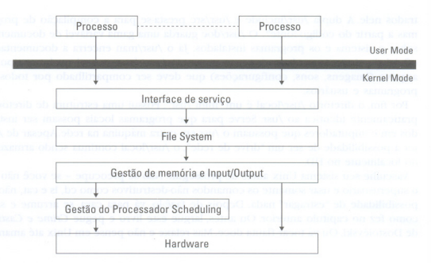
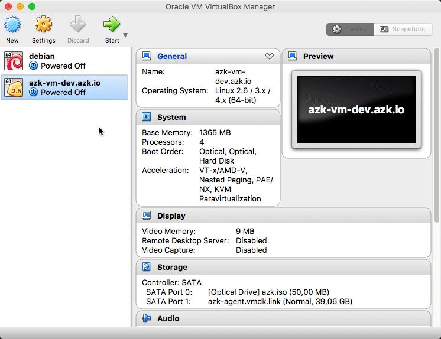
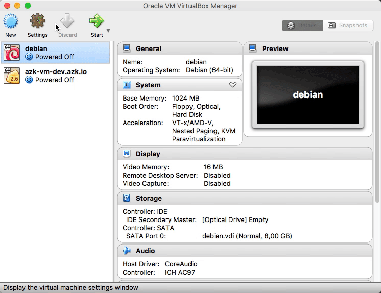

<!-- TOC depthFrom:1 depthTo:6 withLinks:1 updateOnSave:1 orderedList:1 -->

1. [Sistema operacional](#sistema-operacional)
	1. [Reiniciar](#reiniciar)
	2. [Desligar](#desligar)
2. [Arquivos](#arquivos)
	1. [Criando arquivos](#criando-arquivos)
	2. [Copiando](#copiando)
	3. [Removendo](#removendo)
	4. [Pesquisando arquivos (find)](#pesquisando-arquivos-find)
	5. [Compactando arquivos](#compactando-arquivos)
	6. [Scripts](#scripts)
3. [Diretórios](#diretrios)
	1. [Mudar de diretório](#mudar-de-diretrio)
	2. [Movendo diretório](#movendo-diretrio)
	3. [Criar diretório](#criar-diretrio)
	4. [Removendo diretórios](#removendo-diretrios)
	5. [Permissão de acesso](#permisso-de-acesso)
		1. [Modo normal](#modo-normal)
		2. [Modo octal](#modo-octal)
	6. [Atribuindo donos](#atribuindo-donos)
4. [Usuários](#usurios)
	1. [Identificar o usuário logado](#identificar-o-usurio-logado)
	2. [Adicionar usuário](#adicionar-usurio)
	3. [Remover usuário](#remover-usurio)
5. [Grupos](#grupos)
	1. [Listando grupos](#listando-grupos)
	2. [Adicionando grupo](#adicionando-grupo)
	3. [Removendo grupoa](#removendo-grupoa)
	4. [Renomeando grupo](#renomeando-grupo)
	5. [Listando grupos do usuário](#listando-grupos-do-usurio)
	6. [Adicionando usuário no grupo](#adicionando-usurio-no-grupo)
	7. [Removendo usuário no grupo](#removendo-usurio-no-grupo)
	8. [Atribuindo administrador de grupo ao usuário](#atribuindo-administrador-de-grupo-ao-usurio)
6. [Cron (Agendador de tarefas)](#cron-agendador-de-tarefas)
	1. [Repetição a cada momento determinado](#repetio-a-cada-momento-determinado)
	2. [Repetição a cada intervalo](#repetio-a-cada-intervalo)
7. [SSH](#ssh)
	1. [Instalando e configurando](#instalando-e-configurando)
	2. [Acessando](#acessando)
	3. [Copiando arquivos por SSH](#copiando-arquivos-por-ssh)

<!-- /TOC -->

# Sistema operacional

## Estrutura

Os sistemas da família Unix podem ser divididos em função:

* kernel(cerne ou núcleo)
* shell
* programas do usuário

Estes três grandes componentes utilizam do sistema de arquivos, logo é necessário entender essa infraestrutura.

### Sistema de arquivos
Os sistemas Unix são estruturados a partir do sistemas de arquivo, logo qualquer coisa que possa ser manipuladoo no sistema é tratada como arquivo. Isso inclui dispositivos de hardware, processos em execução, etc. 

O diretorio raiz(no topo da estrutura) é representada por um sinal de barra(/) e qualquer arquivo ou diretório é referenciado a partir dele.

Cada um dos diretórios possui uma função específica:

* /bin - ferramentas necessárias para a operação do sistema;
* /sbin - ferramentas do administrador ncessárias para a operação e manutenção do sistema - o "s" ´e de superuser;
* /dev - cada dispositivo de hardware instalado possui um arquivo neste diretório;
* /etc - os arquivos de configuração do sistema estão neste diretorio;
* /home - cada usuário cadastrado no sistema possui um diretório com seu nome em  /home - esta é a única área do disco que a maioria dos usuários esta autorizada a gravar seus arquivos;
* /lib - as bibliotecas de funções do sistema estão aqui;
* /mnt - diretório usado para conexão a volumes presentes em outros computadores da rede ou para acessar dispositivos removíveis;
* /tmp - espaço para arquivos temporários gerados pelos programas ou pelos próprios usuários;
* /var - informações variávies do sistema(spoll de impressoras, caixas postais, cache de internet, log de sistema, etc).
* /usr - programas do usuário (ferramentas, editores de texto, navegador, ambientes gráficos);


## Kernel 

O `kernel` cria processos toda vez que pedimos ao sistema operacional para rodar um programa. Além disso, o kernel gerencia para que eles colaborem entre si e não se destruam e gerencia os recursos que cada processos utiliza.

O `kernel` é um núcleo monolítico onde possui tudo embutido. Assim, apenas processos e serviços rodam no modo usuário.



Os processo comunicam-se com o `kernel` por meio de chamadas de sistemas, em inglês (System Call). Estas interagem com hardware, arquivos, etc. Assim, o processo emite uma `System call` solicitando alguma coisa e o `kernel` utiliza suas rotinas para acessar o recurso desejado.


#Comandos

## Reiniciar

```
reboot
shutdown -r 1
```

## Desligar

```
shutdown 1
poweroff
```

# Arquivos

## Criando arquivos

Único arquivo

```
echo "conteudo" > arquivo_1.txt
```

Vários arquivos

```
touch arquivo_{1..3}.txt
```

> `touch` não foi criado para essa funcionalidade, use `man touch` para mais informações.

## Copiando

```
cp ./fonte/arquivo_1.txt ./destino/arquivo_2.txt
```

## Removendo

```
rm ./fonte/arquivo_1.txt
```

## Pesquisando arquivos (find)

Pesquisando arquivo com nome `arquivo-1.txt` a partir de `/`

```
find / -name arquivo-1.txt
```

Pesquisando arquivos do grupo root a partir de `/`

```
find / -group root
```

Pesquisando arquivos de um usuário a partir de `/`

```
find / -user usuario-1
```

Pesquisando arquivos que contenham permissão de acesso 777 a partir de `/`

```
find / -type f -perm 777
```

Pesquisando diretórios que contenham permissão de acesso 777 a partir de `/`

```
find / -type d -perm 777
```

Pesquisando arquivos pelo inode

```
find / -inum 11008
```

> Para identificar o inode do arquivo, use: `stat arquivo-exemplo.txt`


## Compactando arquivos

Compactando `arquivo-1.txt` utilizando algoritmo de compactação gzip

```
tar -czf arquivo.tar.gz arquivo-1.txt
```

Descompactando `arquivo-1.txt` utilizando algoritmo de compactação gzip

```
tar -xzf arquivo.tar.gz
```

## Scripts

Scripts precisam de permissão para execução, no exemplo abaixo exibe a data.

1. Criando script
```
echo "date" > exibe_data.sh
```

2. Alterando permissão
```
chmod +x exibe_data.sh
chmod u+x,o-rx exibe_data.sh
```

3. Executando
```
./exibe_data.sh
```

> É possível usar outra extensão como executável, porém é necessário adicionar qual programa deve executá-lo.
> Adicione a primeira linha (exemplo usando /bin/bash): #!/bin/bash


# Diretórios

## Mudar de diretório

Mudando para diretório pai, diretório filho e diretório `home` do usuário, respectivamente:

```
cd ..
cd pasta
cd ~
```

## Movendo diretório

Criando `pasta_1` e `pasta_2`. Movendo `pasta` para `pasta2`:

```
mkdir pasta_{1..2}
mv pasta_1 pasta_2
```

## Criar diretório

Normal e usando flag, respectivamente:

```
mkdir pasta
mkdir pasta_{1..3}
````

## Removendo diretórios

Vazios e cheios, respectivamente:
```
rmdir -r pasta_{1..3}
rmdir -rf pasta
````

## Permissão de acesso

Através do `chmod`:

### Modo normal

Parâmetros. | Operadores. | Permissões.
------------|-------------|------------
u - user    | +           | r
g - group   | -           | w
o - other   | =           | x
a - all     |             |

Permitir execução do arquivo para todos: `chmod a+x arquivo`
Permitir execução leitura e escrita para o usuário e bloquear escrita para o grupo: `chmod u+rw,g-w arquivo`


### Modo octal

r=4 | w=2 | x=1 | Octal | Permissão
----|-----|-----|-------|----------
0   | 0   | 0   | 0     | ---
0   | 0   | 1   | 1     | --x
0   | 1   | 0   | 2     | -w
0   | 1   | 1   | 3     | -wx
1   | 0   | 0   | 4     | r--
1   | 0   | 1   | 5     | r-x
1   | 1   | 0   | 6     | rw
1   | 1   | 1   | 7     | rwx

Liberar todas permissões (leitura, escrita e execução) para todos: `chmod 777 pasta`
Permitir apenas acesso ao usuário e grupo: `chmod 650 pasta`

## Atribuindo donos

Atribuindo usuário `usuario-1` e grupo `usuario-1` donos de `pasta`

```
chown usuario-1:usuario-1 pasta
```


# Usuários

## Identificar o usuário logado

```
whoami
```

## Adicionar usuário

Adicionando `usuario-1` de forma interativa e direta (com senha `123456`), respectivamente:

```
adduser usuario-1
useradd -m -p $(openssl passwd -1 123456) -s /bin/bash usuario-1
```

## Remover usuário

Removendo `usuario-1`:

```
userdel -r usuario-1
```

# Grupos

## Listando grupos

```
cat /etc/group
```

## Adicionando grupo

Adicionando grupo `grupo-xyz`

```
groupadd grupo-xyz
```

## Removendo grupoa

Removendo grupo `grupo-a`

```
groupdel group-a
````

## Renomeando grupo

Renomeando grupo `grupo-xyz` para `grupo-a`

```
groupmod -n grupo-a grupo-xyz
```


## Listando grupos do usuário

Listando grupos do usuário `usuario-1`

```
id usuario-1
```

## Adicionando usuário no grupo

Adicionando usuário `usuario-1` no grupo `grupo-a`

```
addgroup usuario-1 grupo-a
```

## Removendo usuário no grupo

Removendo usuário `usuario-1` no grupo `grupo-a`

```
deluser usuario-1 grupo-a
```

## Atribuindo administrador de grupo ao usuário

Adicionando usuário `usuario-1` como administrador no grupo `grupo-a`

```
gpasswd -A usuario-1 grupo-a
```

# Cron (Agendador de tarefas)

Cada agendamento segue esta estrutura:

Minuto | Hora | Dia (mês) | Mês | Dia (semana) | Usuário | Comando
-------|------|-----------|-----|--------------|---------|--------
*      | *    | 5         | *   | *            | root    | echo "Pagamento"

> Existe um gerador de crons: [https://crontab.guru/](https://crontab.guru/)

## Repetição a cada momento determinado

Compactando os arquivos da home do usuário `usuario-1` e movendo para a parta `/var/backup/arquivos.tar.gz` em todo minuto `15`:

```
15 * * * * tar -czf /var/backup/arquivos.tar.gz /home/usuario-1/*
```

## Repetição a cada intervalo

Compactando os arquivos da home do usuário `usuario-1` e movendo para a parta `/var/backup/arquivos.tar.gz` a cada `2` minutos:

```
*/2 * * * * tar -czf /var/backup/arquivos.tar.gz /home/usuario-1/*
```


# SSH

## Instalando e configurando

> Caso esteja sem internet, insira a ISO do debian

```
apt-get install openssh-client openssh-server -y
```

Para acessar a maquina com IP dinâmico

1. Abra as configurações do Virtual Box
2. Ative o servidor DHCP
3. Configure para modo `Host-only Adapter`
4. Configure o servidor DHCP:

```
Server Address: 192.168.50.100
Server Mask: 255.255.255.0
Lower Address Bound: 192.168.50.101
Upper Address Bound: 192.168.50.254
```





5. Renove o IP:

> Encontre o ID do adaptador com `ip a`

```
ifdown enp0s3 && ifup enp0s3
```

6. Identifique o IP da maquina
```
ip a
```

## Acessando

Use algum usuário para acessar. Usando `usuario-1` aqui.

```
ssh usuario-1@192.168.50.101
```

## Copiando arquivos por SSH

Da local para SSH

```
scp local.txt usuario-1@192.168.50.101:/home/usuario-1/ssh.txt
```

Da SHH para local

```
scp usuario-1@192.168.50.101:/home/usuario-1/shh.txt local.txt
```
