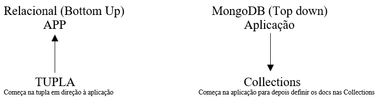

# Aula 5 - Aula para tirar dúvidas sobre o conteúdo

Nesta aula todo o conteúdo passou a ser revisado pelo professor para que fosse possível um melhor entendimento do conteúdo. Esta revisão facilitou a resolução da lista de exercícios. Esta disponível abaixo.

## Lista de exercícios (Solução)

1. Porque é necessário denormalizar as tabelas de dimensão num sistema de B.I e porque isto não fere a integridade referência do sistema ? Porque normalizamos um sistema operacional tradicional ?

> Para otimizar as agregações diminuindo o número de joins. Sistema de B.I é *read-only* em relação ao usuário. Para evitar que alguém esqueça de atualizar campos duplicados, normalizando evito duplicidades.

2. Como é feita a persistência de hierarquias de clientes corporativos e atributos multivalorados em bancos de dados relacionais ?

> Tabela ponte

3. Cite alguns motivos pelos quais é difícil a persistência de dados de redes sociais em bancos de dados relacionais

> Dentre os pontos destaca-se: Schema flexível, Schema dinâmico, Campos adicionais (Necessidade de mudanças)

4. Cite dois objetivos pelos quais bancos de dados semiestruturados são procurados pelas empresas nos dias atuais.

> Schema flexível e escalabilidade horizontal (Mais máquinas trabalhando juntas)

5. Diferencie escalabilidade horizontal e vertical para bancos de dados. Exemplifique.

> - Horizontal: Várias máquinas *commodity* trabalhando com um banco de dados distribuido. Exemplos de uso: Facebook e Google;
> - Vertical: Um servidor com CPU e memória principal único. Exemplo de uso: Mainframes de bancos

6. Bancos não relacionais são antigos, citando como exemplo IMS da década de 60. Cite alguns motivos pelos quais bancos NoSQL ganharam destaque nos dias de hoje

> 1. Opensource;
> 2. Schema dinâmico; 
> 3. Ecalabilidade horizontal;
> 4. Atende necessidade específica.

7. Cite algum significado atual para a sigla NoSQL. Dê quatro características que configuram estes bancos atualmente. Explique porque o termo não ajuda a definir o que estes bancos são de fato

> NoSQL: *Not Only SQL*
> 1. Opensource;
> 2. Schema flexível;
> 3. Escalabilidade horizontal;
> 4. Atende necessidade específica.
> O termo pode parecer negativo em um primeiro momento.

8. O que **Martin Fowler** entende por **impedance mismatch**, no seu livro NoSQL Essencial. Exemplifique.

> É a diferença entre as tuplas persistidas e objeto utilizada no desenvolvimento. 

> 

9. O que é consistência eventual. Qual é uma tradução errada **PT-BR** que deve ser evitada.

> É uma relaxação do ACID para obter maior disponibilidade.
> O que é gravado no nó primário, em instantes estará nos secundários. Cuidado que, eventualmente consistente em **PT-BR** pode significar **Pode não ocorrer**.

10. Enuncie o teorema CAP.

> Consistência, disponibilidade, particionamento não podem ocorrer ao mesmo tempo em um sistema distribuído. No máximo teremos dois dos três itens no mesmo momento.

11. O que são **BigTable** e **Dynamo** e como o **Apache Hadoop** se relaciona com ambos.

> BigTable (NoSQL da Google) e Dynamo (NoSQL da Amazon), são de código fechado. Apache Hadoop procurou criar uma infraestrutura para banco NoSQL em sistemas distribuídos.

12. Porque é difícil comparar bancos NoSQL entre si.

> Atendem necessidades específicas

13. Dizemos que fazemos a modelagem no banco relacional **Botton-Up** e no MongoDB **Top-Down**. Explique

> **MongoDB**: São as aplicações que definem a *collection*
> **Relacional**: Precisa fazer a normalização 3° Forma Normal (3FN) para definir o objeto a ser utilizado na aplicação

> Exemplo

> 

14. O **MongoDB 3.X** não aceita transações, porém ele é muito utilizado. Em que cenários ele é competitivo e em quais ele não tem seu uso recomendado.

> **MongoDB 3.X** é competitivo para aplicações específicas, e não é recomendável para sistemas genéricos e grandes, como por exemplo, sistemas de cartão de crédito)

15. Exemplifique o find_and_modify (PyMongo) ou findAndModify (MongoShell)

> Como faço operações atômicas no **MongoDB 3.X**.

16. Qual é a limitação do dicionário em Python e como é contornada quando implementamos um cliente **MongoDB**.

> Em versões anteriores a 3.6 (Python) não mantém a ordem dos elementos em um dicionário, por isso, passo uma lista de tuplas para um comando de sort com chave composta.
> OBS: Versão 3.6 já tem a característica de manter a ordem.

17. O que é um **upsert**.

> É um update e insert. Se existe atualiza, se não existe, insere.

18. Disserte sobre Schema Design no MongoDB.

> Veja as cardinalidades presentes no **MongoDB**

> - **1:1**
>   - Quando for grande ou muito acessado, modelo como dois documentos diferentes;
>   - Quando for pequeno e pouco acessado, inserir no documento funcional.

> - **1:N**
>   - Quando for grande ou muito acessado, modelo como dois documentos diferentes;
>   - Quando a cardinalidade é pequena.

> - **N:N**
>   - Quando a cardinalidade é pequena pode-se imbutir nos dois lados

19. O que significa que o **Aggregation Framework** funciona como um pipeline.

> A saída  de uma etapa, é utilizada como entradada na etapa seguinte.

20. O que é **sharding** no MongoDB. Isso pressupõe algum gargalo no banco de dados ?

> É o particionamento horizontal de uma *collection*. Pressupõe um gargalo que o **MongoS** controla a entrada e saída.

21. Cite duas vantagens de um banco de dados colunar para a gregações massivas de um sistema de B.I.

> Só realiza a leitura das colunas que fazem parte da agregação. Pode ter indices nas colunas.
> - Não precisa fazer a leitura de todo o registro, somente as colunas;
> - Pode fazer índice por coluna;
> - A compactação é melhor pois os dados são do mesmo tipo.

22. Fale sobre as opções de persistência do **Redis**. O que significa **In memory database**.

> O Redis possui três tipos de persistência:
> - Não persiste nada;
> - Você define o número de transações ou um tempo para fazer push da memória;
> - Gravo em um log toda transação.

> **Memory Database**: O banco fica na memória.

23. Qual é a grande desvantagem do **MongoDB** em relacionaç ao **CouchDB**. Explique

> **MongoDB**, na versão 3.X não é ACID, portanto não tem transação. O **CouchDB**, apesar de ser mais lento, é ACID. 
> Veja que, na versão 4.X o MongoDB tem suporte a transações ACID.

24. No **Redis**, explique a vantagem de inserts TTL. Como é feito o *namespace* dos databases.

> TTL = *Time To Live*, tem uma inserção com um tempo fixo de vida.

> Namespaces nos databases é: 0, 1, 2, 3, 4, [...]

25. No **MongoDB** qual é a função do _id, a vantagem da *collection* ser *schema free*. Descreva o erro comum de chave duplicada _id dada em aula.

> - A função do _id: Chave única do documento no cluster;
> - Vantagem da *collection* ser *schema free*: Agilidade no desenvolvimento;
> - Quando você lê um documento, ele virá com _id, se tentar gravar aquele documento irá dar exceção de chave duplicada.

26. No **MongoDB** o que são **upserts**. O que são **fire-and-forget functions** e sua vantagem.

> - Upserts: É um update e insert. Se existe atualiza, se não existe, insere;
> - **Fire and Forget** Manda gravar no nó primário, não espera a resposta. A vantagem é, muito mais rápido.

27. No **MongoDB** exemplifique a vantagem de **findOne**. O que são hint e explain.

> **findOne**: Descubro o primeiro documento segundo o critério no cluster.
> - hint: Sugere uma sequência de índices para a próxima query;
> - explain: Detalhamento da última query executada.

28. Explique o que significa ser **Linearmente escalável** no caso do Cassandra. Qual é a limitação deste NoSQL.

> - Se dobra o número, dobraremos a disponibilidade; 
> - A limitação do Cassandra é eventualmente consistente.

29. O que é BASE e qual sua relação com ACID. 

> BASE é a relaxação do ACID, através da consistência eventual.

30. Exemplifique uma situação onde bancos NoSQL não são adequados.

> Sistema de cartões de crédito porque são grandes e genéricos.

31. Seja um exemplo de documento da *collection* username do curso {_id: "fmasanori", password: "abacate"}. Seguindo a lógica do exemplo, insira um usuário genérico "username", com senha "1234".

```js
db.collection.insertOne({
    _id: 'username',
    password: '1234'
});
```

32. Seja a collection username, de acordo com o documento exemplo. Execute uma busca de todos os usuários em ordem crescente de username, sem mostrar o campo "password".

```js
db.collection.aggregate([{
                    $sort: {
                        _id: 1
                    }
                }, {
                    $project: {
                        _id: 1
                    }
                }]);
```

33. MovieDetails é uma collection que tem os campos: "title", "year", "rated" e "award" com subcampo "wins" e uma lista "countries". Mostre o título do filme do ano 2013, PG-13, que não ganhou prêmios.

> Abaixo um exemplo de documento utilizado na collection de filmes, utilizado no momento da criação da consulta. (Este documento foi disponibilizado no curso do MongoDB M101P)

```js
{
	"_id" : ObjectId("569190ca24de1e0ce2dfcd4f"),
	"title" : "Once Upon a Time in the West",
	"year" : 1968,
	"rated" : "PG-13",
	"released" : ISODate("1968-12-21T05:00:00Z"),
	"runtime" : 175,
	"countries" : [
		"Italy",
		"USA",
		"Spain"
	],
	"genres" : [
		"Western"
	],
	"director" : "Sergio Leone",
	"writers" : [
		"Sergio Donati",
		"Sergio Leone",
		"Dario Argento",
		"Bernardo Bertolucci",
		"Sergio Leone"
	],
	"actors" : [
		"Claudia Cardinale",
		"Henry Fonda",
		"Jason Robards",
		"Charles Bronson"
	],
	"plot" : "Epic story of a mysterious stranger with a harmonica who joins forces with a notorious desperado to protect a beautiful widow from a ruthless assassin working for the railroad.",
	"poster" : "http://ia.media-imdb.com/images/M/MV5BMTEyODQzNDkzNjVeQTJeQWpwZ15BbWU4MDgyODk1NDEx._V1_SX300.jpg",
	"imdb" : {
		"id" : "tt0064116",
		"rating" : 8.6,
		"votes" : 201283
	},
	"tomato" : {
		"meter" : 98,
		"image" : "certified",
		"rating" : 9,
		"reviews" : 54,
		"fresh" : 53,
		"consensus" : "A landmark Sergio Leone spaghetti western masterpiece featuring a classic Morricone score.",
		"userMeter" : 95,
		"userRating" : 4.3,
		"userReviews" : 64006
	},
	"metacritic" : 80,
	"awards" : {
		"wins" : 4,
		"nominations" : 5,
		"text" : "4 wins & 5 nominations."
	},
	"type" : "movie"
}
``` 

> A consulta para encontrar o resultado foi a seguinte:

```shell
db.movieDetails.find({
                        year: 2013, 
                        "awards.wins": { 
                                $eq: 0
                        }, rated: "PG-13"
                    }, {
                        _id: 0, 
                        title: 1, 
                        rated: 1, 
                        year: 1, 
                        "awards.wins": 1
                });
``` 

> A resposta é a seguinte:

```js
{ 
    "title" : "A Decade of Decadence, Pt. 2: Legacy of Dreams", 
    "year" : 2013, 
    "rated" : "PG-13", 
    "awards" : { 
        "wins" : 0 
    }
}
```

34. Na collection MovieDetais quantos filmes mostram Sweeden na segunda posição (índice 1) na lista "countries".

```js
db.movieDetails.find({"countries.1": "Sweeden"})
```

## Informações extras

Forma de gravação no EasyTaxi: `Fire and Forget`
- Material de apoio: AAA - https://pt.slideshare.net/fmasanori/hello-nosql-world