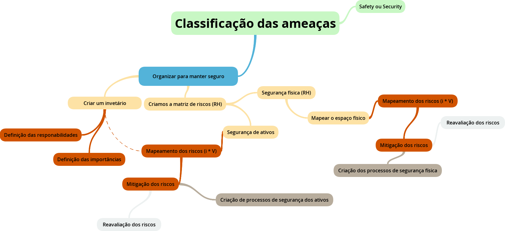

# Segurança da informação - Revisão das atividades (1° Bimestre)

<!-- Aviso de um marujo: Caso tenha de escolher entre prova e trabalho, escolha trabalho nesta matéria, ele acaba sendo mais interessante-->

Esta é uma revisão dos principais conceitos passados em sala da matéria de segurança da informação, onde de forma prática, os tópicos da ISO 27002/2013.

`OBS`: Este curso trata sobre **segurança** e não sobre **in-segurança**. Esta definição é importante para entender o objetivo do que é passado.

## Análise de riscos

Para que as empresas evitem problemas relacionados a incidentes de segurança da informação, é importante que elas entendam os requisitos de segurança da informação que seus ambientes requisitam.

De acordo com a norma ISO 27002/2013, existem três fontes principais de segurança da informação, neste caso, será levado em consideração apenas através da avaliação de riscos fornecidas, sobre seus ativos.

Porém, antes de prosseguir, vamos entender alguns conceitos importantes

Vamos começar entendendo sobre o que são ameaças. Ameaças são ocorrências prejudiciais tais como terremotos, falhas de energia, uma sabotagem, exploração de falhas, entre vários outros. 

Veja que, estas ameaças ter duas naturezas principais.

- Safety
    - Relacionado a qualidade;
    - Relacionado também com Confiabilidade;
    - Exige Normas definidas;
    - Sendo assim, tem-se que safety está relacionado a erros e falhas (Não intencional).

- Security
    - Relacionado a ameaças;
    - Desta forma, o Security trata de problemas causados de forma intencional.

Ao entendermos o que são ameaças, podemos entender que, a vulnerabilidade representa uma fraqueza organizacional que permite a uma ameaça causar danos.

Certo, com isto entendido, precisamos entender porque estamos sempre mapeando riscos, o que são estes ?

> Os riscos representam a vulnerabilidade junto ao impacto que a ameaça pode causar.

Desta forma, riscos podem ser quantificados através de uma fórmula simples:

```js
risco = vulnerabilidade * impacto;
```

Veja que, as formas quantitativas da vulnerabilidade e do impacto são as seguintes:

- Vulnerabilidade:
    - Alto (1);
    - Médio (0.5);
    - Baixo (0.1)
- Impacto:
    - Alto (100);
    - Médio (50); 
    - Baixo (10).

Mas, é importante deixar claro que, as formas de classificar estes tipos pode ser muito difícil, dependendo principalmente de questões relacionadas aos objetivos da empresa, e o quão importantes são cada uma das informações que a empresa carrega.

Agora que sabemos todos estes conceitos básicos, precisamos entender como o processo de levantamento é feito. No caso deste trabalho, o levantamento foi feito através da organização da empresa, tendo como base as seguintes etapas:

- 1 - Criação de um inventário da empresa;
    - 1.1 - Definição dos resposáveis da empresa por cada um dos ativos (Isto faz com que, eles estejam sempre sendo verificados)
- 2 - Mapeamento dos riscos de ativos (Soluções via RH)
    - 2.1. Após a identificação dos riscos, criar soluções através das atividades de RH;
    - 2.2. Realizar mitigação dos riscos
        - 2.2.1. Verificar o que a mudança altera, Vulnerabilidade ou impacto.
- 3 - Mapeamento dos riscos físicos (Soluções via RH)  
    - 3.1. Mapear o espaço físico
    - 3.2. Após a identificação dos riscos, criar soluções através das atividades de RH;
    - 3.3. Realizar mitigação dos riscos
        - 3.2.1. Verificar o que a mudança altera, Vulnerabilidade ou impacto.

Aqui um mind map das etapas realizadas acima:



Lembre-se que, todas estas atividades podem variar muito de acordo com o caso, assim como descrito pela norma, é importante que haja adaptações dos mecanismos de segurança descritos na norma.

## Referências :books:

- [Avaliação de Riscos para a Segurança da Informação no ISEP Aplicação ao Processo de Notas](https://core.ac.uk/download/pdf/47142493.pdf);
- [ISO 27002/2013]()