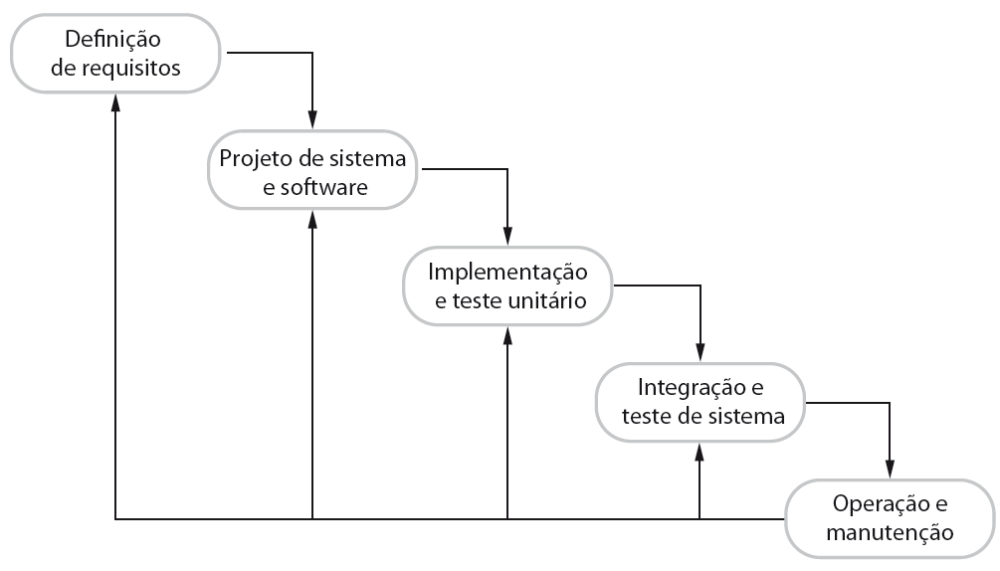
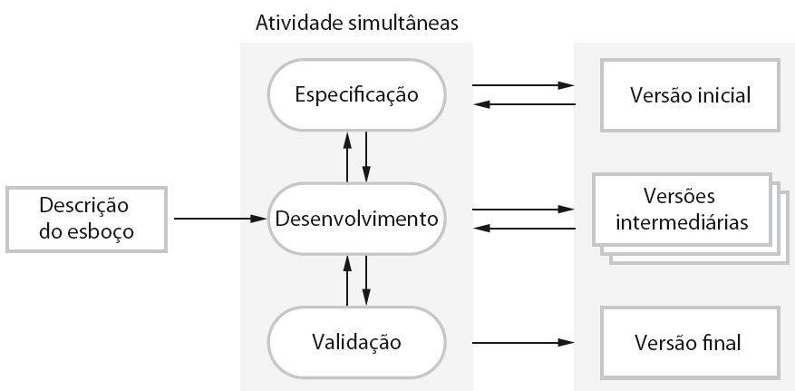
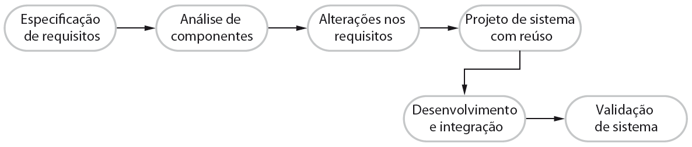
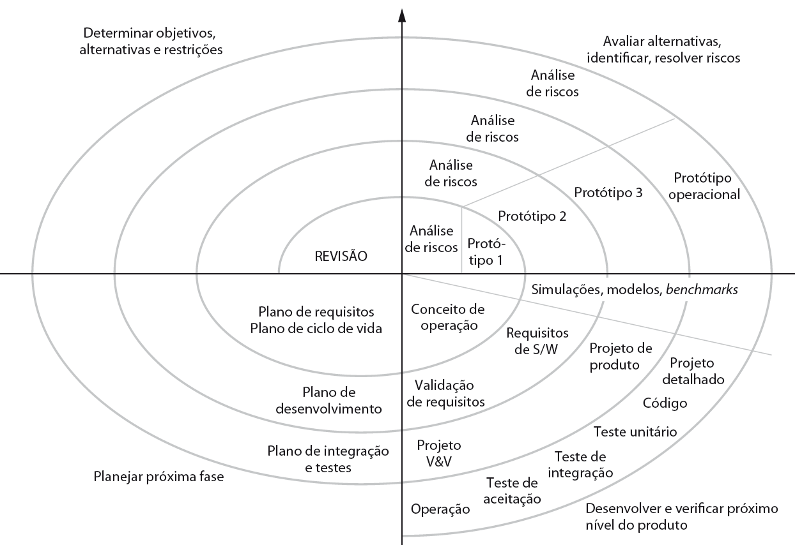
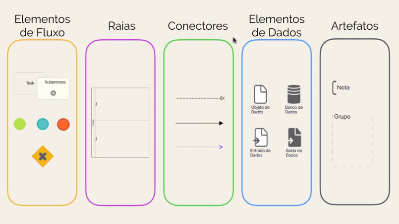
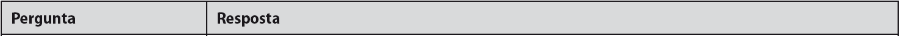
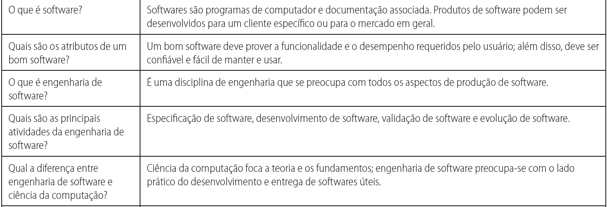
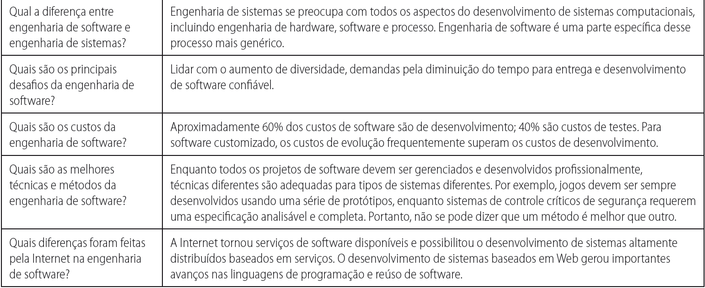
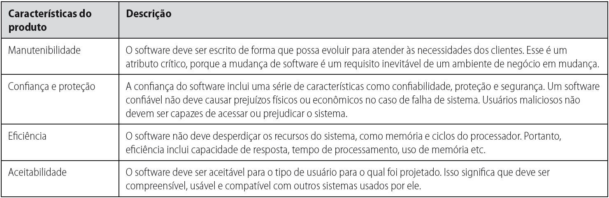

# Engenharia de software 2 - Fatec SJC (Revisão)

## Introdução

A engenharia de software (ES) preocupa-se com as teorias, métodos e ferramentas para desempenhar da melhor forma possível a criação de softwares

Isso porque o mercado atualmente depende de softwares para se manter, e cada vez mais há sistemas sendo controlados por softwares, e ainda, uma parte consideral do PIB de vários países são voltados para os softwares.

Perceba que a engenharia de software, busca utilizar métodos e teorias que se encaixem nos contextos organizacionais e financeiros das empresas.

Esta área, não trata apenas dos aspectos técnicos do desenvolvimento de software, e sim, de todo o ecossistema que rodeia esta atividade, ou seja, ela se preocupa e revisa, ferramentas, métodos e teorias que dão apoio ao desenvolvimento de software.

A importância desta engenharia tem crescido muito, por conta da necessidade do mercado e das pessoas de terem softwares mais rápidos, e mais confiavéis.

O interessante dos trabalhos da ES é que não há um padrão universal, aplicável em todos os projetos, cada projeto utiliza certas técnicas, que em casos, não irão se aplicar a outros projetos

Quando não há a engenhria de software, tem-se problemas com o gerenciamento e manutenção do sistema desenvolvido.

### Custos de software

Em sistemas de computador, geralmente, o software acaba sendo a parte com maior custo, isso porque além do hardware barato, há que o software tem custos até o final de sua vida útil. Perceba que em softwares com vidas muito longas, o preço da manutenção pode se tornar muitas vezes o valor de compra do mesmo.

Então a engenharia de software preocupa-se com que os custos sejam efetivos.

### Produtos de software

Estes podem ser divididos em duas partes.

* Produtos genéricos
    * Estes são os softwares que são comercializados e vendidos para qualquer cliente com desejo e poder de compra;
    * As específicações e decisões de mudanças são ditas pelo desenvolvedor;
    * Exemplos: Softwares CAD, sistemas operacionais, entre outros.

* Produtos sob encomenda 
    * Este tipo de software é encomendado por um cliente que deseja resolver suas próprias necessidades;
    * As específicações e decisões são ditas pelas prioridades do cliente;
    * Exemplos: Sistemas de tráfego aéreo, sistemas de monitoramento de trafego, entre outros.

### Problemas que podem afetar um software

* Heterogeneidade
    * Cada vez mais é exigido do software que ele seja o mais distribuido possível e que ele esteja nos mais diferentes dispositivos e computadores;
* Mudanças de negócio e social
    * O crescimento rápido das empresas fazem com que o software cresca junto com a empresa, assim para que ele não seja um problema, e sim uma solução;
* Segurança e confiança
    * É exigido do software que ele seja confiável, sempre esteja disponível e que garanta a segurança dos dados.

### Alguns tipos de software

* 1° - Aplicações stand-alone
    * São aplicações que são executadas em um único PC, e não necessitam estar contectadas a rede.
* 2° - Aplicações interativas baseadas em transações
    * São aplicações alocadas em computadores remotos, e nestes os usuários fazem o acesso de seus próprios computadores ou terminais. Exemplo: Aplicações web para e-commerce
* 3° - Sistemas de controle embutidos
    * São sistemas de software que controlam e gerenciam dispositivos de hardware
* 4° - Sistemas de entretenimento
    * Sistemas para uso pessoal, utilizado para entreter os usuários.

### Fundamentos da engenharia de software

Foi citado acima que, não há um único padrão que se adequa a todos os projetos, foi visto que o que ocorre é a utilização de cada modelo de processo de software (Discutido no tópico a frente) em momentos em que o projeto permite.

Porém há alguns fundamentos que são a base, e que devem ser utilizados em qualquer modelo de software, e são eles:

* 1° - Conhecer e entender os requisitos e especificações é de extrema importância para o desenvolvimento do projeto;
* 2° - Gerenciar e enteder o projeto é muito importante. Isso porque não basta entender somente gerenciar, é necessário entender para que o gerenciamento seja efetivo;
* 3° - Levar em consideração o desempenho e a segurança. Esses são tópicos listados como desafios da engenharia de software, e que devem sempre ter a atenção em um projeto;
* 4° - Fazer a reutilização de software é muito importante, e deve ser feito sempre que possível.

## O processo de software

Um processo de software é um conjunto de passos necessários para a construção de um software.

Existem diversos tipos de processos de software, que são utilizados para o desenvolvimento, mas, todos eles compartilham as seguintes características:

<!-- EDVE  -->

* Específicar: Nesta étapa os requisitos e especificações do software são realizados;
* Desenvolvimento: É nesta fase que o software é projeto e desenvolvido;
* Validar: Aqui é feito a validação do software, isso é, se ele possuí todos os requisitos leventados
* Evoluir: Por fim a evolução ocorre, este passo normalmente é posto após a implantação do projeto. 

O modelo de processo de desenvolvimento é apenas uma representação abstrata, assim, ela representa uma perspectiva em particular do processo.

### Descrição do processo de software

Ao falarmos sobre a descrição dos processos de software, estamos citando as atividades deste processos, mas esta descrição não abrange apenas as atividades mas também, os papeis, produtos e pré e pós condições, desta forma, a abrangência da descrição passa a ser:

* Modelos de dados;
* Interfaces de usuário;
* Os papeis, suas atividades e importâncias (Aqui em específico, o tratamento é voltado para as pessoas que vão particicar dos processos descritos);
* Pré e pós condições, este que descreve algo que ocorre antes e/ou depois da execução do processo.

Os processos podem ser divididos em:

* Planos
    * Este tipo de processo é aquele em que as etapas estão bem definidas, mesmo antes da iniciação do projeto;

* Ágeis
    * Aqui o processo é feito de forma incremental, e nem todas as etapas estão definidas, já que elas vão sendo desenvolvidas durante a adição de incrementos ao projeto.

#### Modelos de processos de software

Há vários tipos de processos de software, dentre eles:

* Modelo cascata
    * São processos de desenvolvimento de software bastante ortodoxos. Mudanças são difíceis de serem feitas;
    * Recomendado apenas para processos de software em que os requisitos são muito bem conhecidos;
    * Todas as etapas são separadas e distintas;
    
Visualização do processo

* Desenvolvimento incremental
    * Permite mudanças rápidas;
    * Feedback do cliente é feito de forma mais rápida;
        * Isso ocorre porque entre os incrementos o software vai se modelando, assim é possível o cliente visualizar como ele está ficando e operando.
    * Possíbilidade de rapidez;
    * Pouca visibilidade do processo;
    * Pode ocorrer de o sistema ficar degradado com a adição de muitos incrementos.

Visualização do processo

* Desenvolvimento orientado a reúso
    * Utiliza a abordagem de que os sistemas são integrados com componentes já existentes. (Este é um processo presenta a bastante tempo na WEB);

Visualização do processo

## Prototipação de software
Um protótipo é uma versão inicial de um sistema, usada para demonstrar conceitos e testar opções de projeto.

Estes podem ser utilizados para:
* Facilitar a visualização do sistema para o usuário;
* Modelar alguma função que será implementada;

Com esta modelagem ganha-se:
* Melhoria do uso de software;
* Menor esforço para o desenvolvimento;
* Melhoria na qualidade do projeto.

## Modelo espiral de Boehm

Esta é uma forma diferente de demonstar como o processo de software funciona. Cada loop do representa uma fase do processo. 

O ponto importante da esperial é que nele não existem especificações fixas, a cada loop as definições são feitas de acordo com a necessidade.

Outro ponto interessante é que os riscos são avaliados explicitamente, e com o decorrer do processo vão sendo resolvidos.

Veja um exemplo de espiral abaixo

## Rational Unified Process - RUP

* O que é ?
    * RUP é um processo de engenharia de software que proporciona uma abordagem estruturada para atribuir tarefas e responsabilidades dentro de uma organização

* Objetivos
    * O principal objetivo do RUP é assegurar a produção de software de alta qualidade que satisfaça as necessidade de seus usuários finais, respeitando prazo e custo

* Características
Ao invês de dar ênfase na produção de grandes volumes de documentação em papel, o RUP tem seu foco no desenvolvimento e na manutenção de modelos com uma rica representação visual do sistema em desenvolvimento
    * Focado no usuário;
    * Baseado em UML.

O RUP é conhecido como uma metodologia que destaca-se por seguir as 'melhores práticas' de desenvolvimento de software. Entenda que as 'melhores práticas' no contexto de engenharia de software significa:

* a-) Desenvolvimento iterativo;
* b-) Gerenciamento de requisitos; 
* c-) Arquitetura baseada em componentes;
* d-) Organização do projeto em estruturas estáticas e dinâmicas;
* e-) Especificação do software baseado em modelagem visual;
* f-) Verificação constante de qualidade.

O RUP pode ser entendido também, como um processo genérico, derivado do trabalho em UML.

Sua descrição neste caso, normalmente é feita por 3 perspectivas:

* Uma perspectiva dinâmica - Que mostra fases no tempo;
* Uma perspectiva estática - Que mostra atividades do processo;
* Uma perspectiva prática - Que sugere boas práticas.

O ciclo de vida do Processo Unificado está organizado em quatro fases de gerênciamento

* Concepção - Estabelece o business case para o sistema
    * Delimita o contexto;
    * Identifica os riscos críticos;
    * Construir um protótipo do sistema.
* Elaboração - Desenvolve um entendimento da extensão do problema e da arquitetura do sistema
    * Identificar e detalhas os casos de uso;
    * Formular a arquitetura básica do sistema proposto;
    * Identificar os riscos do desenvolvimento do projeto.
* Construção - Projeta o sistema, programa e testa o sistema
    * Aqui o desenvolvimento do projeto ocorre.
* Transição - Implanta o sistema no seu ambiente de operação
    * O foco desta etapa é transferir o produto para o cliente;
    * Garantir o nível de qualidade esperado;
    * Migração de dados
    * É nesta etapa que os riscos são mais altos.

* Workflows
    * O RUP possúi diversos workflows, mas serão vistos apenas dois:
        * Modelagem de negócios: Os processos de negócio são modelados por meio de casos de uso de negócios
        * Requisitos: Atores que interagem com o sistema são identificados e casos de uso são desenvolvidos para modelas os requisitos do sistema.

## Processos de negócios

Um processo de negócios nada mais é que um conjunto de atividades, iniciado primeiramente por um evento, dirigo por regras de negócio e utilizando recursos, cujo qual entrega um resultado, finalizando com um determinado valor, seja para o cliente interno, seja para o cliente externo de uma empresa.
* Hierarquia:
   * Processos;
   * Subprocessos
   * Atividades
   * Tarefas

Deve-se manter a análise somente no nível de processos. Como fazer isso? Para cada funcionalidade do negócio em estudo, verificam-se as características dessa funcionalidade.
 
Com os candidatos a processos identificados, temos realizado apenas o primeiro passo. O próximo passo consiste em definir cada um deles. É necessário então, para cada processo, responder ao Questionário de Identificação de Processos. 
* Questionário de Identificação de Processos:
 * Atividades envolvidas (de acordo com a descrição narrativa)
 * Quando será realizado a atividade (define o evento de entrada, "quando")
 * Sequência da realização das atividades(implementação dos fluxos)
 * Como serão realizadas as atividades
 * Objetivo do processo
 * O que está envolvido na execução das atividades
 * O que é consumido ou utilizado
 * O que é produzido
 * Relação entre o processo e a estrutura de negócio

* A Visão de Processos é realizada usando o diagrama das extensões Eriksson Penker da modelagem UML. 

## Modelagem de processos de negócios

Um modelo de negócio é uma abstração do funcionamento do próprio negócio, visto de várias visões, de modo a gerar informações relevantes.

Assim o processo de negócio também pode ser visto como, um conjunto de atividades, que é iniciado por um evento, que utiliza recursos e é dirigido por regras de negócio e entrega um resultado.

Cada uma das visões pode ser representada utilizando um diagrama. Assim cada uma das estruturas ou situações do negócio podem ser demostradas e assim expressarem as relações entre os vários objetos do negócio.

Os objetos de négocio são:

* Objetivos
    * O objetivo refere-se a, Para que o processo existe;
    * Identifica uma ação de valor para o negócio.
* Processos
    * São atividades que devem ser executadas para atingir os Objetivos.
* Recursos
    * Os recursos são objetos de negócio que atuam ou são utilizados ou manipulados pelos Processos de negócio, que podem ser classificados como elementos físicos, abstratos e informacionais. Podendo ser elementos de entrada ou de saída.
* Regras de negócio
    * As regras de negócio podem ser vista sobre duas perspectivas:
        * Negócio: Diretivas que visam influenciar ou guiar o comportamento do negócio. Tais diretivas existem como suporte a políticas do negócio, formuladas em resposta a riscos, ameaças ou oportunidades;
        * Sistemas de informação: Uma sentença que define ou restringe algum aspecto do negócio (...) sua intenção é manter a estrutura do negócio, controlar ou influenciar algum aspecto do negócio.

    * As regras de neǵocio tem essa divisão, pois passou a ser considerada muito importante para a comunidade de sistemas de informação, que passou a usa-la, como parâmetro no momento da construção de softwares, esses mais flexíveis e menos sensíveis a mudanças.

OBS: Exemplos de recursos -  produto ou material (formulário de comandas, papel, caneta, etc.), pessoa (vendedor), informação (lista de livros a serem vendidos), serviço (motoboy), página web, servidor, banco de dados, etc.

## Modelagem de processos

Até aqui, foi falando da importância do controle e visualização dos processos de neǵocio, porém é necessário que estes sejam demonstrados, com notações que todos sejam capaz de visualizar. 

Desta forma, serão demonstrados duas técnicas de Modelagem de processos de negócio, são elas:

* Eriksson-Penker;
* Bussiness Process Modeling and Notation (BPMN);

### Eriksson-Penker

A notação Eriksson-Penker apresenta os Processos de Negócio em uma visão de mais alto nível, sem detalhamento dos “passos” (atividade internas) assim como das regra de negócio embutidas.

Nesta notação, são destacados os seguintes objetos de negócio:

* Evento: É um acontecimento que dispara a execução de um processo de negócio;
* Recursos: São os recursos utilizados ou manipulados pelos processos de neǵocio;
* Objetivo: O objetivo é utilizado para específicar a importância daquele processo, ou, o porque ele exite no negócio; 
* Saída: Representa a saída gerada pelas atividades do processo de negócio

### BPM

* BPM é a abreviação de Business Process Management, que traduzido para o português significa Gerenciamento de Processos de Negócio.

* BPM é uma abordagem de gerenciamento adaptável, desenvolvido com a finalidade de sistematizar e facilitar processos organizacionais individuais complexos, dentro e fora das empresas.

* O BPM tem como intuito trazer a tona informações pertinentes de como os processos são executados para que melhorias possam ser realizadas e para que os processos possam ser gerenciados possibilitando uma melhor tomada de decisões e visão do negócio como um todo.

* Frase de impacto: "Você só pode melhorar aquilo que pode gerenciar, só pode gerenciar aquilo que pode medir e só pode medir aquilo que realmente conhece como é executado."

O BPM é a modelagem de processos de negócio, utilizado para visualizar e entender os processos, para que assim seja possível entender como o processo funciona. E com isso é possível melhorar, reestruturar e automatizar o processo. 

### BPMN

Notação BPMN especifica o processo de negócio em um diagrama que é fácil de ler tanto para os usuários técnicos quanto para os usuários de negócios. É intuitivo e permite a representação de detalhes complexos do processo. BPMN serve como uma linguagem padrão, colocando um fim na lacuna de comunicação entre a modelagem do processo e sua execução. Por este motivo e considerado hoje a lingua franca para comunicação no mundo dos negócios.
* Resumindo:
  Desenvolver uma visão clara sobre o projeto de entendimento "universal"

O BPMN é utilizado para desenhar processos de negócio. Utiliza dos conceitos do BPM com uma notação gráfica.

* Elementos
    * Elementos de fluxos:
        São esses os elementos que definem quando inicia e quando termina um processo, as tarefas humanas ou de sistema, que estão envolvidas e os desvios
            * Tarefas;
            * Eventos;
            * Representa desvios do fluxo.

    * Raias:
        Fazem a organização e definição de departamentos dos que irão participar do processo. São conhecidos como containers de elementos de fluxo.
            * As rais definem as responsabilidades dentro do processo;
            * A raia também é utilizada para facilitar a organização e visualização dos elementos de cada integrante do processo.

    * Piscina:
        Container que define certa estrutura, um contexto, como uma empresa, e dentro deste grupo há várias raias.
        
    * Conectores:
        Os elementos de fluxo não podem estar sozinhos, eles precisam de comunicação, e isso ocorre com os conectores. Para isso é possível fazer uma troca de mensagens, uma simples conexão ou uma associação de certos elementos.
            * Troca de mensagem;
            * Fluxo de sequência (Concetor mais simples);
            * Associação (Liga dados a tarefas)

    * Elementos de dados
        Os elementos de dados representam as formas de armazenamento e utilização dos dados (input e output).
            * Descrevem as entradas e saidas do processo
    
    * Artefatos:
        São utilizados para tornar o fluxo de diagrama mais claro.
        * São as representações da documentação

* Veja abaixo, uma representação completa dos elementos separados em grupo. (Imagem retirada do Heflo.com)

* Elementos do BPMN
    * Gateways: É um direcionador de fluxo;
        * Gateway paralelo: A paralelização de serviços do BPMN é possível com a utilização deste gateway, através dele, é possível fazer com que dois ou mais fluxos sejam executados ao mesmo tempo.
        * OBS: Para fazer com que os fluxos sejam sincronizados novamente não esqueça de utilizar a convergência.
        * Gateway inclusivo: Com este gateway é possível fazer uma combinação de caminhos, isso porque ao verificar, ele consegue assumir que mais de um valor é verdade, fazendo assim que haja uma unificação de caminhos;
        * Também deve ser utilizado a convergência para únificar os caminhos.
        * Gateway exclusivo: Apenas um dos caminhos de verificação será realizado, diferente do inclusivo.
        * Gateway complexo: É utilizado para tratar situações complexas, veja que, ele serve para ser usado principalmente quando há muitas entradas e combinações de gateways diferentes.

## Métodos ágeis
Os métodos ágeis são uma alterativa as formas tradicionais de desenvolvimento de software, este formato de desenvolvimento de software surgiu em meio a crise enfrentada pelas empresas de desenvolvimento de software.

Os processos ágeis incentivam a auto-organização e o trabalho em equipe, além de falar muito sobre a comunicação entre a equipe.

Estas são formas de desenvolvimento de software, que visam a entrega rápida de produtos, sem deixar a qualidade de lado.

As formas ágeis são bastante criticadas por deixarem de lado um grande conjunto de documentação, utilizada pelos métodos de desenvolvimento de softwares antigos.
Porém o manifesto diz que, a documentação é menos importante que software funcionando, mas isso não significa que a documentação não deve existir.

Ela apenas muda a forma como a documentação é vista, perceba que, nos projetos mais antigos a documentação era vista como forma de comunicação, nos métodos ágeis, ela é uma das formas de comunicação, assim com mais formas de comunicação a documentação diminuiu, porém não sumiu como muitos dizem.

E este é o principal ponto dos métodos ágeis, ele foca muito em comunicação, por isso as equipes são pequenas, essas que fazem pequenas entregas incrementais. Tudo isso faz com que o processo se torne algo mais natural, fazendo com que o desenvolvimento de software seja mais rápido e efetivo.

Mas quando devemos documentar ?

Quando o benefício e o valor do que será documentado, é maior que o custo trago por aquela documentação.

### Users Stories
Vale aqui lembra que, as User Stories, assim como qualquer outro método talvez não se adapte a todos os casos de desenvolvimento e levantamento de requisitos. 

Objetivo

As Users Stories, tem como objetivo facilitar o processo de levantamento de requisitos. Ela busca fazer isso de forma rápida e com muita interação dos usuários que irão utilizar o sistema.

Características 

O fato das Users Stories não encaixar em qualquer projeto se da por algumas características que ela apresenta, e além disso o seu objetivo.

Este método trabalha na captura de informações diretamente com o usuário, e não foca muito em documentar todos os detalhes.  Aqui são gravados o que o usuário deseja fazer, e nada mais, como por exemplo detalhes de implementação, ou como o sistema deve se comportar.
Outro fato interessante sobre esta forma de levantamento de requisitos é o quão fácil é seu aprendizado e aplicação, isso permite que todos os envolvidos possam criar as User Stories, sem a necessidade de um especialista fazendo a interface com o cliente e a equipe que desenvolve.

Sua aplicação é feita principalmente quando as equipes são pequenas, e a comunicação com o usuário pode ser feita frequentemente.

* Aplicação

Sua forma de aplicação, como já citado, é bastante simples. Veja que as histórias devem ser curtas e diretas ao ponto. 
Para a criação de uma história um paragrafo deve resolver o problema, caso não seja o suficiente, ela deve ser revista e caso necessário removida ou segmentada em outras pequenas histórias.

Ela deve conter os tópicos listados abaixo:
* Ator - Representa quem escreveu aquela história, ou, a quem ela atende;
* Ação - Mostra a ação que o ator quer efetuar;
* Funcionalidade - Mostra o resultado que o ator espera após a execução a execução da ação.
* Um exemplo simples de descrição pode ser visto abaixo:

"Como cliente quero verificar quais livros estão disponíveis para compra, para que possa seleciona-los e efetuar a compra"

## FAQ - Engenharia de software

Os atributos essenciais de um bom software

